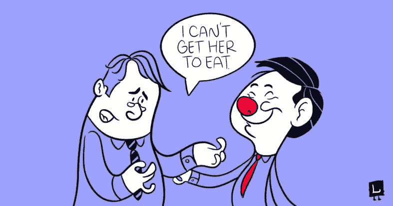

# 如果你不能智取，你必须超越别人

> 原文：<https://medium.com/hackernoon/if-you-cant-outsmart-you-must-outbehave-ddc530021ded>

坚持到底，跟进，体贴周到；这些是关系和[业务](https://hackernoon.com/tagged/business)的基础。在世界各地，所有这些关键的关系和业务建设活动都有一个长期的问题，没有一天有人不抱怨被忽视，被当作商品对待，以及与他人相处不愉快。

在[我的上一篇文章](http://www.game-changer.net/2017/04/04/subtraction-the-simplest-most-common-path-to-innovation-there-is/)中，我解释了办理我业务的银行如何有一个发送 ATM 卡的冗长过程。现在，我相信为银行工作的人如果处在我的位置，也会和我一样不耐烦，但是作为雇员，他们的手腕是被绑住的。

这是大多数以照常经营的心态经营的企业的情况。尽管如此，这并不意味着他们对此无能为力。

比如什么？

不找借口。

例如，上周末，我和家人在一家非常有名的餐馆吃午饭。一切都很好，直到我们注意到我们各自的[订单一个接一个地到达，并且一个接一个地迟到。我叔叔很生气，温和地向我们的服务员指出了这一点，但服务员不喜欢被置于尴尬的境地，并迅速将责任推给了厨房工作人员。](https://hackernoon.com/tagged/respective)

什么！？

# 活出你的价值观

现在，这不是一个好的专业人士。这与是否比其他人聪明无关。而是为了你自己和你工作的公司成为一个伟大的人。

如果这就是你的行为，找借口，不负责，那么这就是你的公司的行为。这就是人们所记得的，不管你喜不喜欢。价值观，无论是否明确，都存在于每个企业中。这是你如何对待自己，如何对待别人，如何对待彼此。在大多数地方，价值观是写出来的，但很少被实践。

电影《心灵点滴》中有一个场景，菲利普·西摩·霍夫曼扮演的角色，一个专注于比其他人都聪明的人，告诉心灵点滴“他不能让”某个特定的病人吃饭:

这就是活出你的价值观的样子。心灵点滴哲学是通过笑声治病，让病人忘记烦恼；他们都因此爱他。

# 在竞争中胜出

对于聪明、创新的公司来说，一切照旧是敌人；他们的目标是通过实践自己的价值观来超越期望。例如，初创公司比现有公司思维更敏捷，执行能力更强，但他们并不是仅仅通过更加努力地工作就取得了胜利；而是在重要的事情上更加努力:关心和付出更多。

价值观是没有人喜欢谈论的软东西，因为它是模糊的，但它也是人们记得的部分。这是机器人和聊天机器人无法自动化的东西。这是让顾客感到被理解和被照顾的东西；是胶水粘住了。

你的公司可能没有世界上最聪明的头脑，但你仍然可以在场，关注和照顾客户。这是一个唾手可得的果实**没有人可以垄断成为一个伟大的人**。

记住，你希望别人怎样对待你，你就怎样对待别人。想象自己在另一边，难道你不愿意被照顾吗？感到惊讶和敬畏？这也是每个人想要的感觉。

**底线:** *产品、服务、流程，它们都是可以复制的，而且永远都是。所以，* [*不能智取，就要智取*](http://sethgodin.typepad.com/seths_blog/2012/06/outsmart.html) *:多关心，多付出，多关爱，多倾听，多拼搏。*

> [黑客中午](http://bit.ly/Hackernoon)是黑客如何开始他们的下午。我们是阿妹家庭的一员。我们现在[接受投稿](http://bit.ly/hackernoonsubmission)并乐意[讨论广告&赞助](mailto:partners@amipublications.com)的机会。
> 
> 如果你喜欢这个故事，我们推荐你阅读我们的[最新科技故事](http://bit.ly/hackernoonlatestt)和[趋势科技故事](https://hackernoon.com/trending)。直到下一次，不要把世界的现实想当然！

