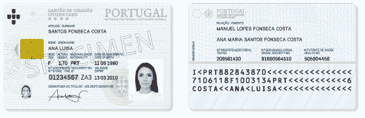

# “如果你找到我，在最近的自助餐厅给我”——从来没有身份证说

> 原文：<https://medium.com/hackernoon/if-you-find-me-hand-me-at-the-nearest-cafeteria-said-no-id-card-ever-268d7fe57768>

## 周日早上关于身份盗窃的想法

Photo by [Tyler Nix](https://unsplash.com/photos/mMXsCA-IKJQ?utm_source=unsplash&utm_medium=referral&utm_content=creditCopyText) on [Unsplash](https://unsplash.com/?utm_source=unsplash&utm_medium=referral&utm_content=creditCopyText) (cropped)

今天，我周日早上出去散步，在附近吃小吃/喝咖啡。坐在街边自助餐厅外的桌子旁(哦，里斯本九月的额外津贴)，我看着入口门旁边的透明玻璃窗，看到至少有三张 T2 市民卡贴在玻璃上。女生卡，男生卡，老太太卡。这在葡萄牙是一件奇怪的平常事。其背后的假设是，丢失卡的人住在附近，可能会回到自助餐厅，并在没有麻烦的情况下要求补发卡(或有人认出此人并联系他们)。卡片贴在窗户的内侧，没错，但即使如此，它们还是:

*   很容易被人拿走；
*   相当可供某人对卡片的两面拍照；和
*   完全可以在自助餐厅关门的时候有人去那里拍张卡的正面。

Specimen of the Portuguese “Citizen Card” (from [autenticacao.gov.pt](https://www.autenticacao.gov.pt/o-cartao-de-cidadao))

就上下文而言，让我们记住葡萄牙身份证两面的内容(斜体表示特别敏感的信息):

*   前面:*全名*，性别，身高，民族，*出生日期*，*身份证号*，有效期，*签名，照片* (B & W)。
*   回:*父母双方全名，纳税人号，社会安全号，国民健康服务号*。

通往地狱的道路是由良好的意图和诈骗铺成的，这些诈骗只使用你能从贴在自助餐厅窗户上的 ID 卡上获得的信息。虽然葡萄牙卡是电子卡，但绝大多数身份证明用例(特别强调… **银行**！)仍然像我们没有留下那张丑陋的黄色纸身份证一样被处理。

A (blank) good old “Bilhete de Identidade” (By User:Dantadd [Public domain], [via Wikimedia Commons](https://commons.wikimedia.org/wiki/File:BIPT.jpg))

由于缺乏技术设备，以及善意和商业利益的结合，使人们通过漏斗，太多的审计跟踪是使用电子卡片的[法律上可疑的](http://visao.sapo.pt/actualidade/sociedade/2017-04-15-Sabe-o-que-fazer-se-lhe-pedirem-uma-copia-do-Cartao-do-Cidadao-) **纸质副本**建立的(有时，有足够的说服力和良好的背景故事，甚至不显示真实的文档)。自助餐厅窗户上的一张卡片来自一位老年人，因此欺诈者可以很容易地编造出一个与移动性相关的故事，既可以证明该人的缺席，又可以产生共鸣，以减少一些程序上的漏洞。

对于通过**电话**渠道获取受限信息，这一点尤为严重。我们这里有客户支持代理通常询问的大部分信息，作为确认您身份的手段。唯一丢失的关键信息是你的地址(在卡的芯片里，由一个密码保护)。在大多数情况下，人们可以通过一些社会工程行动来获得它。这种努力的复杂性可以包括现场观察(记得名片留在了*街区*的一家自助餐厅，上面有照片)和乐于助人的邻居(*“你知道史密斯先生在几楼吗？我找到他的钱包了！”简单地用谷歌搜索你的名字。攻击者还可以通过*另一个*客户支持热线的简单程序找到您的地址(例如，为了给您换一张忠诚卡，他们通过剩余的信息确认您的身份，然后*告诉您完整的地址*以确认您要将卡寄到哪里)。*

最后，还有获得**在线账户**(电子邮件、社交网络、电子商务等)。).通过姓名、出生日期和照片的组合，人们可以在这些帐户中的一个帐户上找到一个肯定的匹配，然后通过社交工程进入密码重置/恢复。一个人甚至可能得到“母亲的娘家姓”[安全](https://hackernoon.com/tagged/security)问题！对于一个葡萄牙公民来说，这特别容易获得，因为这是一个人全名的一部分——但是在卡的背面有父母双方的全名是一种很方便的方式，可以分辨出这些中间名中的哪一个是神奇的答案。

通过所有这些场景，攻击者也有可能从… ***you*** 处获取您有价值的信息！在将身份证中的信息与电话号码(同样是社会工程)联系起来后，攻击者可以将自己伪装成合法的客户服务代表(他们知道你的全名、出生日期、身份证号码、纳税人号码等等)，声称正在解决你的帐户问题。

上面的例子是在我的脑海中用葡萄牙的社会和制度结构来描述的，但它们也很容易适用于其他地方，一些引人注目的案例正好说明了这一点。亚马逊很容易受到这种黑客攻击。苹果公司也是如此。

总之，作为一个强有力的建议:

*   如果您发现丢失的身份证(或任何类型的个人文件)，**将其交给最近的警察局或警官**。与使某人暴露于身份盗窃的潜在后果相比，要求更换身份证的时间和金钱成本微不足道——所以你这样做是在帮某人更大的忙。
*   如果你经营一家任何类型的商店，要么不接受任何丢失的文件(并引导人们向当局求助)，要么接受它们并在交给当局之前将它们*保存在一个安全的地方*几天。**永远不要展示任何人的文件！**

身份盗窃*是*真实的。

*这篇文章代表了我在这个问题上的个人观点，而不是我现在/曾经工作过的任何公司在这个问题上的观点。*