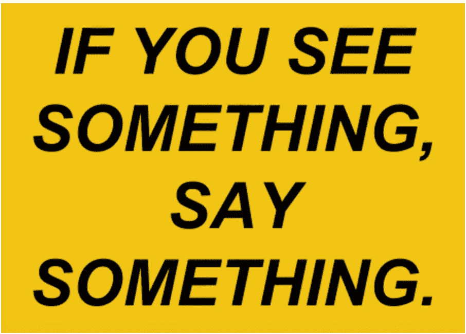
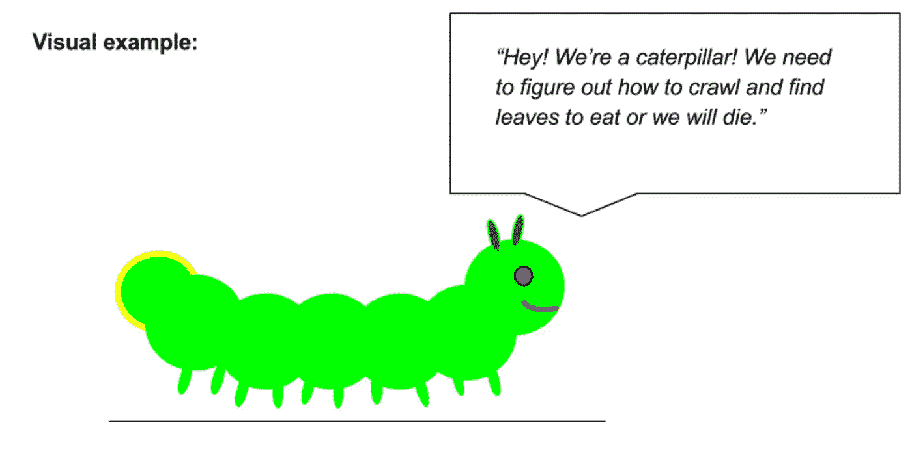
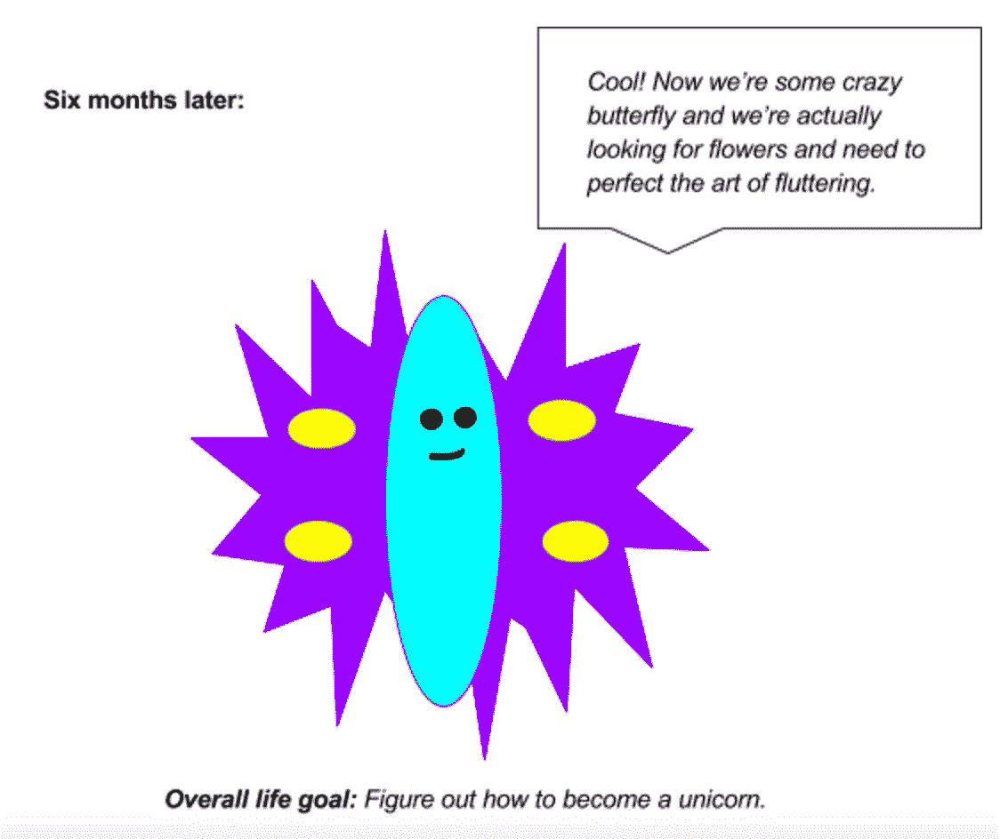
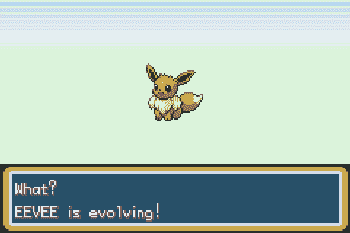

# 如果你看到了什么，就说出来:我在科技行业工作的新咒语

> 原文：<https://medium.com/hackernoon/if-you-see-something-say-something-my-new-mantra-on-working-in-tech-6a1c45bb98bf>

在 [tech](https://hackernoon.com/tagged/tech) 工作的最大好处是，如果有东西坏了，你有能力修好它。

在科技行业工作最糟糕的一点是，东西总是会坏掉，而要靠你来修理它们。

[Popularized by the MTA](http://www.mta.info/news/2010/05/03/if-you-see-something-say-something), this is generally good life advice in tech.

# 这条路(不)畅通

在联合广场风险投资公司工作之前，我在 [Stack Overflow](http://business.stackoverflow.com/) 工作了四年。当我 2012 年开始在那里工作时，公司大约有 50 名员工。当我去年离开时，我们正迅速接近 300 人的大关。但是当人们问我在那里工作时做了什么，这实际上是一个很难回答的问题。

对话不可避免地是这样的:

**他们:**“你在栈溢出工作了四年？太酷了！你在那里做了什么？”
**我:**“嗯……我从销售开始，但大部分时间都花在市场营销上。”
**他们:**“好看。市场营销的什么领域？”
**我:**“嗯，很多不同的地区？我的意思是，它开始写了很多博客文章和案例研究，然后演变成活动营销和一些国际发布，但最终我做了一些客户研究，产品战略和销售支持的混合。你知道，无论我们当时需要什么。”

对于创业公司来说，事情从来没有这么简单，不是吗？

毕竟，一家公司在四年内会发生很多变化。在科技领域尤其如此。尤其是当你在一家每月流量指标持续上升的公司工作时。

而当营销团队是 2 个人的时候(就像 2012 年的时候)，你所执行的工作与营销团队是 20 个人的时候(就像 2016 年的时候)有着天壤之别。

如果你是那种很容易厌倦的人，可能没有比科技行业更适合你的行业了。因为事实上。一直都是。一些事情。否则。去修复。

但是，如果你是那种渴望在某个特定过程中保持一致性和掌控力的人，这种环境和行业可能会让你感到愤怒。因为事情发生了很大的变化。全部。的。时间。

我明白了我是那种很容易厌倦，但也很难适应变化的人。非常好。

到我在 Stack Overflow 的任期结束时，我在接受这些变化方面变得更好了。每次我们重新布置我们的办公室，我不得不换桌子时，我都不再抓狂，我开始重新思考我对我们公司和我的角色的看法。

我喜欢把 Stack Overflow 想象成一种被茧包裹的动物，每六个月就会变成某种新的生物。

认识到这一点帮助了我。我会告诉自己，我们正处在一个全新的地方，有着新的机遇和新的挑战。就个人而言，这意味着大约每六个月，我会重新调整自己的工作重点和优先顺序，以确保我仍然在做最重要的事情。

因此，不断变化。

# **变革即将来临**

从那以后，我知道这一切都很平常。在联合广场风险投资公司，我有独特的特权去观察 [65+家公司](http://usv.com/portfolio)经历成长、变形和改变的过程。

USV 大学的艾伯特将这种想法称为“提升”——就像你玩视频游戏，需要在达到下一个水平之前很好地完善某个特定的技能，这时你需要完善下一个重要的技能。

我喜欢把它想象成进化你的一个神奇宝贝。

With Eevee, you never know what you’re going to get. (Image [via this blog post](https://jygersrant.wordpress.com/2014/12/09/why-do-they-call-it-evolution-in-pokemon/))

有一天，你有了一个非常普通的像狗一样的神奇宝贝，名叫 [Eevee](https://bulbapedia.bulbagarden.net/wiki/Eevee_(Pok%C3%A9mon)) ，它在战斗中实际上非常虚弱。接下来，你可能会有一种叫做[水伊布](https://bulbapedia.bulbagarden.net/wiki/Vaporeon_(Pok%C3%A9mon))的生物利用水能战斗。或者一个叫雷伊布的用电击的。或者一个 [Flareon](https://bulbapedia.bulbagarden.net/wiki/Flareon_(Pok%C3%A9mon)) ，引导火力。每一次进化都会带来新的挑战。

当我在栈溢出时，这些变化或进化以不同的形式出现。有时候，我周围的人会给我明确的指示，告诉我应该如何改变努力的方向。有时，变化会发生得如此之快，以至于我们都感到意外，我们会集体停下来重新组合。

有时我们甚至不会注意到变化已经发生了。这种类型总是最难驾驭的。

现在，我已经在数十家其他公司经历过几次这样的“六个月周期”，更容易看到所有这些变形、变化和灭火工作都在各地发生。这是我们希望我们的公司从参与我们的 USV 投资组合网络中获得的一部分，也是我的工作存在的原因。

我们的理论是:如果一家公司的某人知道如何以某种方式灭火，也许当另一家公司“升级”或“发展”时，这种策略对他们也有用。

我知道这种思路确实帮助我在 Stack Overflow 的项目和工作中走了弯路。如果我没有能够与 Flurry 的营销人员讨论数据分析和调查开发的最佳实践，我就无法制定一个游戏计划来正确地对我们的客户群进行研究。如果我没有了解 Foursquare 的公关主管，我永远不会明白在讲述你公司的故事时，你需要多么复杂和周到。

当然，所有这些说起来容易做起来难。有了一些观点和后见之明，这也变得容易多了，这是我现在拥有的奢侈品，但在我最忙的时候却没有。

# **采用新的咒语**

我想了很多，当我身处其中时，我希望我知道些什么。当我们有 50 名员工，100 名员工，超过 200 人时，什么能帮助我更好地应对变化？但是很难确定任何精确的东西。

我想到的最接近建议的事情是:集中注意力。

如果你目前在一家[初创公司](https://hackernoon.com/tagged/startup)从事技术工作，我认为你能为公司做的最好的事情就是密切关注你周围发生的事情。对你在公司内外注意到的任何变化保持高度的观察力，然后花一分钟看看其他人是否也注意到了。如果是这样，弄清楚这种改变是否值得行为改变或焦点转移。

我要说的第二件事是，在这方面保持一致是关键。毕竟，公司里的每个人越早认同你已经走出了“Eevee 阶段”，进入了“水伊布阶段”，你们就能越早共同投资于新阶段的正确战略。

有了这些，这里有一些基本的问题，你可以试着定期问自己，这可能会帮助你更好地评估你现在处于哪个“水平”或“进化阶段”:

*   **认识变化:**与六个月前相比，现在的公司有什么不同？从我开始的时候呢？
*   **识别意识:**这些变化对我们的目标和优先事项有什么影响？其他人和我一样理解这些变化吗？
*   **适应行为:**我的团队现在怎样才能对组织最有帮助？我们在做正确的事情吗？我是吗？

总之，我认为创业生活与其说是一份易于解释的“盒子里面”的工作描述，不如说是采纳了我们在纽约地铁站看到的 [MTA 的口号](http://www.mta.info/news/2010/05/03/if-you-see-something-say-something) :
*如果你看到了什么，说出来。*

就像我说的，在科技行业工作最棒的一点是，如果有东西坏了，你有能力修好它。

最糟糕的是，东西总是坏，要靠你来修理。