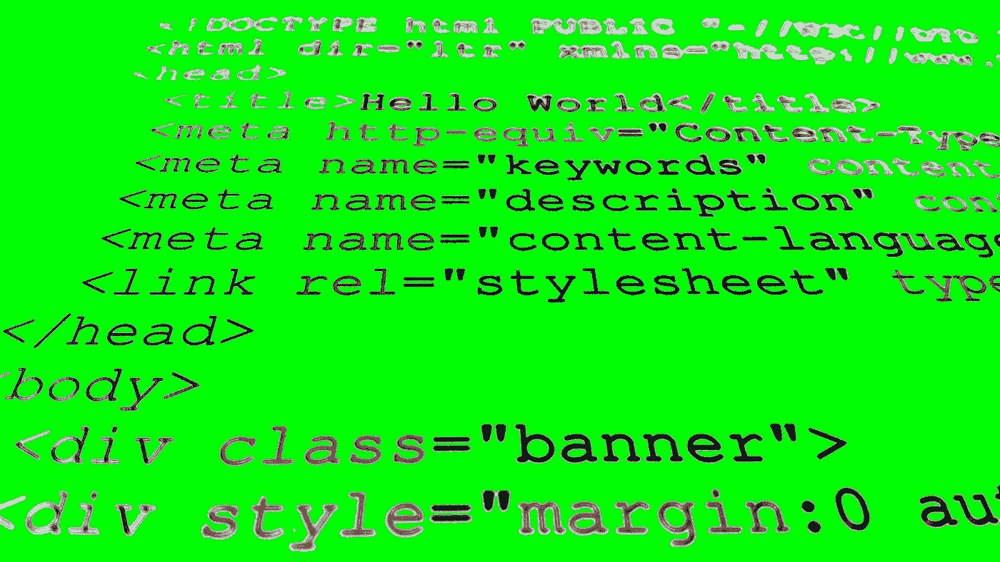

# 如果你想在 FAAGM 工作，你应该学习哪种编程语言？

> 原文：<https://medium.com/hackernoon/if-you-want-a-job-at-faagm-which-programming-language-should-you-learn-b026917e2c38>

> 谷歌 Fuchsia 高级软件工程师贾斯汀·马特森(2016 年至今)。[原载](https://www.quora.com/Which-programming-language-should-you-learn-if-you-want-a-job-at-Google-Amazon-Facebook-or-any-big-software-company/answer/Justin-Mattson)于 [Quora](http://quora.com?ref=hackernoon) 。

简单的回答是，不要担心编程语言。任何一家公司(尤其是大公司)如果你知道 X 语言，但不知道 Y 语言，那它就是你不想为之工作的公司。说真的，因为这意味着该公司的员工认为语言对你是否称职非常重要。语言是一种工具，就像锯子一样。不管是手动锯、台式锯还是激光锯，都不如理解木材的基本原理和切割过程重要。有很多人知道 Java，但却是糟糕的工程师，这不是需要测试的相关知识。

对于一门语言来说，重要的是理解内存发生了什么，语言如何使用指针，堆栈等等。C，C++和类似的语言让你知道这一点，所以至少理解一次这些是很好的，即使你再也不会使用它们。这样，当你使用 Java、Ruby、Python 等时，你会对你的设计选择如何转化为实际的内存操作有一个更直观的理解。

最后，不要只学一门，至少学两门，希望是三门。这将让您更好地了解大多数语言有哪些共同特性，以及有哪些不同之处。不同之处暗示了在软件开发中导致问题的原因。这将有助于你理解当你开始构建某个东西时，你是应该使用 C 还是 Python 或者其他语言，因为每种语言都有其基于你要解决的问题的优势。

最后，虽然你进门时掌握的具体语言知识在很大程度上是不相关的(嘿，Go 在 10 年前还不存在)，但要成为你所用语言的专家，因为如果你说你是 Python 专家，但却不能在面试中正确使用它，那就成问题了。

> 谷歌 Fuchsia 高级软件工程师贾斯汀·马特森(2016 年至今)。[原载](https://www.quora.com/Which-programming-language-should-you-learn-if-you-want-a-job-at-Google-Amazon-Facebook-or-any-big-software-company/answer/Justin-Mattson)于 [Quora](http://quora.com?ref=hackernoon) 。
> 
> 更多来自 Quora 的趋势科技答案，请访问[HackerNoon.com/quora](https://hackernoon.com/quora/home)。