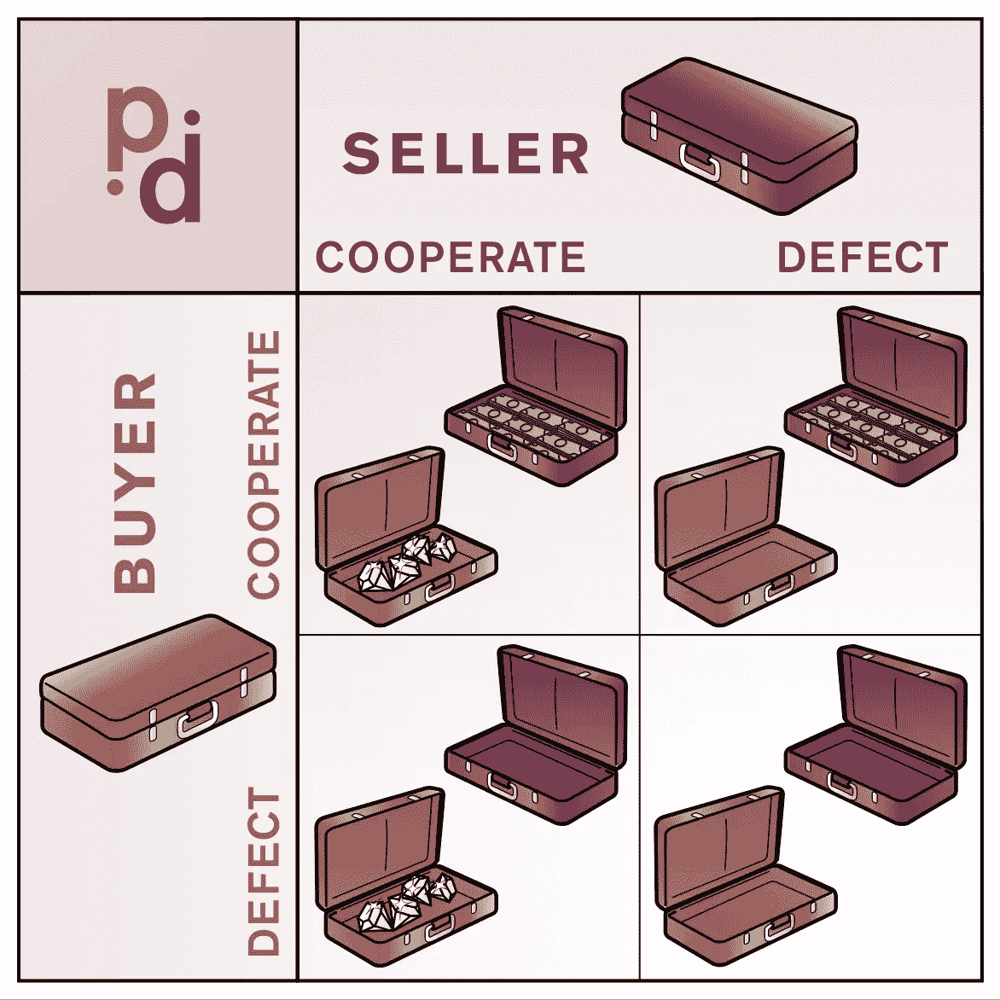

# 如果你想成倍地变得更好:合作。

> 原文：<https://medium.com/hackernoon/if-you-want-to-be-exponentially-better-be-cooperative-6a7383fa0587>

## 目前的技术进步速度和一定程度的连通性促使合作模式成为最佳战略。

做一个企业家意味着什么？这意味着你要去一个没人去过的地方。意思是创造一个给大家带来财富的想法。这些想法必须通过为出资者、投资者、员工、合作伙伴和客户创造双赢的局面来创造合作。它应该为所有人带来长期利益。

让我们从数学家的角度来看这些陈述。

# 囚徒困境

考虑 Douglas Hofstadter 的“[封闭式箱包交换](https://en.wikipedia.org/wiki/Prisoner's_dilemma#Closed-bag_exchange)”示例:

> 两个人见面并交换封闭的袋子，其中一个装着钱，另一个装着购买的东西。任何一个玩家都可以选择通过将他或她同意的东西放入他或她的包中来兑现交易，或者他或她可以通过交出一个空包来叛逃。

他们都不知道，也不信任对方。如果他们是理性的玩家，缺陷总是最好的选择。为了以合作的方式达成交易，他们必须承担额外的成本。

这种困境带来了调解人，他们可以用交易的 10%来解决问题。想象一下网上交易。很明显你需要亚马逊，易趣，阿里巴巴，你的银行等中介。但过一段时间后，这种中介可能会变得垄断。毕竟，这种垄断也遭遇了*同样的困境*——如果它想与自己的客户合作，或者例如提高 15%的利率，通过背叛所有客户来增加利润。这种垄断成为权力的来源。我们需要另一个调解人来控制局面。

# 舞台上的比特币

2008 年 11 月，一篇名为中本聪的论文被发布在互联网上，题目是*比特币:一个点对点的电子现金系统*。那是比特币的开始。一个月前，美国第四大投资银行雷曼兄弟(Lehman Brothers)在 2008 年危机高峰时申请破产，该银行自 1850 年成立以来运营了 158 年。

比特币的做法与银行数百年来的做法完全相反。它表明，我们不需要一个有自己意愿的等级组织来为我们管理资金。

# 区块链是比特币背后的技术

区块链的美妙之处在于，垄断不是这项技术的选项，权力融化在所有用户之间。而且人人平等。

区块链是一个分布式系统的例子，在这个系统中没有等级制度，控制权也不集中在一只手里。这个想法是绝对完美的，因为它为所有人带来了与你相同的利益。同时，竞争意味着对某些财富资源的垄断，从长远来看，这是自私和破坏性的。我们支持的像区块链这样的项目越多，我们每个人获得的累积财富就越多。使用类似区块链的方法没有垄断的空间。

你们有些人每天都遵循这个想法，有些人不。

但是前面还有一步——你可以教其他人使用这些知识。“思想创造部落”。分享合作理念的部落越大，我们生活的世界就越美好。

# 人工智能安全

有一种观点认为在不久的将来有可能创造出具有人类水平甚至更高能力的人工智能。这就是为什么顶级人工智能研究人员正在谈论一只手集中人工智能的风险。对于这个选项来说，AI 最终太强大了。对于这种情况，我们已经有了回应。例如，[科技巨头承诺为“利他人工智能”企业 OpenAI 投资 10 亿美元。](http://www.bbc.com/news/technology-35082344)

> [OpenAI](https://openai.com/about/) 是一家非营利性的人工智能研究公司。我们的任务是构建安全的人工智能，而**确保人工智能的好处尽可能广泛而均匀地分配**。

所以问题是真实的。

# 结论

发展公司的最佳策略是什么——帮助你的客户解决问题。什么是生活的最佳策略——帮助你周围的人。想合作。帮助他人。这个想法也是所有宗教的基础。你希望别人怎样对待你，你就怎样对待别人。你可能同意，也可能不同意。我想强调的是，这不仅仅是一个好的建议，而是一个被博弈论证明了的机制。我们生活在一个巨大的非零和合作游戏中，这就是为什么合作是成功的关键。

> 如果你想逐渐变得更好:要有竞争力。如果你想成倍地变得更好:合作。—作者未知

我对这句话的解释是，如今的进步已经足够快了，如果你今天把你的项目开源，明天有人就可以用它创造出一项令人惊叹的技术，后天你会在一个对你来说一切都更好的世界中醒来。

当埃隆·马斯克放弃所有专利时，我想他也有同样的想法。

我的话让你更合作了吗？

# 行动号召:

*   **Pr*ess the heart*******或*** ***分享文章*** *如果你觉得这篇文章有趣**
*   ****关注我*** *上* [*中*](/@mikecorp) *或* [*推特*](https://twitter.com/AIissimple) *这样你就可以在你的 feed 里看到我即将发布的文章。**
*   *[**回答问题:你对 AI 的兴趣是什么？**](https://snowman647.typeform.com/to/Rg6Bcj)*

******

> *[黑客中午](http://bit.ly/Hackernoon)是黑客如何开始他们的下午。我们是 [@AMI](http://bit.ly/atAMIatAMI) 家庭的一员。我们现在[接受投稿](http://bit.ly/hackernoonsubmission)并乐意[讨论广告&赞助](mailto:partners@amipublications.com)机会。*
> 
> *如果你喜欢这个故事，我们推荐你阅读我们的[最新科技故事](http://bit.ly/hackernoonlatestt)和[趋势科技故事](https://hackernoon.com/trending)。直到下一次，不要把世界的现实想当然！*

**