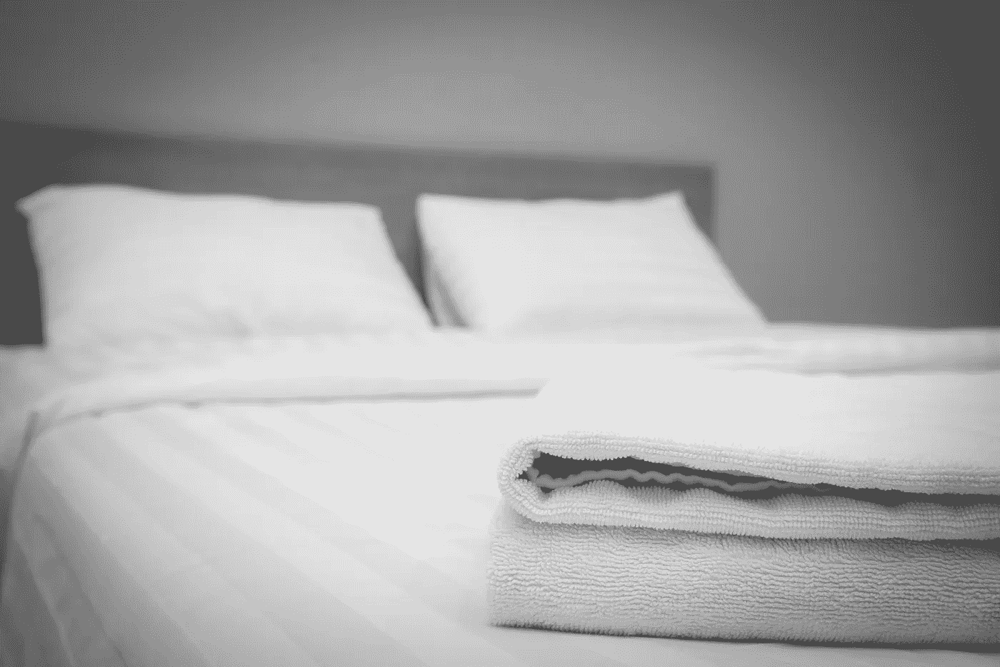
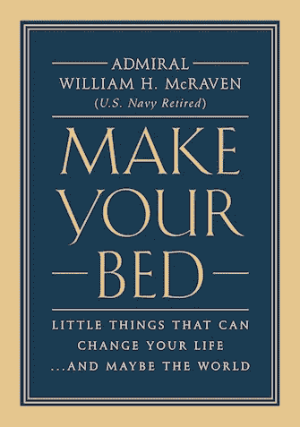

# 如果你想改变世界…从整理床铺开始

> 原文：<https://medium.com/hackernoon/if-you-want-to-change-the-world-start-off-by-making-your-bed-fd32e3475b3f>

## 独家摘录自[海军上将威廉·h·麦克雷文](https://twitter.com/billmcraven?lang=en)的[铺床](http://www.mcravenbook.com/)

2014 年 5 月 17 日，我很荣幸为奥斯汀的德克萨斯大学毕业班做毕业演讲。尽管这所大学是我的母校，但我担心一名职业生涯被战争定义的军官可能不会受到大学生的欢迎。但令我惊讶的是，毕业班接受了这个演讲。我从海军海豹突击队训练中学到的十条经验教训，是我发言的基础，似乎具有普遍的吸引力。这些都是克服海豹突击队训练的考验的简单课程，但是这十个课程对于应对生活的挑战同样重要——不管你是谁。在过去的三年里，我在街上被一些伟大的人拦住，他们告诉我他们自己的故事:他们如何没有在鲨鱼面前退缩，他们如何没有按门铃，或者他们如何每天早上整理床铺帮助他们度过艰难时期。他们都想更多地了解这十课如何塑造了我的人生，以及在我的职业生涯中激励过我的人。这本小书就是这样一种尝试。每一章都为个人课程提供了更多的背景知识，还增加了一个关于一些人的小故事，这些人用他们的纪律、毅力、荣誉和勇气激励了我。我希望你喜欢这本书！

# 完成一项任务，开始你的一天

海豹突击队基础训练的营房是一栋不起眼的三层建筑，坐落在加利福尼亚州科罗纳多的海滩上，距离太平洋只有一百码。楼里没有空调，到了晚上，开着窗户，就能听到潮水滚滚而来，海浪冲击沙滩的声音。

兵营里的房间很简朴。在我和其他三个同学合住的军官室里，有四张床，一个挂制服的壁橱，其他什么都没有。那些我待在军营的早晨，我会铺开我的海军“架子”,立即开始铺床。这是当天的第一项任务。我知道这一天将会充满整齐划一的检查、长距离游泳、长距离跑步、障碍训练和来自海豹突击队教练的不断骚扰。

“立正！”当教练走进教室时，班长，上尉低年级学生管事喊道。当一名军士长走近我的位置时，我站在床脚，并拢脚跟，站直了。教练严肃而面无表情，开始检查，检查我绿色制服帽子上的淀粉，确保八面“封面”是清晰的，正确的封锁。他的眼睛从上到下打量着我制服的每一寸。上衣和裤子上的折痕对齐了吗？皮带上的黄铜是否闪耀着镜子般的光芒？我的靴子擦得够亮吗，这样他就能在镜子里看到自己的手指了？他对我达到了海豹突击队实习生的高标准感到满意，然后过来检查了一下床。

床和房间一样简单，只有一个钢架和一个单人床垫。床垫上盖着一层床单，上面是一层床单。一条灰色的羊毛毯子紧紧地塞在床垫下，在圣地亚哥凉爽的夜晚提供了温暖。

第二张毯子被熟练地折叠成一个长方形放在床脚。灯塔为盲人制作的一个枕头，放在床的顶部中央，与床底下的毯子成 90 度角相交。这是标准。任何偏离这一严格要求的行为都会导致我“冲浪”，然后在沙滩上打滚，直到我从头到脚都被湿沙子覆盖——这被称为“糖饼干”

我一动不动地站着，从眼角的余光可以看到教练。他疲倦地看着我的床。弯下腰，他检查了医院的角落，然后检查了毯子和枕头，以确保它们正确对齐。然后，他把手伸进口袋，掏出一枚 25 美分的硬币，在空中抛了几次，以确保我知道床的最终测试即将到来。最后一次翻转，硬币高高地飞向空中，轻轻一弹落在床垫上。它从床上跳了几英寸，高得足以让教练用手接住它。

教练转过身来面对着我，看着我的眼睛，点了点头。他一句话也没说。把我的床整理好不会是一个被表扬的机会。这是对我的期望。这是我一天的第一项任务，做好它很重要。它展示了我的纪律。它显示了我对细节的关注，在一天结束时，它会提醒我做得很好，值得骄傲，不管任务有多小。

在我的海军生涯中，铺床是我每天都可以依赖的一件事。作为一名年轻的海豹突击队少尉，我在美国海军特种作战潜艇“格雷巴克”号上，被安置在医务室，那里的床有四层那么高。管理医务室的那个刻薄的老医生坚持要我每天早上起床。他经常说，如果床铺不整理，房间不干净，水手们怎么能指望得到最好的医疗服务呢？我后来发现，这种清洁和秩序的观念适用于军队生活的方方面面。

三十年后，纽约市的双子塔倒塌了。五角大楼被击中，勇敢的美国人死于宾夕法尼亚州上空的一架飞机中。

袭击发生时，我正因一次严重的跳伞事故在家中休养。一张病床被推进了我的政府宿舍，我花了一整天的时间躺在床上，试图恢复。我最想离开那张床。像每一个海豹突击队人一样，我渴望在战斗中与我的战友们在一起。

当我终于好到可以自己从床上爬起来的时候，我做的第一件事就是把床单拉紧，调整好枕头，确保医院的床对所有进入我家的人来说都是像样的。这是我展示自己战胜了伤痛，继续生活的方式。

911 事件后的四周内，我被调到白宫，在新成立的反恐办公室呆了两年。2003 年 10 月，我在伊拉克巴格达机场的临时指挥部。头几个月，我们睡在军用帆布床上。尽管如此，我还是会每天早上醒来，卷起睡袋，把枕头放在小床的床头，为新的一天做好准备。

2003 年 12 月，美军抓获萨达姆·侯赛因。他被监禁，在此期间我们把他关在一个小房间里。他也睡在军用帆布床上，但是有豪华的床单和毯子。我每天都会去探望萨达姆一次，以确保我的士兵们能好好照顾他。

> 我颇感有趣地注意到，萨达姆没有自己铺床。床罩在他的床脚总是皱巴巴的，他似乎很少想把它们弄直。

在接下来的十年里，我有幸与这个国家培养出来的一些最优秀的男女共事——从将军到士兵，从海军上将到海军新兵，从大使到打字员。部署在海外支持战争的美国人自愿前来，为保护这个伟大的国家牺牲了很多。

他们都明白生活是艰难的，有时你无法改变一天的结果。在战斗中，士兵死亡，家庭悲伤，你的日子漫长而充满焦虑的时刻。你寻找能给你安慰的东西，能激励你开始新的一天的东西，能让你在这个丑陋的世界中感到自豪的东西。但这不仅仅是战斗。日常生活也需要这种结构感。没有什么可以取代一个人的信念的力量和舒适，但是有时候整理床铺这个简单的行为可以给你带来开始新一天的动力，并让你满意地结束这一天。

> 如果你想改变你的生活，或者改变这个世界，从整理床铺开始吧！

更多信息，请查看威廉·h·麦克雷文上将的《铺床》。由 [出版*盛大中央出版社*](https://www.facebook.com/l.php?u=https%3A%2F%2Ftwitter.com%2Fgrandcentralpub&h=ZAQGsFawq&s=1) *出版。版权 2017 威廉·h·麦克雷文上将。*

*现已上市！*

[*亚马逊*](https://www.amazon.com/dp/1455570249/?tag=gcptracking-20) *，* [*巴恩斯&贵族*](http://www.anrdoezrs.net/links/8040641/type/dlg/http://www.barnesandnoble.com/w/make-your-bed-william-mcraven/1124481737?ean=9781478920380) *，* [*iBooks*](https://geo.itunes.apple.com/us/book/make-your-bed/id1144035945?mt=11&at=1l3vqKK)

更多信息:[http://www.mcravenbook.com](http://www.mcravenbook.com/)