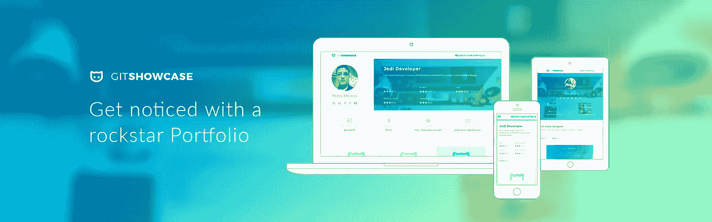

# 如果你是一个开发者，来获得你自己的摇滚明星组合！

> 原文：<https://medium.com/hackernoon/if-youre-a-dev-come-and-get-your-own-rockstar-portfolio-102cb30b8668>

## 查看 [GitShowcase](https://www.gitshowcase.com/) 并使用您的 GitHub 创建一个摇滚明星组合。

Git noticed with a rockstar Portfolio with GitShowcase

如果你不想阅读，只想看看它是如何工作的，就点击这里【https://www.gitshowcase.com/

你好。

我已经做了一段时间的全栈开发人员，构建网站、管理仪表板、应用程序、库，像许多开发人员一样，虽然我以此为生，但我从来没有抽出时间来构建自己的 web 组合。

> "鞋匠的儿子总是光着脚。"

创建自己的投资组合需要时间。首先，你必须在我们拥有的大量选项中选择技术。我会做出反应吗？棱角分明？PHP？露比？SEO 呢？我应该试试 node 吗？什么他们，我在哪里主持？一旦你决定并设置好一切，你必须手动列出你所有的项目，添加描述，链接，图片，并决定一个能展示你最好的设计。**突然间，创建一个漂亮的投资组合这个简单的任务变得势不可挡。**

两周前，我决定改变它。我总是努力为我的客户和承包商做高质量的工作，建立一个好的架构，让事情变得漂亮和易于使用。这是为我自己做的时候了！对我们所有人来说❤

# 我提出一个替代方案。

 [## GitShowcase

### 开发人员，在即插即用产品组合中展示您的最佳项目。最棒的是，免费的。

www.gitshowcase.com](https://www.gitshowcase.com/) 

GitHub 一直是开发者展示他们自己项目的平台，我想，如果我可以从我的 GitHub 中获取所有项目，推断信息并建立一个漂亮和专业的投资组合会怎么样？

Woooowwww!!!

考虑到这一点，我建立了一个初始原型，它工作了！！！

我的 GitHub 中有几个开源项目，如 [Premiere](https://hackernoon.com/consuming-restful-apis-with-premiere-ae712d1bc935#.p1t53oat8) 、 [Premiere Player](https://premiere-player.herokuapp.com/) 、 [PokeMTS](http://www.pokemts.com/) 和 [GitShowcase](https://www.gitshowcase.com/) 本身，其中大多数都指向一个有预览图片的网站(那些你在脸书、Twitter 上看到的图片，当你粘贴一个链接时)，所以当我登录时自动生成的文件夹已经准备好了。

我向我的几个朋友展示了我制作的原型，其中一位，Victor F. Santos ，一位 UI/UX 设计大师，发现这是一个很好的想法，并决定加入进来。有了 Victor 的参与，除了实现自动化之外，这个项目还有更好的可用性，并且*像钻石一样闪耀着光芒*

如果你是一名开发者或者在你的项目中使用 GitHub，我建议你试试 [GitShowcase](https://www.gitshowcase.com/) 。您可以导入您的项目，然后使用我们的仪表板进行定制。迄今为止，结果令人印象深刻。在第一个项目中，我们导入了令人难以置信的 4000 个项目，用户群保持快速增长。

> 我们希望**你们所有人**都加入进来，与我们分享这份精彩:)

我们对如何推进和改善我们的服务有许多想法，也希望听到您的意见。

如果你喜欢这篇文章或 GitShowcase 的想法，不要忘记推荐这篇文章，与你的朋友、同事分享你的爱，当然，在你的下一份工作申请中开始使用你的新 rockstar 作品集来展示你有多棒！

If you like this, remember to the love and recommend it ❤

你已经有了很棒的项目，是时候让世界了解它们了！

*感谢*[*Raz Karmi*](https://medium.com/u/59cd8f6aa571?source=post_page-----102cb30b8668--------------------------------)*为我们提供产品搜索*

> 黑客中午是黑客如何开始他们的下午。我们是这个家庭的一员。我们现在[接受投稿](http://bit.ly/hackernoonsubmission)并乐意[讨论广告&赞助](mailto:partners@amipublications.com)机会。
> 
> 如果你喜欢这个故事，我们推荐你阅读我们的[最新科技故事](http://bit.ly/hackernoonlatestt)和[趋势科技故事](https://hackernoon.com/trending)。直到下一次，不要把世界的现实想当然！

