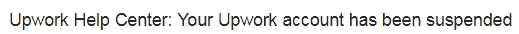
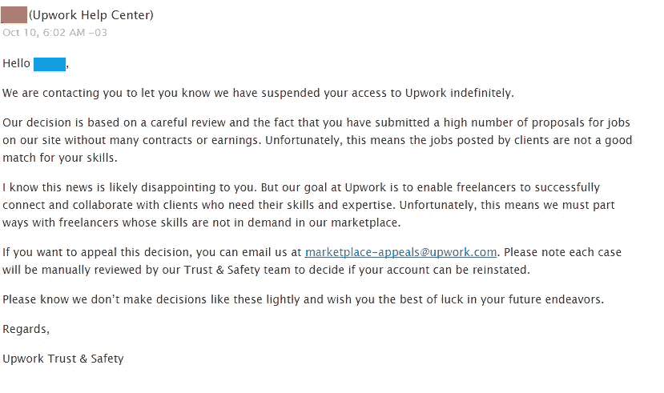
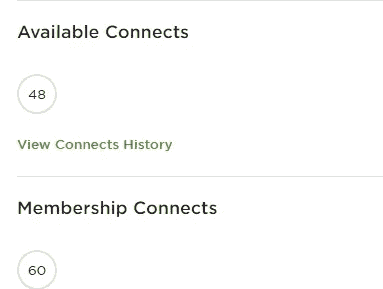
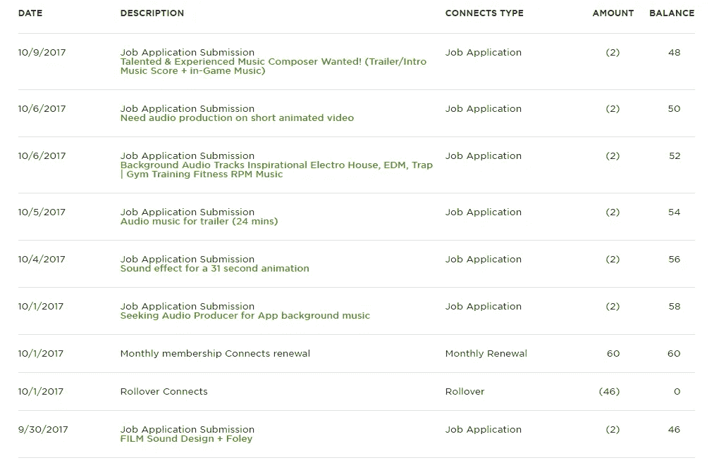
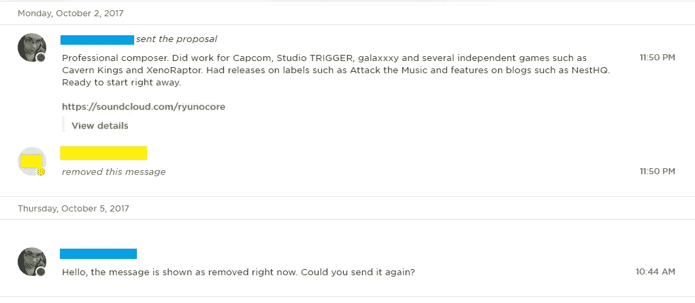
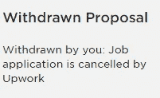
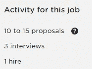
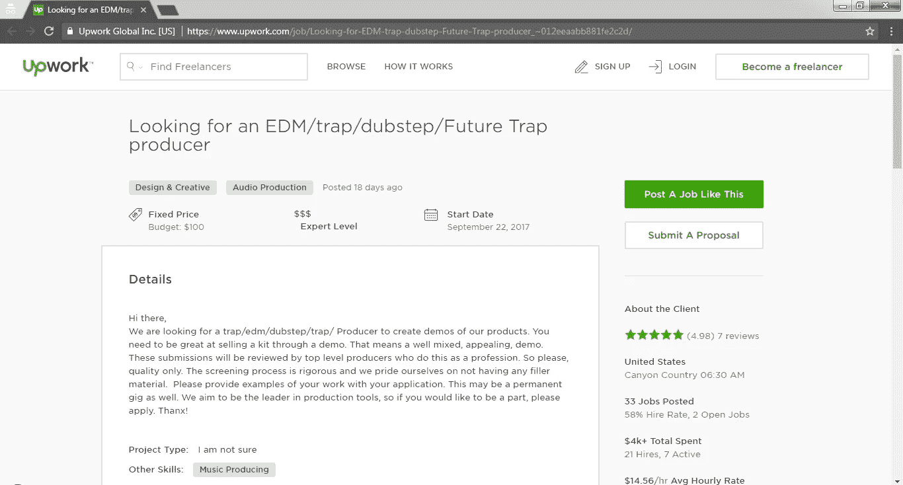
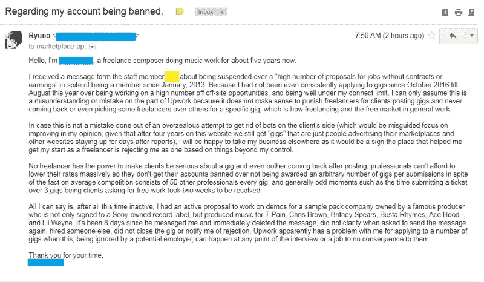

# 如果你是自由职业者，这可能会让你重新考虑

> 原文：<https://medium.com/hackernoon/if-youre-freelancing-on-upwork-this-might-make-you-reconsider-82f68039786c>

今天早上醒来时，我意外地收到了一封来自自由职业者网站的电子邮件:

作为一名自由职业者，我已经有 5 年的时间了，我已经习惯了定期收到工作邀请的垃圾邮件，平均每天 12 次，除了你会从这样的网站收到的正常自动通知。对于任何自由职业者来说，即使大多数潜在的工作都没有进展，竞争也很激烈，但通过电子邮件接收招聘信息非常方便，这样你就可以与未来的客户保持一致，而不必呆在电脑前刷新屏幕，因为我和其他任何人一样，可以做很多其他事情。客户可能并不总是意识到这一点，但自由职业者在某种程度上确实有自己的生活，即使我们在业余时间或假期接受和交付工作的倾向可能会让他们产生相反的想法。

收到这个通知的“意外”之处源于我**不记得做错了什么**。我无法想象为什么我会被暂停，因为我最近才开始再次使用该网站，自 2016 年 10 月以来一直在休假，主要是因为从事一些耗时的工作，让我没有时间去寻找更多的工作。

我的好奇心被激起了，所以我打开了电子邮件，想知道到底发生了什么。

I decided to censor out names because I value the Upwork employee’s privacy as much as my own and would not appreciate it if someone writing an article about the policies of a company I worked on resulted in blowback to me as a person.

不用说，我发现自己在反思自己是否以某种方式申请了集体演出*或诸如此类的事情。我很快就明白这不可能，因为 Upwork(前 oDesk)有一个系统，限制你可以同时申请多少个工作机会。该系统的工作方式是给你分配一定数量的“连接”，数量取决于你的账户状态(免费、付费等)，你通过申请工作来花费这些钱；这些积分在每月周期结束时得到补充。你不能把这些分数留到未来几个月，所以在任何一个月，你都可以得到一定数量的工作提议。到目前为止这很简单，对吧？*

**

*好吧，这很奇怪。我还剩 48 个连接。也许我们应该看看历史，以确保一切正常。*

**

*从这里的信息，我们可以推断出两件事:*

1.  *10 月份，我在 6 个应用程序中花了 12 次连接，费用为每 g 2 英镑；*
2.  *9 月份，我还剩 46 个连接，这意味着我总共申请了 7 次。*

*根据他们网站上的数据，在两个月的时间里，我总共申请了 60 份工作中的 13 份。那将是我被允许申请的总数的 21.6%，所以可以确定我没有到处发垃圾邮件。事实上，这意味着我每 4 天半申请一份工作，这对于自由职业者来说是非常温和的。*

*原来这里的关键词是**应用**。我没有收到这些客户的详细说明，也没有被告知我不适合这份工作，我也没有看到他们雇佣足够多的人，让他们觉得关闭广告很舒服。*

*这些广告中的一个让我觉得整个情况非常不寻常:当他们的广告仍然开放时，我可能没有收到其中 12 个的消息，但有一个工作申请已经升级为活动提案(这意味着客户看到了你的提案，并在承诺任何资金之前给你回信息讨论进一步的细节)。*

*这份工作是为一家公司制作合成器补丁库的演示，这家公司由一位著名的制作人经营，我在这里就不一一列举了。我不会像批评任何优柔寡断的企业家那样批评他的行为，上帝知道，到目前为止，这些人构成了接近自由职业者的大多数。然而，我要说的是，他与索尼有联系，并与 T-Pain 和布兰妮·斯皮尔斯合作过，所以我们不是在谈论一个普通的青少年，他有一个 SoundCloud 帐户，试图租用服务，后来决定太多了。*

*我在收到这条私人信息的两天内就找到并回复了它，因为 Upwork 根本没有向我的电子邮件发送通知，尽管他应该在我申请的同一分钟内就给我发了这条信息。*

**

*对我来说，这条消息被删除已经够奇怪的了，但在我写这篇文章的时候，在给他们发了一封电子邮件之后，我的提案页面从活动更新为:*

**

*等等，什么？要么是我退出了(我没有)，要么是工作申请被取消了。不可能两者都有。*

*然后我看到了更奇怪的事情:*

**

*你没看错:确实有一个人已经被录用了。只是为了确保这不是一个畸形的 bug，而且演出已经因雇佣而关闭，我继续隐姓埋名地去查看:*

**

*如你所见，这个职位仍然空缺。只是不适合我。这同样适用于一般的 Upwork。*

*我上网阅读了更多关于有类似情况的人的信息，并决定给他们发消息，充分意识到他们不想解决这个问题，因为这恰好是所有其他自由职业者与 Upwork 的恐怖故事的结局。*

**

*我收到了一条自动回复信息，提醒我前面提到的在要求免费工作的“演出”被从市场上移除之前的两周等待。*

*最后，这一切看起来似乎 Upwork 对客户是否会回来从平均 50 名竞争一份工作的自由职业者中挑选任何人不太感兴趣，他们更感兴趣的是自由职业者是“更接近的人”。在我离开之前，我有客户，或者我还有“关系”:他们不希望我申请，因为不管演出的质量或客户有多认真，他们都选择将发布演出后不返回网站的客户解释为不花钱选择任何人的客户，因为网站的质量水平。*

*他们完全忽略了任何从事零售工作的人可能会告诉他们的一点:**询问报价是免费的，说“*我过会儿过来拿”*也是免费的，而且再也不会回到商店，因为它比你想象的要贵**。如果客户缺乏兴趣或找不到他们确切想要的东西，这不是自由职业者的错，当策展的唯一标准是有多少雇主选择了你而不是你正确地申请了多少时，假设淘汰人才会导致成功是非常违反直觉的，**鉴于没有人保证你申请的工作会发现你是正确的候选人**。这就是被雇佣的方式，尤其是对于自由职业者。*

*这是否是一个清除质量用户群的尝试，或者如果我被无限期暂停，因为我是一个自由用户，他们不希望我像他们希望的那样坏，除了他们的百分比之外，每月支付他们我在那里参加的任何演出，我没有办法告诉或发现。*

*我知道，如果不告诉你为什么现在使用这个网站可能不符合你的最佳利益，我就无法继续我的一天。自由职业者与客户和其他自由职业者打交道已经够难的了，我们不需要与那些应该为我们提供与客户联系的适当框架的平台对抗，并在此基础上从每场演出中获得良好的服务。*

*更新:*

**

*Not surprised in the slightest.*