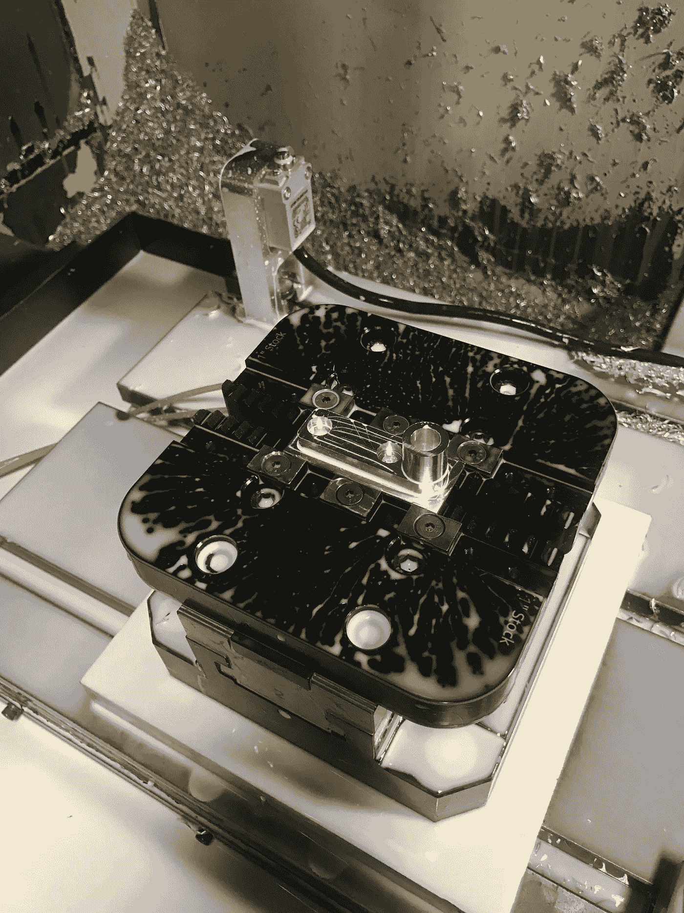
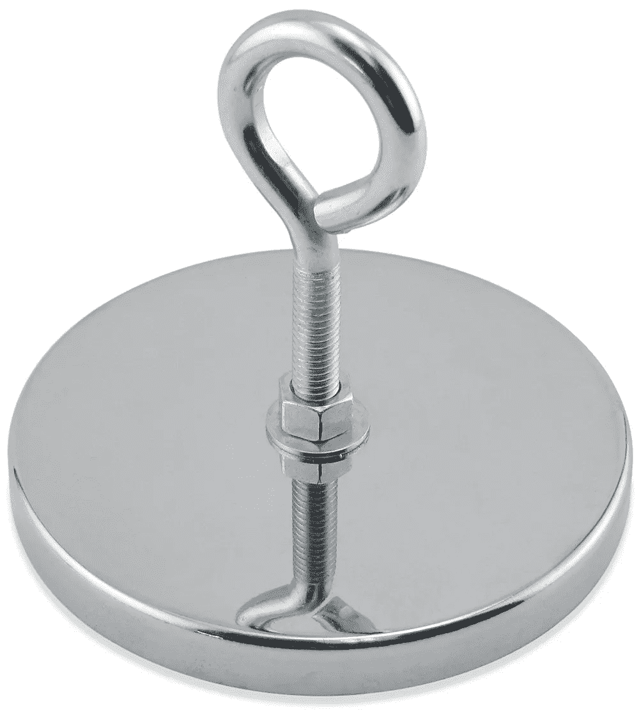
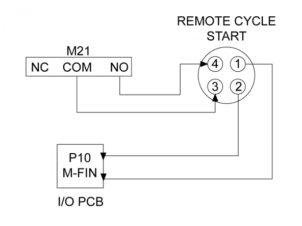
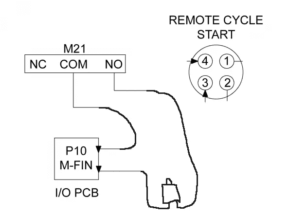
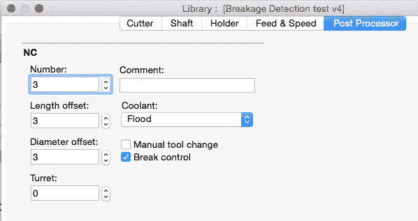

# Haas 的廉价破损刀具检测

> 原文：<https://medium.com/hackernoon/if-youve-got-an-older-machine-that-doesn-t-have-macros-or-a-probe-and-you-need-to-detect-broken-8da7d249825f>

如果你有一台没有宏或探针的旧机器，你需要检测坏了的工具，下面是如何做的。

# 基本思想

在工作台上安装一个限位开关，并将其位置保存为工作偏移量。将该开关连接到您的一个 M21–25 继电器和 M-Fin 引脚。每当你想检查一个损坏的刀具时，让你的程序调用一个子程序，该子程序快速到达开关，按下开关，并触发一个 M21，这将使机器等待 M-Fin 信号。如果按下开关，它会立即看到信号，并继续它的快乐之路。如果工具坏了，它会一直等到你来修理。这就是概述。以下是详细情况:

# 开关

你需要一个 IP67 等级的常开限位开关，这样你就可以用冷却剂喷洒它。我用的是 Automation Direct 的[这个](https://www.automationdirect.com/adc/Shopping/Catalog/Sensors_-z-_Encoders/Limit_Switches/Compact_Limit_Switches_(AEM2G_Series)/Metal_Plunger_Actuator/AEM2G11X11-3)。我加工了一块安装在桌子上，并用螺栓固定在远处的角落。



The position at which a tool will press the switch is saved as a work offset so you can send the tool to X0 Y0 Z0.

为了设置开关，将按钮闭合触点的点保存为工作偏移，这样您可以将[工具](https://hackernoon.com/tagged/tool)带到 X-Zero Y-Zero Z-Zero 进行触发。这个开关应该重复到 0.002”，但为了安全起见，我将 Z 零点设置为开关闭合点以下的 0.005”。

为了让机器不会吃掉电线，我使用了[这些方便的磁铁钩](https://www.amazon.com/gp/product/B00IYFOIRO/ref=s9_acsd_zgift_hd_bw_b16rhT_c_x_w?pf_rd_m=ATVPDKIKX0DER&pf_rd_s=merchandised-search-9&pf_rd_r=M5BHE05YVGPPSBZ8Z18E&pf_rd_t=101&pf_rd_p=18bf1809-501b-5b2c-ab7e-0653f9f1ed66&pf_rd_i=16412731)粘在外壳的内部(我可能会尝试通过一个夹在吊环螺栓上的铁锁来运行它们，以便更容易运行新电缆或修改设置):



# 给开关接线

说到电线，这对我来说是可怕的部分，因为在此之前，我从来没有把任何电线连接到[哈斯](https://hackernoon.com/tagged/haas)控制器上。我的机器有一个 M 功能端口，我认为是用于哈斯索引器。它使用一个 4 针 DIN 连接器，但我身边没有这样的连接器，所以我打开了橱柜，剪下了那些电线(如果我想的话，以后再重新连接就很容易了)。在你把它全部弄乱之前，这里是接线的样子:



The wiring as Haas intended it.

接好开关后应该是这样的:



The wiring as hacks like us intended it. If you need the M-Function port you can wire it up to retain this functionality. You’d just use another M-relay for the broken tool switch. It’s okay for multiple sources to fire the M-Fin signal.

# 代码

所以一旦你把所有东西都连接好了，你就需要告诉机器做你的破损检测。这涉及三个部分:

1.  您的子程序
2.  你的零件程序
3.  你的后处理器

## 您的子程序

```
O02030      (Tool Breakage Detection)
G53 G0 Z0\.  (retract Z to safe level)
G129        (set Tool probe Work Offset)
M5          (make sure spindle is stopped)
M9          (turn off coolant)
G0 X0\. Y0\.  (go to switch)
G0 Z.25     (rapid close to switch)
M8          (turn on coolant to blast chips away)
G1 Z0\. F10\. (slowly press switch)
M9          (turn off coolant)
M21         (waits for M-Fin signal)
G53 G0 Z0\.  (retract Z to safe level)
M99         (back to part program)
%
```

## 你的零件程序

每当您想要检测一个损坏的工具时，您需要您的 gcode 看起来像下面的代码。您只需调用检测子程序，然后在调用子程序之前重置先前的工作偏移量。

```
M98 P02030   (Call your subprogram)
G112         (Make sure to reinstitute your prior work offset)
```

## 你的后处理器

我使用 Fusion 360 进行 CAM，因此这些说明就是为了这个目的。请记住，我在这方面是一个超级新手，所以采取这些指示与一个强烈的警告，做自己的尽职调查。这对我有效，但对你可能无效。

Fusion 360 允许您打开特定工具的中断控制。



我修改了通用哈斯邮报。这是我摆弄它之前的样子。对我来说，这个块从第 1889 行开始:

```
case COMMAND_BREAK_CONTROL:
    if (!toolChecked) { // avoid duplicate COMMAND_BREAK_CONTROL
      onCommand(COMMAND_STOP_SPINDLE);
      onCommand(COMMAND_COOLANT_OFF);
      writeBlock(
        gFormat.format(65),
        "P" + 9853,
        "T" + toolFormat.format(tool.number),
        "B" + xyzFormat.format(0),
        "H" + xyzFormat.format(properties.toolBreakageTolerance)
      );
      toolChecked = true;
    }
```

我把它改成了:

```
case COMMAND_BREAK_CONTROL:
    if (!toolChecked) { // avoid duplicate COMMAND_BREAK_CONTROL
      onCommand(COMMAND_STOP_SPINDLE);
      onCommand(COMMAND_COOLANT_OFF);
      writeBlock(mFormat.format(98), "P" + "02030");
      if (currentWorkOffset < 6) {writeBlock(gFormat.format(53 + currentWorkOffset));
      } else {
      {writeBlock(gFormat.format(103 + currentWorkOffset));
      }
      }
      toolChecked = true;
    }
```

一些解释:这只是在刀具检查应该去的地方插入子程序调用，然后用当前的工作偏移量跟踪它。我的机器喜欢 G54-G59 和 G110-G129，因此 if 语句只是寻找 Fusion 360 的 WCS 偏移，并输出正确的范围。如果你使用 G154 偏移，你会想要重写那部分。

# 最后

原来如此。如果你有任何改进的想法，请告诉我。这在我的平面铣刀上不起作用，因为它只在中心点检测，但是你可以在子程序中建立一些逻辑来为某些刀具偏移 X-0Y-0。祝你好运。

[](http://bit.ly/HackernoonFB)[](https://goo.gl/k7XYbx)[](https://goo.gl/4ofytp)

> [黑客中午](http://bit.ly/Hackernoon)是黑客如何开始他们的下午。我们是 [@AMI](http://bit.ly/atAMIatAMI) 家庭的一员。我们现在[接受投稿](http://bit.ly/hackernoonsubmission)，并乐意[讨论广告&赞助](mailto:partners@amipublications.com)机会。
> 
> 如果你喜欢这个故事，我们推荐你阅读我们的[最新科技故事](http://bit.ly/hackernoonlatestt)和[趋势科技故事](https://hackernoon.com/trending)。直到下一次，不要把世界的现实想当然！

