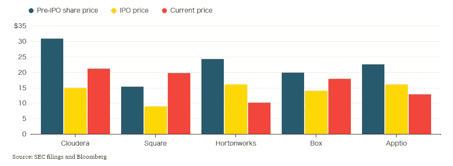
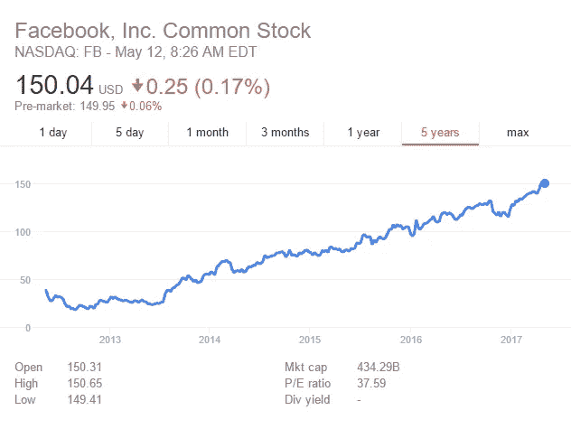

# 忽略 Cloudera:收购科技初创公司与价格无关，而是与公司的契合度有关

> 原文：<https://medium.com/hackernoon/ignore-cloudera-tech-startup-acquisitions-arent-about-price-they-re-about-company-fit-6a8822bd3fcb>

The debate about a tech bubble is distracting

最近一连串关于科技行业价格下跌的恐慌故事不仅是错误的，而且是不相关的。

如果你是一个寻求收购初创公司的企业投资者，这最新一轮的媒体噪音、流言蜚语和闲聊会分散你的注意力。

与其纠结于市场以及是否有新出现的泡沫，你最好还是退一步；给自己一个机会，不要问 Snap、Cloudera 或 Alfa 财务软件的价格是否合理，而是问——作为一名投资者——这对*你*来说是否合理。

> 如果你看看五只表现不佳的科技股，它们的价值下跌可能更多地与它们各自的商业策略有关，而不是总体市场状况

这是因为价格不是孤立存在的。价格是市场在任何一个特定时间点准备为一个企业的股份支付的指示。更重要的是，价格反映了收购者认为自己能从收购目标身上获得的价值。因此，与其试图从公司外部寻找创业目标的价值，不如先看看内部。

## **科技是一个快速发展的世界，故事也是如此**

最近这一轮歇斯底里始于彭博的一篇文章，这篇文章讲述了一系列可能以低于 IPO 前估值的价格上市的初创公司。Cloudera 被称为第一家以“显著”低于其私人估值的价格上市的科技独角兽。还参考了 HortonWorks 和 Apptio。

The original graph from the Bloomberg article

但是，这里真正的新闻是什么？公司的价格和价值一直在波动。有些上升，有些下降。这通常是因为一家公司的个别战略已经成功或失败，其收入增长或萎缩超出预期，或者其前景是积极或消极的。

> 对于你能找到的每一家上市后估值下降的公司，你可能都能找到另一家估值上升的公司

很难(如果不是不可能的话)从公司估值的个别情况中解脱出来，并得出更大、更广泛的结论——尤其是关于像技术领域这样多样化和广泛的行业。如果你看看五只表现不佳的科技股，它们的价值下跌可能更多地与它们各自的商业策略有关，而不是总体市场状况。

对于你能找到的每一家上市后估值下降的公司，你可能都能找到另一家上涨的公司。脸书就是一个恰当的例子。自 2012 年上市时市值达到约 1000 亿美元的峰值以来，该公司市值已增长逾 4 倍。目前其市值超过 4300 亿美元。在它上市的时候，你可以找到很多关于科技泡沫的可怕故事，以及脸书是如何成为又一个被高估的科技公司最终会崩溃的例子。

Five-year view of Facebook’s price on the NASDAQ (source: Google Finance)

当它宣布以 10 亿美元收购 Instagram 时，也发生了同样的反应。他们大错特错了。

## **从私有到公有，价格上涨是很自然的事情**

你还会听到很多私营科技公司的估值在各地飙升。

我们可能会认为，这种波动是市场出现问题的信号。所以，或许，并不是 Cloudera 的价格下降了，而是下降了这么多这么快。但这也不清楚。**当一家公司是私有企业，或者从私有企业上市时，价格上涨是很自然的事情。这不是波动。称之为“价格暴涨”根本就不正确。**

**这些价格波动只是反映了这样一个事实，即私有公司通常只在标志性事件**时估值，比如融资、收购或首次公开募股。这些里程碑式的事件之间可能会相隔很长时间，通常是几年，这意味着公司的真正价值在大部分时间里是被隐藏的；而上市公司在公开市场上每天都被估价，这意味着价格下跌通常遵循平滑的下降曲线。这通常足以解释表面上看起来迅速、直接的价值变化。

## **恐怖故事的风险，以及它们真正重要的原因**

所有这些围绕科技初创公司价格的媒体噪音的风险在于，它会分散战略投资者做出正确决策的注意力。您可以从两个方面看到这种情况。一方面，大公司的首席财务官可能会被收购一家初创公司的故事吓跑，认为市场调整即将到来，他们最终可能会破坏价值。另一方面，他们可能会横扫市场，在没有做足够尽职调查的情况下，以他们认为便宜的价格收购一家初创公司。

> 当一家公司寻求投资或收购一家初创公司时，他们不应该首先考虑更广阔的市场，而是应该考虑目标公司将为他们提供什么价值

这两个都不对。当一家公司寻求投资或收购一家初创公司时，他们不应该主要考虑更广泛的市场，而是应该考虑目标公司将为他们提供什么价值:投资或收购将产生的协同效应，以及目标公司如何帮助公司转型以跟上数字化变革的步伐。这就是为什么一家看起来很小或无足轻重的目标公司实际上可以对合适的公司获得很高的估值和价格。

In retrospect Google’s acquisition of Android seems like a fantastic strategic move

例如，2005 年，谷歌斥资 5000 万美元收购了一家小公司，当时很少有人知道这家公司，它在手机软件流行之前就已经开始为手机开发软件了。它只存在了 22 个月。许多评论家无法理解这项收购，并指责谷歌犯了一个战略错误。是什么公司？安卓。它已经成为世界上领先的移动电话操作系统，在全世界超过 16 亿台设备上使用。

虽然这个价格在当时看起来很高，但事实并非如此。**随着消费者越来越多地采用手持设备，谷歌有一个将其服务带到移动端的愿景，而 Android 是其战略中的关键一环**。对于另一家公司来说，Android 值 5000 万美元吗？也许不是，但对谷歌来说是值得的，因为这是一个伟大的战略契合，并使谷歌释放出巨大的潜在价值。

## **几乎任何价格都可以是合适的价格**

由此得出的教训是，几乎任何价格都可能是合适公司对合适资产的合适价格。

越来越难以跟上最新技术发展步伐的企业投资者，需要审视自己的公司，制定一项战略，为未来进行自我转型，然后——也只有到那时——走向市场，寻找一个良好的战略契合点，首先忽略价格，甚至在某些情况下忽略数字。价格会分散寻找合适公司的注意力，而这才是真正重要的。

> 由此得出的教训是，几乎任何价格都可能是来自合适公司的合适资产的合适价格

在这家公司被发现后，公司可以开始问一些关于价值的难题:我们有什么历史价值信息？我们能把这家公司与其他类似的竞争对手进行比较吗？最重要的是，这次收购将给我的公司带来什么样的战略价值？

企业需要找到一家像手套一样适合他们公司的初创公司，并同意一个价格和条款，在考虑所有其他价值因素的情况下，这个价格和条款是合理的。如果企业能够做到这一点，它们将最有可能找到适合自己的变革性收购目标。然后他们必须执行，这是另一篇文章的主题…

Paul Cuatrecasas 是总部位于伦敦的投资银行 Aquaa Partners *的首席执行官兼创始人，该银行致力于帮助成长型企业寻找并收购合适的科技公司。*

*请访问:*[*http://aquaapartners.com*](http://aquaapartners.com)，了解更多有关 Aquaa Partners 如何为您提供帮助的信息

> [黑客中午](http://bit.ly/Hackernoon)是黑客如何开始他们的下午。我们是阿妹家庭的一员。我们现在[接受投稿](http://bit.ly/hackernoonsubmission)并乐意[讨论广告&赞助](mailto:partners@amipublications.com)的机会。
> 
> 如果你喜欢这个故事，我们推荐你阅读我们的[最新科技故事](http://bit.ly/hackernoonlatestt)和[趋势科技故事](https://hackernoon.com/trending)。直到下一次，不要把世界的现实想当然！

