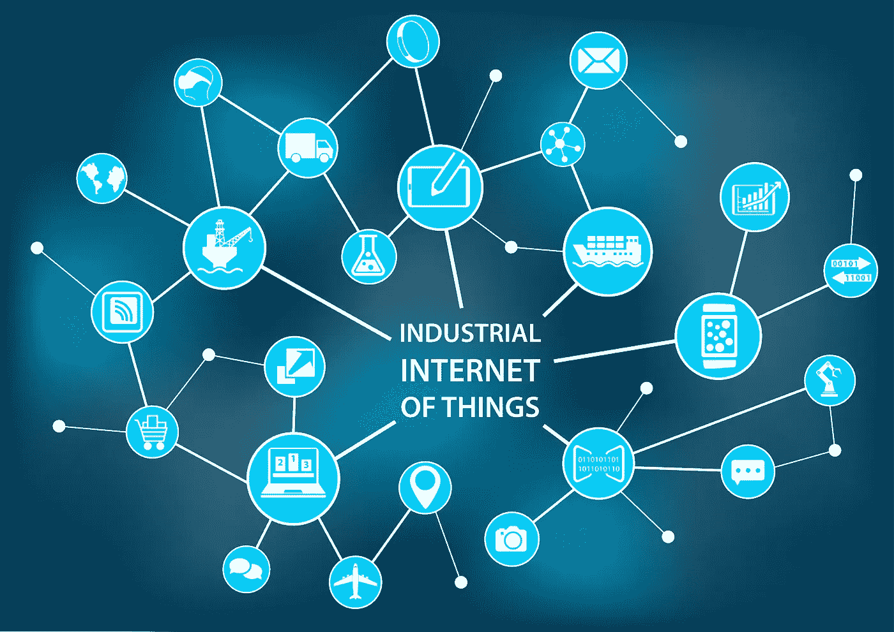

# 2017 年值得关注的趋势

> 原文：<https://medium.com/hackernoon/iiot-trends-to-watch-out-for-in-2017-96c498d39017>

# 趋势 1:更多工业设备处于边缘

物联网的边缘是行动的地方，因为它包括一系列广泛的传感器、执行器和设备，与网络保持实时通信。边缘计算代表了计算的一种转变，来自云的智能被推到边缘，[本地化](https://hackernoon.com/tagged/localizing)决策和分析。由于设备处于边缘，它们将不会受到网络延迟的影响，并且通过选择性地将适当的数据中继到云，减少的流量将实现更快的响应时间。与[网络](https://hackernoon.com/tagged/network)拓扑中的任何其他层相比，边缘具有更多的特性和执行更多的功能。

# 趋势 2:高级分析、人工智能和机器学习成为 IIoT 推动者

在各个行业，高级分析、机器学习和人工智能的应用正在颠覆传统的制造方法。制造商可以通过使用机器学习获得对生产的预测洞察力，从而变得更具竞争力。通过使用高级数据分析和人工智能，制造商可以结合来自许多传感器的输入，梳理数据，找出任何设备故障和其他潜在问题。随着时间的推移，该技术将能够增强其检测故障的能力。

> 工业物联网(IIoT)是一种变革性的制造战略，有助于提高行业的质量、安全和生产率。[阅读更多 ](https://www.happiestminds.com/Insights/industrial-iot/)

# 趋势 3:利用增强和虚拟现实

基于模拟器的培训是培训工厂员工的有效方法。支持 IIoT 的技术，如游戏、增强/虚拟现实、3D 沉浸式和可穿戴设备，可以通过复制现实生活中的工厂场景来改善学习并帮助培养技能。应用包括软件的测试和验证，帮助系统迁移等。这项技术可以帮助制造商了解员工在最坏情况下的反应，从而规划应急程序。罗克韦尔自动化的工业聊天机器人、亚马逊的 Alexa 和微软的混合现实 Hololens 平台都是消费技术在工业领域应用的例子。

# 趋势 4:数字双胞胎将成为新的规范

随着 IIoT 的发展，制造商将不得不花费大量时间在地板上测试新系统。虽然联网会有所帮助，但创建产品/服务的数字双胞胎，并在投入使用前在虚拟环境中对其进行彻底测试，也将有助于制造商避免停机问题，并节省他们投入实际资源的时间。此外，这将有助于他们在投入使用之前解决工厂车间的问题，并允许持续的设计和制造改进。来自集成传感器的实时数据可用于分析任务，如状态监控、故障诊断、规定和 [**预测分析**](https://www.happiestminds.com/Insights/predictive-analytics/) 。我想我想要一个双人间！在他身上做实验会很酷。

# 趋势五:网络安全将成为必备

根据 [**Tripwire**](https://www.tripwire.com/company/press-releases/2017/03/tripwire-study-96-percent-of-it-security-professionals-expect-an-increase-in-cybe/) 的一项调查，组织中近 96%的安全专业人士预计对 IIoT 基础设施的网络攻击会越来越多。虽然绝大多数人认为有必要增强现有的基础设施，但更多的人认为他们没有为此类攻击做好充分准备。最近通过 [**WannaCry 病毒**](http://www.telegraph.co.uk/technology/2017/05/15/nhs-cyber-attack-latest-authorities-warn-day-chaos-ransomware/) 爆发的全球勒索病毒对 150 个国家的数十家 NHS 信托机构造成了严重破坏，并攻击了数千台计算机，这凸显了随着联网设备数量的迅速增加，加强各行业网络安全的必要性。Blob 想知道为什么当局称这种病毒为“WannaCry”。他们是在提问还是在暗示结果？

*原帖发布* [***此处***](https://www.happiestminds.com/blogs/transformers-on-the-factory-floor-and-other-iiot-trends-to-watch-out-for-in-2017/) *。*