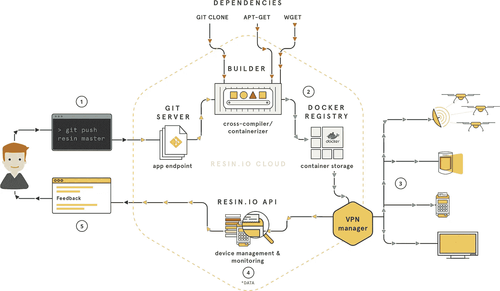
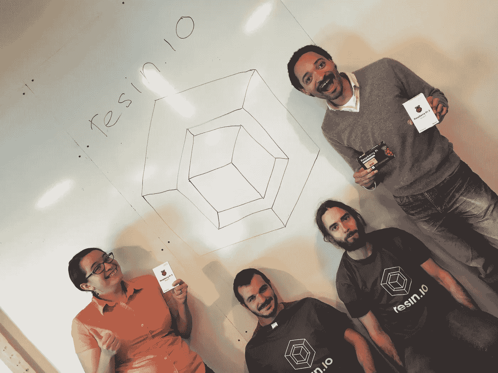

# 我是 resin.io 的粉丝，你也应该是

> 原文：<https://medium.com/hackernoon/im-a-resin-io-fanboy-and-you-should-be-too-2b70e90b0710>

## TL；博士:物联网有很多的谎言，但是这些家伙是合法的。试试它们，你会爱上它的。

You do (1). They do the rest.

****更新:* [*尸. io*](http://resin.io) *送来的赃物！请参见下面的更新。****

不，我不是在说[爪哇树脂](http://resin.caucho.com/)。我说的是 IoT [resin.io](http://resin.io) 。

Resin.io 让在一系列设备上部署应用变得轻而易举，包括 Pi、Arduino，甚至是相当强大的英特尔 NUC。他们已经[支持十几个设备系列](https://docs.resin.io/hardware/devices/)，并且新的设备也在不断地被支持。

在网络上，基于云的部署已经取得了很大进展，有了诸如 [Heroku](https://www.heroku.com/) (易于使用)[AWS elastic beanstalk](https://aws.amazon.com/elasticbeanstalk/)([具有 CloudFormation 扩展的无限能力](https://www.youtube.com/watch?v=e_DqV1xdf-Y))[drie.co](https://drie.co/)(安全)和 [now](https://zeit.co/now) (每次部署一个 URL)。

现在想象一下上面所有的，但是使用物理翻转硬件。那就是 [resin.io](http://resin.io) 。

Kicking ass and taking names

# 球形产品

[它。只是。作品。](https://resin.io/how-it-works/)

1.  用他们漂亮的[蚀刻机](https://www.etcher.io/)工具烧掉你的 SD 卡。

2.将 SD 卡插入您的设备

3.打开设备(并将其连接到互联网)

4.参见 [resin.io](http://resin.io) web 仪表板上的装置

5.通过“git 推送”部署您的软件

软件更新很容易，全舰队，快如闪电(见亲提示)。大多数事情都可以通过他们的网络仪表板来完成。对于高级用户，一切都可以通过 API、CLI 和 [SDK](https://resin.io/blog/resin-io-sdks/) 获得。

别误会，这一切都不是一夜之间发生的。预蚀刻机，从 ISO 烧 SD 卡有点麻烦。偶尔也会有麻烦，比如查看你的日志超过了仪表盘上显示的 100 行左右(见专业提示)。

尽管总的来说，他们在过去的几年里坚持不懈地关注他们的用户，这是显而易见的。

# 狂热的支持

自定义 linux 内核头文件编译有问题吗？他们的工程师将与你一起工作，立即支持用例(直到它完成，这是棘手的)。然后，他们会将问题添加到待办事项中进行永久修复(您可以看到！，参见下面的透明度)。然后他们会通知你最新情况。

我们提出的问题总是倾向于在几个小时内，或者最多第二天出现在文件中。毫不奇怪，我们几乎没有理由再联系支持部门了。

老实说，这已经到了我们**希望**到 [RTFM](http://www.catb.org/jargon/html/R/RTFM.html) 的地步，因为它做得太好了，他们的支持太好了，我们不会觉得我们在浪费它。

## 更新— 2016-10-07

按照他们狂热支持的传统，我们今天收到了一个爱心包裹(来自希腊雅典)！

Send more swag (T-shirts)!

# 透明度

除了 web dashboard，其他都是开源的。努夫说。

他们的整个问题积压在那里，任何人都可以看到和评论。如果这不是透明，我不知道什么是透明。⁴

这是一家科技公司，所以不出所料，这家公司非常白人化，而且非常男性化；但是，即使这样，在团队页面上也是透明的。:-p

# 结论

如果你是…

*   等着试[树脂. io](http://resin.io) →不要。
*   想着我为自己的死不悔改而感到羞耻。
*   奇怪我为什么一直说 resin.io → [这里](https://www.youtube.com/watch?v=XK6_CH1cH3M&t=0m30s)。

顺便说一句，如果人们想开一个会议，就让它发生吧。我已经就这个问题纠缠了罗纳德和马库斯一段时间了。**下面做评论！**

## 专业提示

*   更快的部署:因为它都是基于 docker 的，所以如果您有很大的依赖性，您可以使用您自己的映像，在 docker 注册表上进行预编译。比如[我们用 OpenCV3](https://github.com/biobright/resin-raspberrypi3-opencv3) 做到了这一点。
*   日志:通过管道将脚本输出到一个文件，或者尝试使用一个[低级工具](https://github.com/resin-io/resin-device-logs)。
*   图像大小:使用阿尔卑斯山为微小的图像[ [博客](https://resin.io/blog/brand-new-distro-for-resin-base-images/) ]。

## 脚注

[1]我和 [resin.io](http://resin.io) 没有关系。过去两年，我和我的团队每天都在使用 [resin.io](http://resin.io) 。越来越好了。没拿过赔偿(更新:除了一些赃物……感谢 [resin.io](http://resin.io) )。从来没有人要求/提示我写这篇文章。我只是喜欢他们的产品。

[2] OMG，[电子](http://electron.atom.io/)在动作。# [BobbySqueal](https://www.youtube.com/watch?v=dswOcb7pn6g)

[3]在他们的蓝/绿部署中， [resin.io](http://resin.io) 编译一切，推送更新，然后用新代码重启容器。简单的想法，但在实践中如此强大。

[4]他们几个月前关闭了 B 轮[新闻](http://www.geekwire.com/2016/resin-io-seattle-devops-vendor-scores-9m-funding/)。如果风投毁了他们，我会血债血偿的。

Seriously, show [resin.io](http://resin.io) some love!

> [黑客中午](http://bit.ly/Hackernoon)是黑客如何开始他们的下午。我们是 T21 家庭的一员。我们现在[接受投稿](http://bit.ly/hackernoonsubmission)并乐意[讨论广告&赞助](mailto:partners@amipublications.com)机会。
> 
> 如果你喜欢这个故事，我们推荐你阅读我们的[最新科技故事](http://bit.ly/hackernoonlatestt)和[趋势科技故事](https://hackernoon.com/trending)。直到下一次，不要把世界的现实想当然！

