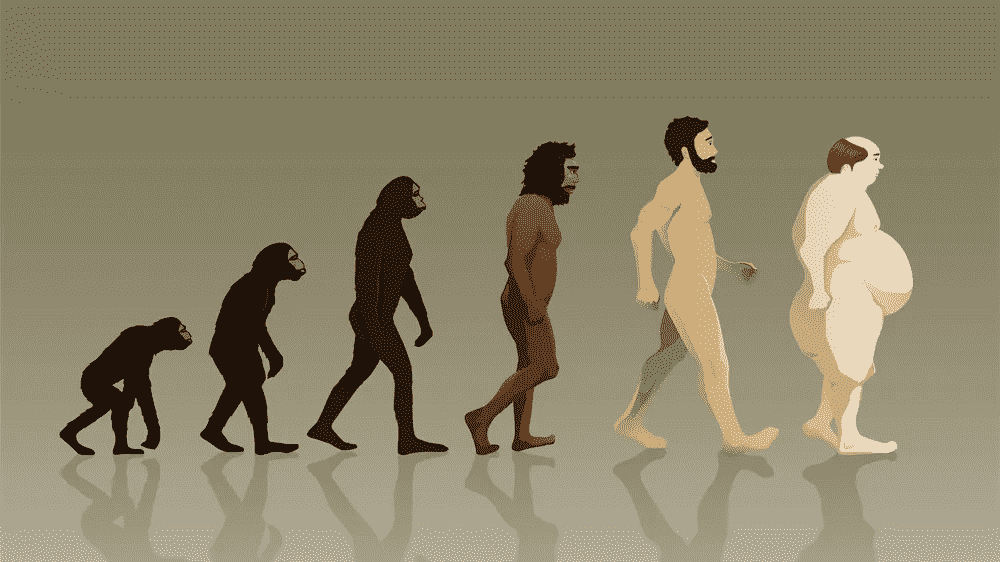

# 我禁食是为了预防癌症，更健康

> 原文：<https://medium.com/hackernoon/im-fasting-to-prevent-cancer-and-be-healthier-a376d691a34d>

*(原载于* [*我的简讯*](http://www.leade.rs/loicnewsletter) *—这里有* [*往期*](/@loic/loic-s-new-startup-newsletters-858fa634d270#.ema799prr) *)*

如你所知，我喜欢实验，尤其是对我自己。

上周，我写了关于冰人维姆·霍夫的文章，他告诉我他一天只吃一顿饭。我做了一些关于间歇性禁食的研究，发现[只有](http://www.allaboutfasting.com/benefits-of-fasting.html) [有益](http://www.lifehack.org/articles/lifestyle/10-benefits-of-fasting-that-will-surprise-you.html)。

科学研究发现[禁食可以在仅仅 3 天内再生你的免疫系统](http://www.telegraph.co.uk/science/2016/03/12/fasting-for-three-days-can-regenerate-entire-immune-system-study/)。大隅良典刚刚因为对“自噬”的研究获得了诺贝尔奖他发现细胞在饥饿期间完全再生并消灭入侵的病毒和细菌。它可以帮助对抗癌症、传染病、免疫性疾病、神经退行性疾病和衰老。

我决定尝试间歇性禁食，除了正餐，我什么都不吃。

头两天我还挺饿的。我也有点暴躁。下午，我有些难以集中注意力。然后第三天我的身体习惯了，没有饥饿的迹象，所以我连续做了 6 天。我感觉棒极了，体重也减轻了不少。我知道，我失去了大部分水分。

更多的朋友告诉我，我应该做一个真正的快速，所以我也尝试了。

我刚刚连续禁食了 72 个小时！我不知道我能做到。多亏了 6 天的间歇禁食，我的身体已经习惯了。3 天没吃东西，只喝水。我觉得非常清晰和轻。我又开始只吃晚餐了。我似乎不再需要早餐或午餐了。

我在 8 天内瘦了 6 公斤(约 13 磅)。那些会很快回来。

我记得当我做我的 [10 天静默冥想](https://www.dhamma.org/en-US/about/vipassana)静修时，我们每天只吃一顿饭，这对保持你的身心安静很有好处。我真的很想再做一次这样的静修。

说到实验，整整一年前，我用我的第一份简讯开始了这个实验。我一年写了 [32 封邮件](/@loic/loic-s-new-startup-newsletters-858fa634d270#.uwixu77rq)。我不知道我今天会为 20，000 人写作，开放率约为 35%。谢谢你跟踪我。

我希望我能早点开始。这封电子邮件现在是我与朋友和社区沟通的主要方式。

我认为电子邮件已经死了，一切都将转移到社交网络。令人惊讶的是我错了这么多。当我给学生做报告时，我分享的第一个建议是创办一份时事通讯。

我开始了这篇时事通讯来分享我是如何建立我的新公司的，但是它对我来说变得更重要了。随着许多朋友的反馈，它不知何故成了我的公开日记。它迫使我每周左右停下来，反思我已经做了什么，正在做什么，打算做什么。

附言:如果你有禁食的好经验，请告诉我，为什么不在我的帖子上留下评论呢？你也可以点击回复。

另外，我们在 12 月 6 日在三藩市举办的[正念与冥想活动中有一些席位，并把 4 月 11 日至 12 日的](http://events.leade.rs/)[巴黎领袖活动改为只邀请](http://www.paris.leade.rs/#about-1)。如果你想被邀请，请告诉我。

谢谢！

Loic

喜欢这个帖子？[订阅我的简讯](https://www.leade.rs/loicnewsletter)。

> [黑客中午](http://bit.ly/Hackernoon)是黑客如何开始他们的下午。我们是阿妹家庭的一员。我们现在[接受投稿](http://bit.ly/hackernoonsubmission)并乐意[讨论广告&赞助](mailto:partners@amipublications.com)机会。
> 
> 如果你喜欢这个故事，我们推荐你阅读我们的[最新科技故事](http://bit.ly/hackernoonlatestt)和[趋势科技故事](https://hackernoon.com/trending)。直到下一次，不要把世界的现实想当然！

