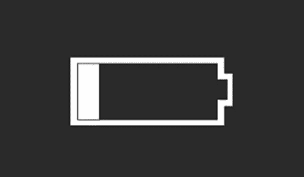

# 抱歉，Surface，但我再也不能了。

> 原文：<https://medium.com/hackernoon/im-sorry-surface-but-i-just-can-t-anymore-62de1c94bb6b>

That’s nice, but I’M not the one, who won’t charge.

亲爱的微软 Surface:

我真的很努力去做这件事。你知道我做到了。但是我再也不能了。

我会说，“不是你，是我，”但我们都知道是你。

这并不是说你没有很多优秀的品质。你知道。我的意思是，虽然这可能开始是一种便利的关系，一种反弹，如果你愿意的话——在 Macbook 因为几滴水而离开我之后——你很快被证明不仅仅是一个更便宜的替代品。

你体重很轻，而且——我敢说——有点性感？你用你的智能笔诱惑了我，你让我用一个音符来强调和记笔记。我仍然喜欢那样…我将永远喜欢那样。你不仅能喝几滴水，我永远不会忘记那次服务员把一整瓶水泼在你身上，而你只是继续喝，就像什么都没发生一样。对此我将永远心存感激，就像我们第一次向微软寻求帮助时，微软换掉了你一样——没有问任何问题——上帝知道，苹果的天才们不会这么做。

但这些都不能弥补你有充电问题的事实。不仅仅是充电的问题。我已经记不清有多少次我需要你陪在我身边，结果却被你中途打断。所有的夜晚我都以为你在家里充电，结果却发现，你是[“插上电源[但]不充电”](https://www.microsoft.com/surface/en-us/support/warranty-service-and-recovery/surface-wont-turn-on-battery-wont-charge?os=windows-10&=undefined#batteryw10)…一点也不。而且，如果你像 Mac 那样只使用电源线，也没什么大不了的。但是不行，你不能做*那个*。

上帝知道，我试着支持你…帮你度过难关。我给你买了新电线，试了所有[留言板](/@jihoelzer/think-im-making-this-up-a51989750d39#.60wprwe1e)上说我应该试的东西。我们卸载并重新安装了驱动程序。下载的更新。我甚至尝试了“替代疗法”还记得外用酒精和棉签吗？但是你在乎吗？没有。不管我做了什么，你都拒绝收费。直到有一天，我完全不能让你兴奋。

我当时应该走开——哦，回到过去——但是微软说服我们再试一次。“一个新的开始，”他们说。我承认，有一段时间情况有所好转。但是没过多久，你的充电灯就不亮了，于是我又一次给你买了一个新充电器。是的，我知道它需要坐平，但为什么坐平这么难？苹果用磁铁，为什么不能直接用磁铁？！！你知道你对我做了什么吗？如果没有…还记得我是如何把你平衡在馅饼冷却架上，放在凳子上，就在厨房墙上插座下面几英寸的地方，因为这是我能让你放下“插上电源，但不充电”的废话，只充电的唯一方法。

然后我们买了扩展坞，你知道吗？我真的以为这次我们会成功的。当然，你增加了一些体重。(我在骗谁呢？你的体型翻了两番。)但是，这对我来说无所谓。你在充电，谁不喜欢多几个 USB 接口呢？但是还不到三个月，我就在这里，在房子里跑来跑去，寻找一个可以偷的带交流适配器的电器，只是为了让你执行基本的功能。我没有自尊吗？我就像一个相互依赖的海报小孩。

我不能再这样生活下去了。

所以，就这样了。我不干了。我们暂时会让它工作，但是一旦我有了钱，我就要回到 MacBook。我知道这意味着吸管杯和不智能的笔，但至少我知道，我总能让他兴奋。

代我向 Cortana 问好，

珍

> [黑客中午](http://bit.ly/Hackernoon)是黑客如何开始他们的下午。我们是 [@AMI](http://bit.ly/atAMIatAMI) 家庭的一员。我们现在[接受投稿](http://bit.ly/hackernoonsubmission)并乐意[讨论广告&赞助](mailto:partners@amipublications.com)机会。
> 
> 如果你喜欢这个故事，我们推荐你阅读我们的[最新科技故事](http://bit.ly/hackernoonlatestt)和[趋势科技故事](https://hackernoon.com/trending)。直到下一次，不要把世界的现实想当然！

