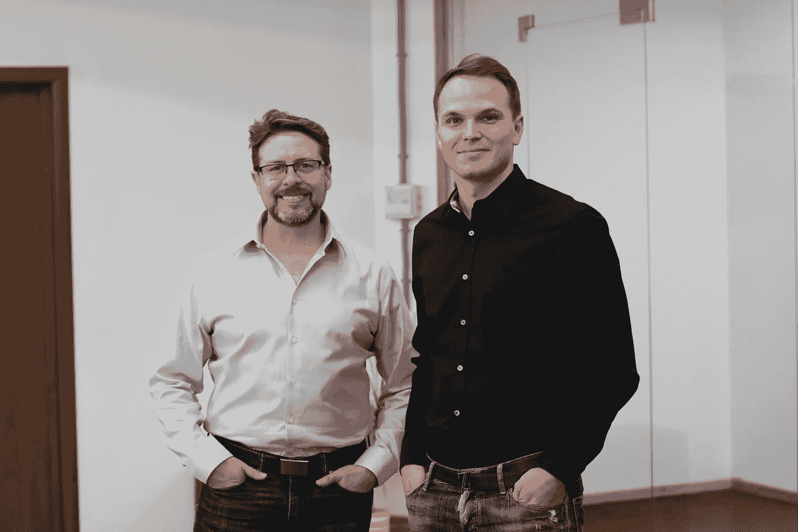
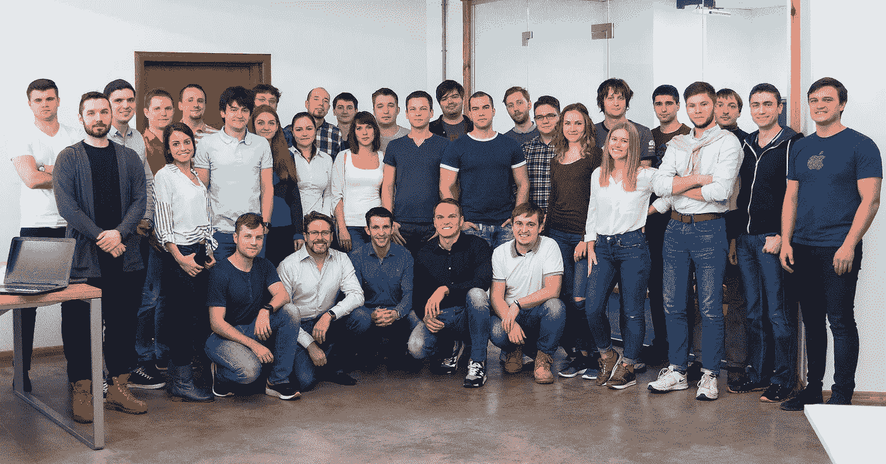

# 我非常兴奋能够打造电子邮件的未来，尤其是当苹果的邮件应用工程经理现在和 Spark 在一起的时候

> 原文：<https://medium.com/hackernoon/im-super-excited-to-build-future-of-email-especially-when-apple-s-mail-app-engineering-manager-is-fdf76a34fe05>

刚刚发生了一件大事！

Terry and Denys (myself)

今天，前苹果邮件工程经理 Terry Blanchard 加入我们的团队，与 Spark 一起打造电子邮件的**未来！**

Terry 花了 6 年时间领导负责 Apple Mail 的工程和 QA 团队，Apple Mail 是全球数百万人使用的默认电子邮件应用程序。

> 正如我们所知，Spark 正在实现电子邮件的现代化。对于电子邮件的未来，我们有着共同的基本愿景。我一直很钦佩 Readdle 的漂亮和创新产品，这使他们成为将愿景变为现实的理想公司。

Terry 对我们的团队来说是一个宝贵的补充，他带来了来自世界上最好的公司之一的多年经验。他将组建一个摇滚明星团队，并在硅谷领导一个办公室。

整个团队对特里的加入感到非常兴奋，迫不及待地想开始一起工作。现在我们可以告诉你——我们是一个由一个主要目标驱动的专业人员组成的完整团队——让你真正热爱你的电子邮件。甚至比你现在还多😉

# 未来的大事

Spark 在 [iPhone](https://itunes.apple.com/app/spark-love-your-email-again/id1176895641?mt=12) 、iPad、 [Mac](https://itunes.apple.com/app/spark-love-your-email-again/id1176895641?mt=12) 和 Apple Watch 上都有。它最近收到了标签、文件夹管理和智能过滤器的巨大更新。

我们的团队正在开发 Android 版本，并计划添加智能日历、自动化和团队机制，以改变公司在日常沟通中使用电子邮件的方式。

我们也在寻找聪明人来共同实现这些目标。如果你想加入星火团队，做令人惊叹的事情，在这里申请 [**。**](https://readdle.com/careers)

> [黑客中午](http://bit.ly/Hackernoon)是黑客如何开始他们的下午。我们是阿妹家庭的一员。我们现在[接受投稿](http://bit.ly/hackernoonsubmission)并乐意[讨论广告&赞助](mailto:partners@amipublications.com)的机会。
> 
> 如果你喜欢这个故事，我们推荐你阅读我们的[最新科技故事](http://bit.ly/hackernoonlatestt)和[趋势科技故事](https://hackernoon.com/trending)。直到下一次，不要把世界的现实想当然！

