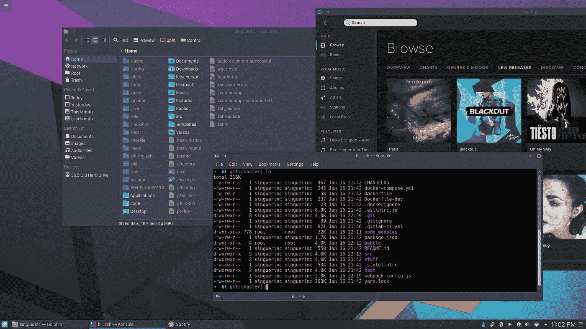
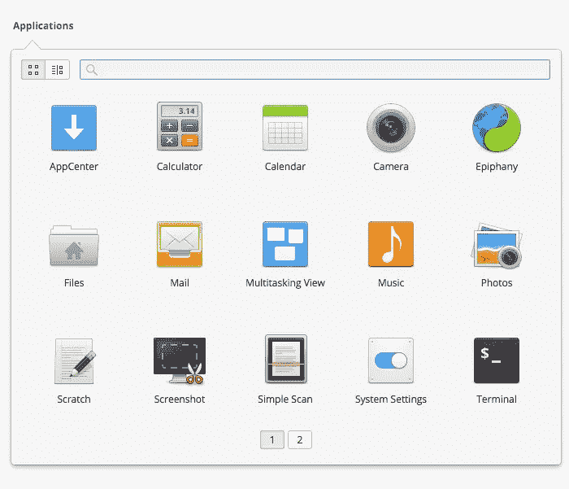
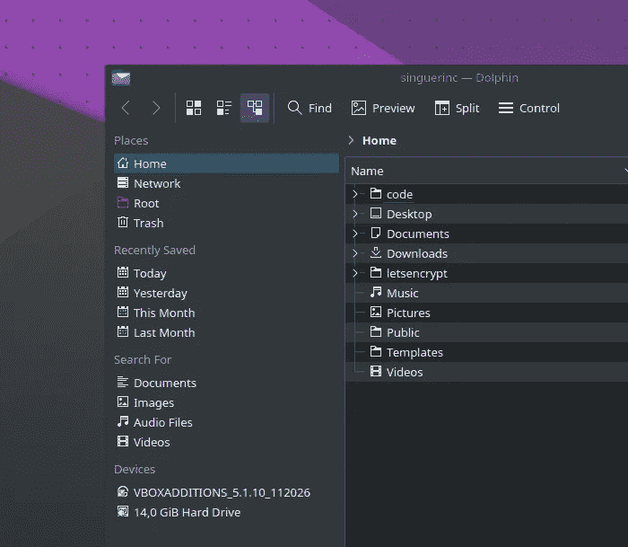

# 我正在和 macOS 分手，我正在和 Linux 约会——第 1 部分

> 原文：<https://medium.com/hackernoon/im-taking-a-break-with-macos-i-m-dating-linux-edf406f2cd6d>

Linux Mint 18 KDE with Arc theme

我必须说我的处境很复杂。想象一下你的妻子和你的新女友住在同一个家里。很奇怪吧？

我不能对 [macOS](https://hackernoon.com/tagged/macos) 说:“嘿，她是 Linux，我的新女友。她将在这里呆一个月，我们正在给我们一个互相了解的机会。”

毕竟， [MacBook](https://hackernoon.com/tagged/macbook) 是*她的*家。

【macOS 怎么了？
如你所知，macOS 已经不是以前的她了。
有人说是因为最近她爸爸忙于弟弟 ios，没有时间照顾她。

**那么 Linux 呢？**
她几乎是在梦中。是我们的客人…实际上是我的客人。她几乎免费使用我们家的所有资源。她现在没有做太多事情，只是观察家里的一切是如何运作的。她试图或多或少地了解我们是如何生活的。

【macOS 对此怎么看？
macOS 心烦。

我必须说，我还没有准备好 100%和 Linux 结婚，我不想失去我和 macOS 的美好关系。我和她的关系可能会有所改善。但是现在我必须两者兼顾。

# 但是说真的，macOS 怎么了？

过去几周，我看到很多人抱怨苹果不再关注 macOS，它不再是“那个”系统了。可悲的是这是真的。

我记得我总是在操作系统发布的同一天或者更早的时候更新。我不在乎与 Adobe 程序或其他软件的不兼容性。看到最新的功能，我超级兴奋。

但是这一次，用 macOS Sierra，我至少花了两个月时间来完成。我这样做是因为我觉得我在用“旧”的东西，而不是因为有新的东西。没有一个新的 wow 功能让我感兴趣或留下深刻印象。尽管它们总是有“1000 多种新功能”，但我对它们都不感兴趣。

更新后，它的工作方式和以前一样，很好！，但现在当我连接外部显示器时，它崩溃了很多！那时我意识到这是个坏主意。可能他们正忙着解决新 MacBook 的电池问题，所以他们不关心我的报告。

# 那么，你是怎么产生遇见 Linux 这个想法的呢？

早在 2014 年，我就在考虑买一台装有 Linux 的电脑。

我需要一台新电脑，一台更快的，因为我的“旧”24 英寸 iMac 已经不够用了。但是想了很多(也花了很多钱)之后，我买了一台新的 MacBook Pro (Retina，15 寸)。主要是因为我在工作中使用了它，而且效果很好。
很开心，但感觉是因为硬件，而不是软件。

当你打开一台新 Mac 时，你注意到的第一件事是它附带了很多东西:照片亭、照片、地图、邮件、车库乐队、日历、通讯录、仪表盘(有人在使用它吗？)、iTunes、Messages、FaceTime、Notes、提醒、QuickTime、通知中心、“Launchpad”(人生中有两次我误开了这个噩梦)、Safari:我用了一次下载 Chrome。我总是做的第一件事是从 Dock 中删除所有东西，如果可能的话，卸载它。

我不是 iPhone 用户，所以这些应用有 50%对我来说没用。另外 50%其实对所有人都没用。

我不想对苹果抱怨太多，因为我认为他们为大量的人做出了非常好的作品。但从我作为一名开发者和老 mac 用户的角度来看，问题是对我来说，这不再是过去那种美妙的环境，或者说是唯一一个拥有良好工具的工作环境。或者也许我简化了我的工作环境，我不再需要他们给我的东西了。

目前我不想购买新的 MacBook、iPhone 或更新到新的 macOS 版本。我是那些想要所有这些东西的人之一。但现在有些东西坏了，他们在做错事，因为当我看到新的 MacBook 或新的 iPhone 时，我没有任何感觉。

## 婚礼策划

最近我意识到，我使用网络应用程序或开源应用程序(其中大部分与电子或类似的东西打包在一起)只是因为它们是免费的或因为它们更好。

我意识到我不需要 Windows 机器或 Mac，因为我不使用任何“特殊/独特/专用”软件。

那时候我就开始考虑换 Linux 了。

## 他们怎么评价你的新女友？

**正文:**关于 Linux 的第一个评论大概是:“它的图形很恐怖”。
这可能是他们对 Android 的相同评论，尽管事实上材料设计远远好于“平面不一致”的 iOS 设计。(我是两次 iPhone 用户，所以我知道我在说什么)。
但可能是因为他们五年前在低配置手机上看到了 Android“姜饼”,或者在奔腾 4 上看到了 Lubuntu。不是 Pixel 上的 Android 7 或 i7 上的 Linux Mint。

我同意你在 Windows 或 macOS 上获得了更好的 UI，但那很可能是因为你在为此付费。

看看这张来自 Elementary OS 的截图:

不错，实际上比苹果或微软的图标好多了。

**化妆**:“你没有 Photoshop”
确实如此，很难找到替代品。在 Linux 中你有 [**GIMP**](https://www.gimp.org) 但是正如我之前所说的，任何东西都是有价格的。GIMP 2.9 看起来很有前途，UI 改进了很多。我认识的人中，90%的人使用 Photoshop 只是为了裁剪图像。当害怕的时候，人们通常会找借口。你可以在任何应用上做到这一点。如果你是一个重度 Photoshop 用户，那么你可能还会使用其他花哨的程序，所以 Linux 不适合你。

昨天我在用 [**Inkscape**](https://inkscape.org) ，让我想起很多旧的 **CorelDraw** ，它不如 **Illustrator，**它也有一些 UI 问题需要改进，但它做得很好。而且是免费的！

**性**:“你不能在 Linux 上玩游戏”
如果你真的想玩游戏，你在 Linux 上有 Steam。是的，这是真的:Linux 就像有游戏的 macOS 一样烂。你需要一个游戏机。

**技巧:**“你没有 Word、Excel、PowerPoint 等”
使用 Google Drive。它很容易使用，免费，而且我们大多数人都有一个 gmail 帐户。或者，如果你想要一个本地应用程序，你可以使用 LibreOffice。

# 5 天后的结论

Current theme

我已经用了五天的 Virtualbox 里的[**Linux Mint 18 KDE**](https://www.linuxmint.com/rel_sarah_kde_whatsnew.php)和所有可用的资源。没有太多太多的发言权。尽管在虚拟机中运行的性能非常好，但系统的响应速度与 macOS 相当。

我做的事情和我平时做的一样(编码、测试、运行容器、浏览、听音乐等等)，没有什么不同。

我的母语是西班牙语，所以我在写作时会用到很多口音，我找到了一种写口音的方法，但应该没有写 unicode 那么复杂:Ctrl+Shift+U + 00e9 = é

键盘快捷键可能是你第一个意识到很难得到的东西，但这只是时间问题。

触摸板工作得不是很好，当你点击时，指针会移动，所以很难调整窗口的大小。所以我现在用鼠标，直到我找到解决办法。

这种关系将继续发展，我知道我们将很难相互了解，但大约一个月后，我可能会知道这种改变是否值得，或者我是否需要再次爱上 macOS。

阅读本文中[的结论。](https://hackernoon.com/im-taking-a-break-with-macos-i-m-dating-linux-part-2-29b1aee00e94#.9z0tt8q5t)

> 黑客中午是黑客如何开始他们的下午。我们是这个家庭的一员。我们现在[接受投稿](http://bit.ly/hackernoonsubmission)并乐意[讨论广告&赞助](mailto:partners@amipublications.com)机会。
> 
> 如果你喜欢这个故事，我们推荐你阅读我们的[最新科技故事](http://bit.ly/hackernoonlatestt)和[趋势科技故事](https://hackernoon.com/trending)。直到下一次，不要把世界的现实想当然！

