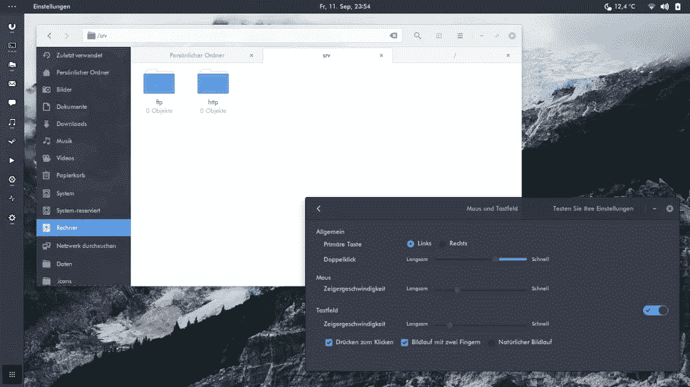
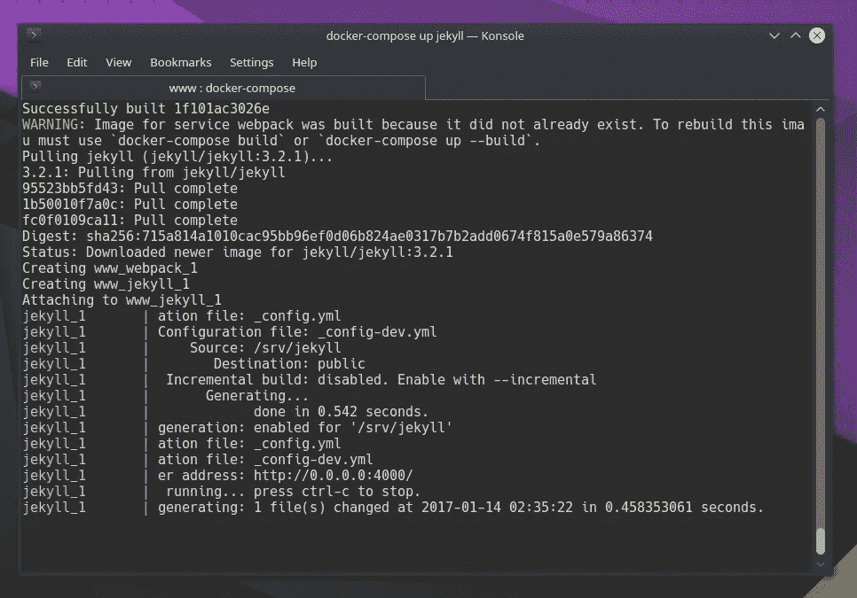
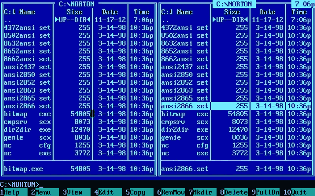
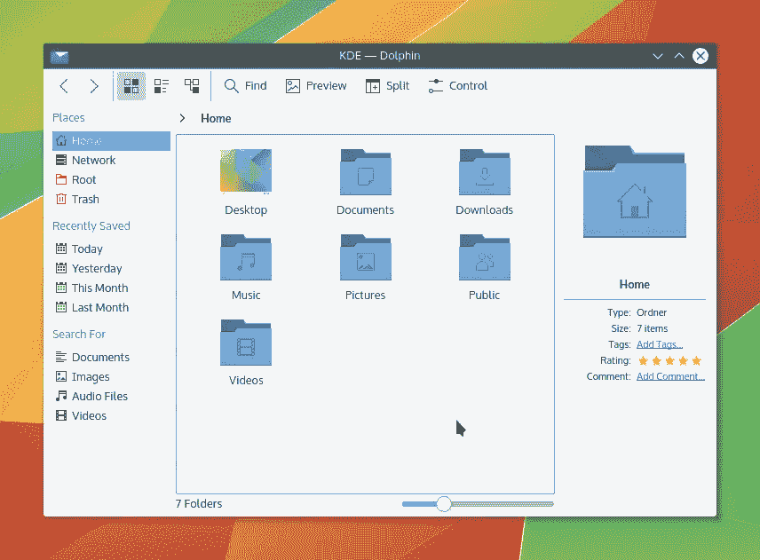

# 我在和 macOS 分手，我在和 Linux 约会。(第二部分)

> 原文：<https://medium.com/hackernoon/im-taking-a-break-with-macos-i-m-dating-linux-part-2-29b1aee00e94>

这是我的文章“ [***的第二部分，我在和 macOS 分手，我在和 Linux 约会。***](https://hackernoon.com/im-taking-a-break-with-macos-i-m-dating-linux-edf406f2cd6d)

下面是在使用 [Linux](https://hackernoon.com/tagged/linux) ，更具体地说是使用 [Linux Mint 18 KDE](https://www.linuxmint.com/) 一个月左右后得出的一些结论。

## 在说 Linux 之前，我是如何爱上 macOS 的？

我使用的第一台麦金塔电脑是 Performa 6300 型，这是我父亲的工作电脑。那时候我 12/14 岁。我以前用的是 4MB 内存的 Windows 3.1 PC 386...我记得我使用 DOS、Photoshop 3 和 Corel Draw 只是为了好玩，还在一台 Hercules 显示器上用 SimCGA 模式玩织机和其他游戏。

我梦想拥有一台 Mac 电脑，但对普通用户来说它太贵了，所以在处理了一段时间黑白像素后，我父亲买了一台装有彩色显示屏和 Windows 95 的 PC 486。

尽管我是个人电脑用户，但我总是接触一些随机的麦金塔电脑。我在 24 岁时得到了我“自己的”Mac，是 MacBook 2，1。

所以假设我看到了从 1995 年到现在，苹果是如何改变 Mac 和 it OS 的。二十多年一堆 OS 版本和硬件变化。

## 为什么我要休息？

就像我之前说的，我正在休息，因为我感觉我的下一台电脑将会是个人电脑，我想为此做好准备。Mac 变得太贵了，我不喜欢苹果的发展方向。

我曾经是一个混合的设计者和开发者，但是几年前我停止了设计。像 Illustrator 或 Photoshop 这样的程序对我来说不再是必须的了。如今，我只使用少数几个可以在所有平台上使用的程序。因此，没有理由拘泥于相同的操作系统/硬件。

# 应用程序…

让我们开始思考未来可能发生的变化，我应该使用哪个软件:

## 操作系统（Operating System）

我真的很喜欢 Linux，因为你可以随心所欲地塑造它。如果你不喜欢某样东西，你就改变它。你可以使用[等离子](https://www.kde.org/workspaces/plasmadesktop/)作为你的环境，或者尝试一些完全不同的东西，比如 [i3](https://i3wm.org/) (我仍在试图找出如何配置它)。

在 macOS 上，你只有 Jony Ive 为你选择的东西，除此之外别无其他。在 Linux 上，你可以不时地改变外观。如果你不喜欢你的发行版自带的默认主题，你可以使用[弧形主题](https://github.com/horst3180/arc-theme)、[adaptea](https://github.com/adapta-project/adapta-gtk-theme)、[纸](https://snwh.org/paper)、[超平](https://www.gnome-look.org/content/show.php/Ultra-Flat?content=167473)、[顶点](https://www.gnome-look.org/content/show.php/Vertex+-+Theme?content=166318)或者从 [unixporn](https://www.reddit.com/r/unixporn/) 中获得一些灵感。

Arc Theme

我喜欢在 KDE 上，你可以开始写东西，然后启动程序就出来了，我喜欢在 mac 上也能这样。
最近发现了 [rofi](https://davedavenport.github.io/rofi/) ，真的很喜欢上面的简单。

## 末端的

iTerm 是我最喜欢的 Mac 终端。在 Linux 上，你有很多选择。我很喜欢它们，因为它们都是定制的。我喜欢 Konsole，我也测试了 [Hyper](https://hyperterm.org/) ，它比 macOS 运行得更快。

Konsole — KDE

## 文件管理器

我以前在 DOS 下用诺顿指挥官，因为我想做很多文件操作。

The old Norton Commander

最近 Finder 变得不如 Google Drive 强大，你甚至不能用它创建文件。多年以后，我用惯了，但还是讨厌。他们不久前引入了标签，但在那之前我记得打开两个窗口，拖放文件。浪费时间。
\_(ツ)_/

KDE — Dolphin

另一方面，Linux 有很多选择:从基本的文件管理器到最复杂的文件管理器。

海豚、木豆、鹦鹉螺等等。

## 集成驱动电子设备

关于他们没什么好说的，Sublime，Atom，VSCode，Webstorm，两个平台都有。

# 如果我换成 Linux，我会错过 macOS 的什么？

很多。
简约。
细节，图形。
一切(几乎)正常。

# 结论

1.  我还没准备好。我有自己多年来一直在塑造的环境和工作流程。使用 Linux 我感到迷茫。
2.  Linux 在 Mac 上无法运行。我最初的想法是在我的 MacBook Pro (i7，Retina，15 英寸，2014 年年中)上用 Linux 取代 macOS，但这并不像我想象的那样顺利。

我发现的一些最大的问题是:

*   电池问题:你得到 3 小时的电池寿命。
*   触控板敏感度:许多精度/点击问题。
*   辅助和视网膜屏幕支持:我最终只使用外部显示器(无视网膜)。还有视频闪烁的问题。
*   电源管理:我不能相信它，感觉它总是醒着并消耗能量。

如果你的想法(像我一样)是在未来某个时候使用 Linux，那就用 PC 吧。在 Mac 上使用 Linux 不值得。感觉就像你在城市里开着一级方程式赛车:你无法获得 Linux 所拥有的动力，也无法从你所拥有的硬件中获得一切。

> [黑客中午](http://bit.ly/Hackernoon)是黑客如何开始他们的下午。我们是 [@AMI](http://bit.ly/atAMIatAMI) 家庭的一员。我们现在[接受投稿](http://bit.ly/hackernoonsubmission)并乐意[讨论广告&赞助](mailto:partners@amipublications.com)机会。
> 
> 如果你喜欢这个故事，我们推荐你阅读我们的[最新科技故事](http://bit.ly/hackernoonlatestt)和[趋势科技故事](https://hackernoon.com/trending)。直到下一次，不要把世界的现实想当然！

