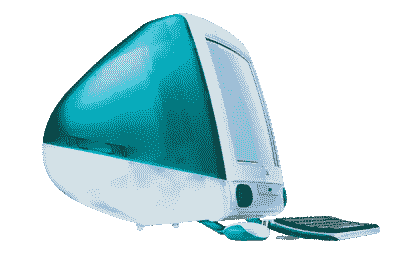
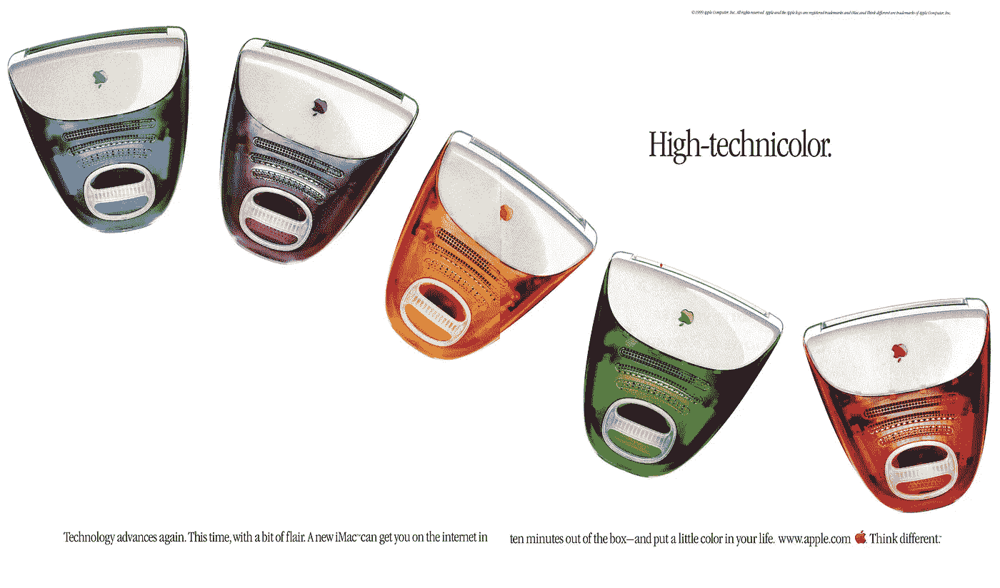
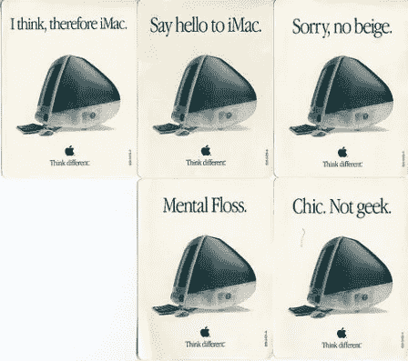
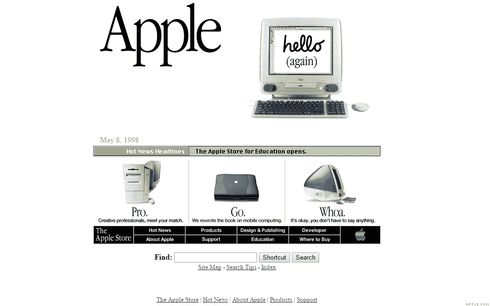
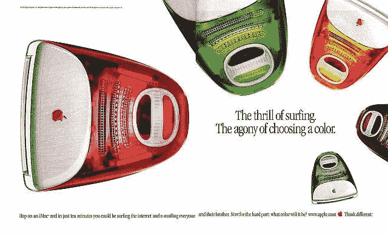

# iMac DV 红宝石拆卸🖥

> 原文：<https://medium.com/hackernoon/imac-g3-ruby-teardown-f56b647227a9>

几周前，Christophe 和我在巴黎碰到了一台便宜的二手 iMac DV，所以我们决定拆掉我们的第一个大东西。这是一段🛠的定格视频

让我们回到过去，更详细地分析鲁比·🛑。

# 一点历史

iMac 系列始于 1998 年，当时史蒂夫·乔布斯刚刚回到苹果公司担任临时首席执行官。Ruby 版本是在 Bondi Blue 一年后的 1999 年发布的。

这是史蒂夫·乔布斯新统治下的第一个产品，是苹果公司惊人转变的原因。从一个几乎破产的公司到过去的公司:一个以设计为导向的公司，有易于使用的电脑。经过 4 年多的商业化，G3 退出了舞台，G4 在 2002 年取而代之。

就像最近 iPhone 失去音频插孔连接的丑闻一样，iMac G3 是第一批放弃当时流行的标准(如软盘)的电脑之一💾苹果桌面总线支持现在的标准:USB 端口(但这能持续多久🤔).

您知道吗，第一代 iMacs 是在 Cupertino 开发的两种设备的组合:MacNC 项目(一种主要依靠 Oracle 推广的网络的设备)和公共硬件参考项目(一种能够在基于 PowerPC 的计算机上运行不同操作系统的标准系统架构)。史蒂夫·乔布斯削减了这两个项目的开发，以专注于苹果的核心价值，但使用已经开发的东西来制造我们所知的 iMac。

它的基本零售价是 1，299 美元，而我们拆掉的 DV 是第一款以 999 美元突破 1000 美元大关的 iMac

# 让我们来谈谈技术

这款 iMac 使用了 13.8 英寸可视 CRT 显示器、ATI Rage IIc 显卡、4GB 硬盘(足以播放一部蓝光电影！)、32MB 内存(PC100 SDRAM)、插槽加载光驱、两个 USB 端口、一个 56 kbit/s 调制解调器、内置以太网、一个红外端口、内置立体声扬声器和两个耳机端口。CPU 和内存都位于直接安装在主板上的子卡上。

最初的 iMac 运行在 233Mhz 处理器上，而我们拆除的 Ruby iMac 使用 400Mhz 处理器和 64mb 内存。最初的版本运行在 Mac OS 8.1 上，可在该机型上使用的最高操作系统是 Mac OS X 10 . 3 . 9“Panther”和 Mac OS 9.2.2。

这个漂亮的婴儿体重超过 17 公斤或超过 37 磅！相比之下，目前的 27 英寸 iMac 仅重不到 22 磅！多好的饮食啊！

# 由加州的苹果公司设计

这台 iMac 的设计是开创性的！没有一台电脑拥有如此多彩的调色板和半透明的机身，让用户可以看到设备的内部。Jony Ive 被认为是这一惊人设计的父亲，并使他成为苹果公司的首席设计官和世界上最著名的设计师之一。

苹果采取的一些激进措施包括只使用 USB 端口，不使用软盘驱动器，你可以想象，这引起了很多争议。通过这样做，苹果打了一个赌，认为可刻录光盘和互联网会淘汰软盘。现在，我们可以说这是一个明智的决定。iPhone 上的插孔端口会是一样的吗？等着瞧。

史蒂夫·乔布斯(Steve Jobs)回归后，苹果公司以细节为导向，决定为他们的新 iMacs 系列制造特定的半透明鼠标和键盘:

因为苹果喜欢让顾客失望，所以键盘比它的前辈更小，黑键上有白色字符。苹果的 USB 鼠标是机械的，圆形的，“ [*”冰球*](https://en.wikipedia.org/wiki/Hockey_puck) *”的设计被嘲笑为对于手较大的用户来说是不必要的困难。*(来源维基百科)。

# 营销时间机器

让我们来看看让 iMac G3 成为 90 年代末流行偶像之一的一些营销活动。这是一个杂志广告，展示了所有可用的颜色。

A magazine ad

第一代 iMac G3 发布时，杂志背面出现的不同标语的集合。

iMac G3 发布时的苹果主页。巧妙引用了最初的 Mac 电脑和史蒂夫·乔布斯重返苹果的故事(“你好(又一次)”)

Apple home page for the iMac G3 release

这是另一个关于不同颜色的平面广告

The thrill of surfing. The agony of choosing a color.

这是苹果在 1998 年 Macworld 上展示的视频

最后是 iMac G3 的一些最佳电视广告

— — — — — —

约翰·洛佩兹[的一次拆解&克里斯托夫·沃布鲁克](https://medium.com/u/13cb361663d8?source=post_page-----f56b647227a9--------------------------------)的 [Unmakr](https://medium.com/u/6397035b4156?source=post_page-----f56b647227a9--------------------------------) 。随时联系我们！

不要忘记💚那里的文章👇在媒体和 Instagram 上关注我们👉[此处](https://www.instagram.com/unmakr/)

从巴黎🇫🇷与爱❤️

> [黑客中午](http://bit.ly/Hackernoon)是黑客如何开始他们的下午。我们是 [@AMI](http://bit.ly/atAMIatAMI) 家庭的一员。我们现在[接受投稿](http://bit.ly/hackernoonsubmission)，并乐意[讨论广告&赞助](mailto:partners@amipublications.com)机会。
> 
> 如果你喜欢这个故事，我们推荐你阅读我们的[最新科技故事](http://bit.ly/hackernoonlatestt)和[趋势科技故事](https://hackernoon.com/trending)。直到下一次，不要把世界的现实想当然！

