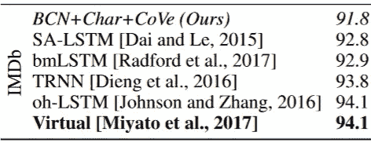

# 使用预训练模型的 IMDB 情感分析

> 原文：<https://medium.com/hackernoon/imdb-sentiment-analysis-using-a-pre-trained-model-80c3d8343d48>

> 本文首发[此处](http://sanyambhutani.com/IMDB-Sentiment-Analysis-using-pretrained-Model/)

我们必须承认，在 NLP 中使用预训练模型的概念是相当新的。

在这篇文章中，我分享了一个在 [FastAI](https://hackernoon.com/tagged/fastai) 课程第二版(将于明年公开发布)中教授的方法:在[大型电影观看数据集](http://ai.stanford.edu/~amaas/data/sentiment/)上训练一个语言模型，该数据集包含来自 [IMDB](https://hackernoon.com/tagged/imdb) 的 50，000 条评论，从而为我们提供了大量数据来测试和训练我们的模型，然后使用相同的模型对 IMDB 评论进行情感分析。

# **语言建模**

创建一个模型，用于预测/产生一种语言或简单地基于当前单词集预测语言中的下一个单词。

# **情感分析**

分析一组给定的单词来预测段落中的情感。

# IMDB 大型电影数据集

*   该数据集有 50，000 条评论
*   所有这些评论都是英文的，两极分化的标签评论

下面是我们实验中关键步骤的演示。

使用的库:PyTorch、FastAI

# 为什么要使用预训练模型？

*   达到的精确度优于传统方法
*   微调模型是强大的

# 预训练

本质上，我们将使用预训练网络，但这里我们将自己创建相同的网络。

我们使用 PyTorch 的 Torchtext 库对数据进行预处理

```
TEXT = data.Field(lower=True, tokenize=spacy_tok)
```

我们用空格来标记我们的数据，并保持小写。

接下来，我们创建我们的模型数据，这些数据将被提供给学习模型来执行语言建模。

```
md = LanguageModelData(PATH, TEXT, **FILES, bs=64, bptt=70, min_freq=10)
```

*   Path 指向数据集的路径。
*   文本包含预处理的数据。
*   文件是我们数据集的字典。
*   bs 提到了批量大小
*   bptt:我们将反向传播的字数。
*   min_freq:频率低于此值的单词保持不分类

既然我们知道神经网络不能真正处理单词，我们需要将单词映射成整数。火炬文本已经通过映射我们的单词做到了这一点

```
TEXT.vocab 
```

# 培养

接下来，我们创建一个学习者对象，并为其调用 fit 函数。

```
learner = md.get_model(opt_fn, em_sz, nh, nl,dropouti=0.05, dropout=0.05, wdrop=0.1, dropoute=0.02, dropouth=0.05)learner.fit(3e-3, 4, wds=1e-6, cycle_len=1, cycle_mult=2)
```

*   opt_fn: Optimizer 函数，快速 AI 库使用 [AWD LSTM 模型](https://arxiv.org/abs/1708.02182)，该模型通过 ising dropout 非常擅长正则化。
*   我们传递嵌入大小
*   nh:隐藏层数
*   nn:神经网络的层数。
*   我们在拟合函数中设置学习率、周期长度和其他参数。

嵌入矩阵:[这是一个关于嵌入的简介](/@krishnakalyan3/a-gentle-introduction-to-embedding-567d8738372b)的链接。

# 语言模型

这是一个由经过训练的模型生成的文本示例

```
. So, it wasn’t quite was I was expecting, but I really liked it anyway! The bestperformance was the one in the movie where he was a little too old for the part . i think he was a good actor , but he was nt that good .the movie was a bit slow , but it was n’t too bad . the acting …
```

因此，到目前为止，我们已经创建了一个可以成功创建电影评论的模型，该模型开始时甚至不懂英语。接下来，我们根据我们的目标任务对此进行微调。

# 微调

到目前为止，我们已经在语言建模方面很好地训练了我们的模型。现在我们用同样的方法来预测电影评论的情绪。

我们预加载我们的模型。

```
model.freeze_to(-1)
model.fit(lr, 1, metrics=[accuracy])
model.unfreeze()
model.fit(lr, 1, metrics=[accuracy], cycle_len=1)
```

我们把模型冻结到最后一层，在设定了学习速率后再进行拟合。我们定义我们的准确性指标。

# 表演

[在翻译中学习:语境化的词向量](https://einstein.ai/research/learned-in-translation-contextualized-word-vectors)是一篇比较所有前沿模型在 IMDB 数据集上的性能作为基准比较的论文。



IMDB Performance Comparisions: Breden et al

在微调学习率、调整周期长度后，模型达到的精度为

```
0.94511217948717952
```

94.51 !

# 结论

我们从制作 IMBD 电影评论的模式开始。

2017 年研究的艺术状态是 94.1。因此，应用预先训练的语言模型的想法实际上也胜过了学术界的前沿研究。

我个人正在与我的学院合作，开发一个模型来分析学生提交的教员评论中的观点。

> 要了解更多关于深度学习的信息，请访问 Fast.ai
> 
> 订阅[我的简讯](http://tinyletter.com/sanyambhutani)获取深度学习、计算机视觉的每周精选文章
> 
> 如果你想在我正在做的项目上与我合作，请访问我的网站。