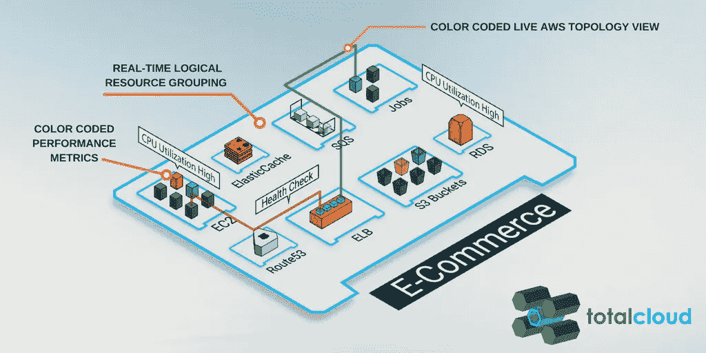
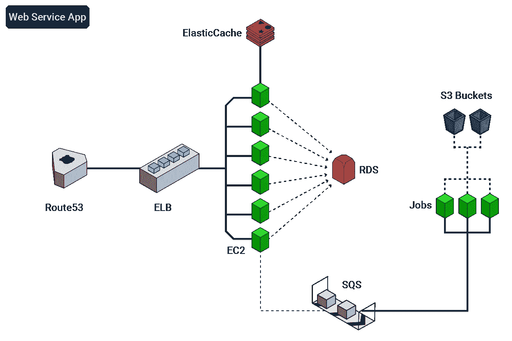
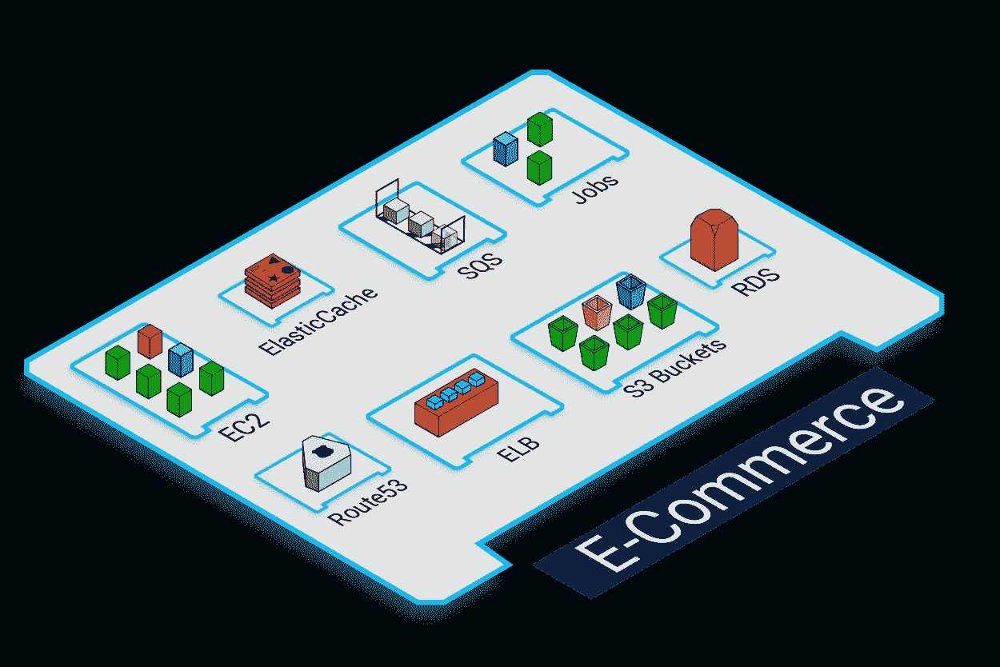
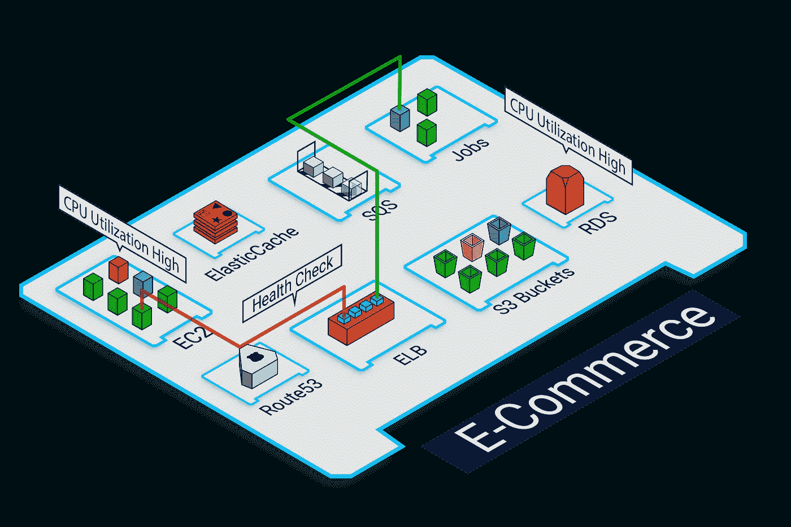
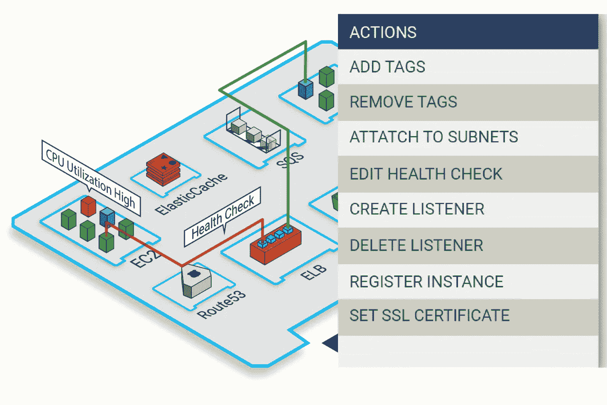
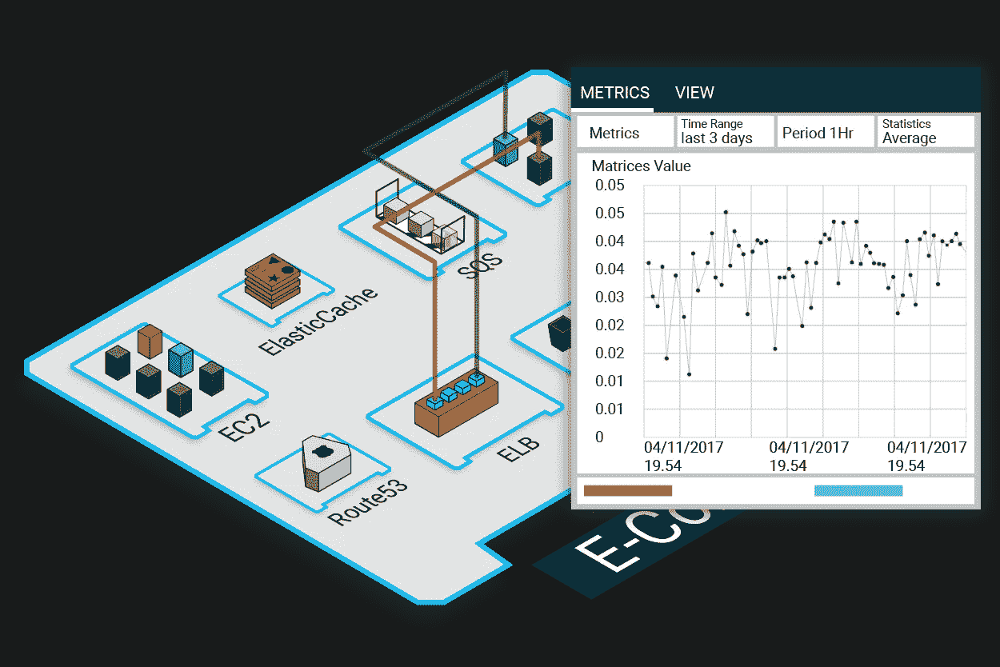
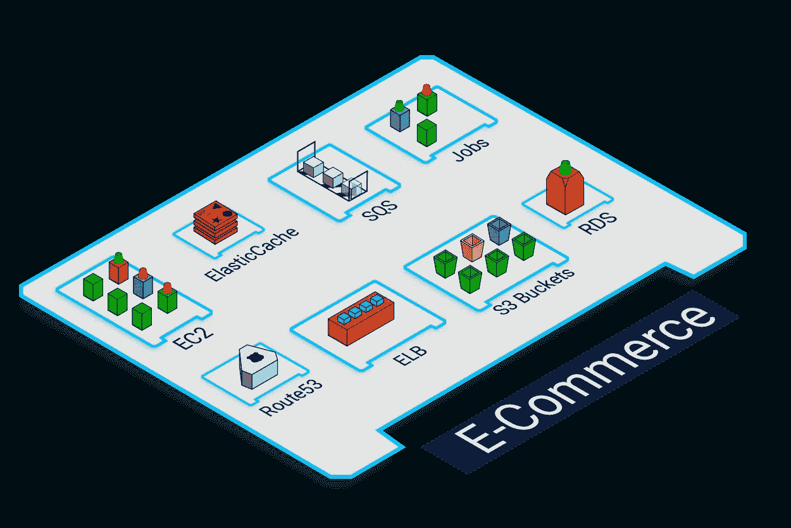

# 情境云监控的沉浸式可视化:打破孤岛壁垒

> 原文：<https://medium.com/hackernoon/immersive-visualization-for-contextual-cloud-monitoring-breaking-the-barriers-of-silos-9bcd218393f7>

今天，云是高度抽象的。公共云服务提供商(CSP)，如 AWS，提供各种专业服务，如 Kinesis、数据管道、简单队列服务(SQS)、简单通知服务(SNS)、DynamoDB、ElasticSearch (ES)等。更重要的是，云生态系统本身是非常动态的——多个资源可以根据需要同时扩展或缩减。然而，监控所有这些资源并获得它们的整体视图是至关重要的，这对企业来说是一个挑战。也就是说，不支持新服务的传统 IT 监控解决方案和孤立的云监控方法不再适用。

# 穿越混乱的 IT 红外线监控

随着企业将其应用程序迁移到云中，并且其需求不断增加，需要考虑几个动态因素——所有这些都围绕着这些孤立的服务。

例如，假设一家企业在 AWS 上托管了一个 Web 服务应用程序，如下图所示:

与传统的 IT 设置不同，在传统的 IT 设置中，监控指标的规模更小，云托管的应用程序(如上面的 Web 服务应用程序)需要监控几个 AWS 服务，如 EC2、RDS、Route 53、ELBs、Elastic Cache、SQS、S3 桶等。此外，业务的 DevOps 团队需要持续检查这些 AWS 服务之间的关系依赖。在这样一个相互依存和动态的环境中，

*   如果另一个团队的某个人在相关团队不知情的情况下删除了对 S3 存储桶的访问权限，并且没有人知道存储在该 S3 中的页面为什么会抛出 404 错误，该怎么办？
*   如果一个团队的服务器实例在 APM 工具上看起来很好，但是它们的 SQS 正在增加，而作业处理服务器没有意识到这一点，该怎么办？
*   如果数据库查询突然激增，另一个团队的某个人更改了 ElastiCache 集群的安全权限，而相关团队在 RDS 饱和之前毫无头绪，该怎么办？

在这种情况下，IT 团队如何仅使用本地化的日志、静态报告和复杂的仪表板来克服性能问题？

> ***最好的前进方式是映射&根据上下文分析资源和其他配置之间的关系，同时监控资源。***

# **当务之急:可视化上下文云监控**

*TotalCloud 上下文监控*有助于在视觉丰富的彩色编码虚拟环境中监控 AWS 资源。在控制台内部，AWS 资源呈现为三维资产，并进行逻辑分组。这种逻辑分组有助于更好地理解整个企业的云使用情况。

本质上，TotalCloud 提供了所有资源的单一窗格视图，以及带有智能说明性见解的关系视图。总之，这些功能消除了分析多个日志和仪表板的需要，从而使 IT 团队能够更快地调试并及时采取纠正措施。

总而言之，TotalCloud 有助于通过多种方式打破云监控的混乱局面，例如:

**定制的单窗格视图，仅显示对团队/角色重要的资源**

借助 TotalCloud，团队可以使用动态分组(一种根据服务类型、应用、标签、标签值或任何其他属性对资源进行分组的功能)以交互方式构建资源视角。这种逻辑分组使团队能够以他们需要的方式可视化资源利用并获得成本洞察。

此外，该团队还可以利用身临其境的放大、缩小功能，在顶级或粒度级别解读驻留在某个区域的所有资源的运行状况。

下图描述了 TotalCloud 如何按应用视图对 web 应用的所有 AWS 服务进行动态分组，并提供所有服务的整体视图。

**映射资源关系，减少调试时间&全面监控云运行状况**

使用多个仪表板来映射实例及其支持服务之间的关系是令人烦恼的。此外，每天跟踪和分析大量日志，即使有监控工具的帮助，也会导致疲劳。

有了 TotalCloud，就不是了。因为，TotalCloud 呈现了从 ELB 到 EC2s、EBS 到 RDS、AppELB 到目标组等资源之间的实时拓扑和关系。，全部用彩色编码，只需点击任何资源。这有助于团队将资源的利用状态以及整个应用程序的资源利用状态跨多个指标关联起来，一目了然。

下图描述了 TotalCloud 如何映射 Web 服务应用程序资源之间的资源关系，帮助更快地调试，并使团队能够整体监控云运行状况。

**从单点触摸点采取纠正措施**

TotalCloud 提供说明性见解，有助于从控制台采取纠正措施。这个特性使团队能够对任何需要必要关注的资源采取相应的行动，而无需离开控制台。

下图描述了用户可以对用于运行 Web 服务应用程序的 EC2 实例采取的操作类型。

**执行历史分析**

尽管 TotalCloud 提供了云资源的完整可视化覆盖图，但它也提供了图形，可以显示多个 CloudWatch 指标的历史数据以及自定义的时间范围、周期和统计数据，以便您可以对数据执行详细的历史分析。

下图描述了如何为您的 Web 服务应用程序生成历史分析图表。

**通过自动云监控警报加速无缝云监控**

TotalCloud 具有基于行为人工智能的自动 CloudWatch 警报，可全天候跟踪实例，并自动创建 CloudWatch 警报配置。最重要的是，这些警报以彩色编码信标的形式出现，以便用户可以快速分析情况，了解云的状态，监控关键资源并及时采取行动。

下图描述了带有自动云监控警报的 Web 服务应用程序。

# **底线:TotalCloud 通过上下文云监控加快 IT 运营**

孤立的云监控非常混乱，因为企业很快就会失去对云使用情况的了解。尽管 CSP 负责监控基础设施和保持业务服务的运行，但是监控资源性能的责任仍然在团队身上。 *TotalCloud 上下文监控*可在单一视图中无缝了解完整的云清单及其之上托管的应用，从而加快需要数小时才能解决的云监控任务。更重要的是，实时云库存视图覆盖了规范的见解，并且能够在正确的时间采取正确的行动，确保企业的应用程序始终正常运行。

您是否是 IT 团队中的开发人员或运营人员之一，试图找出如何在云上加快 IT 运营和调试速度？如果是，您需要试用一下 *TotalCloud 上下文分析器。*您还可以从同一个控制台虚拟地实时查看云成本溢出，并采取纠正措施。

> 今天就拿一个 [**免费试用**](https://totalcloud.io/download.html) 自己看看吧。

