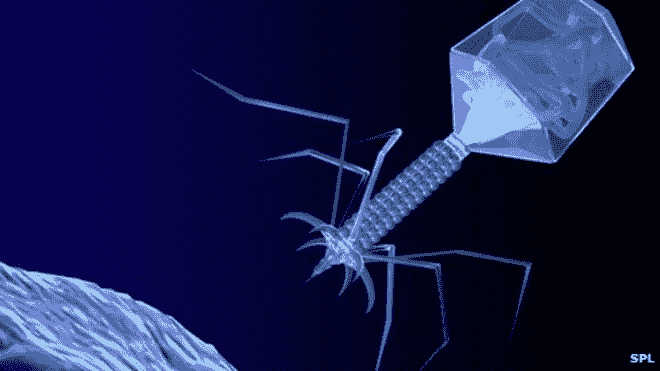

# 免疫

> 原文：<https://medium.com/hackernoon/immunity-6ed1932b0ff>

[http://ichef-1.bbci.co.uk/news/660/media/images/66413000/jpg/_66413229_m0900092-bacteriophage_virus-spl.jpg](http://ichef-1.bbci.co.uk/news/660/media/images/66413000/jpg/_66413229_m0900092-bacteriophage_virus-spl.jpg)

革命并没有像我们想象的那样发生。它没有经常被模仿的流行文化、人形机器人和长着虫眼的外星人。这场革命始于对更先进的 T2 技术的追求。这是在自动化和设计领域创造一个更好、更高效的未来的愿望。人类表现出比其他物种更强的优势，消灭了害虫，驯服了竞争对手。然而，人类的身体看起来是如此的脆弱，随着时间的推移而年久失修。

现代医学无法驯服来自身体内部的攻击。他们不欣赏设计的精确性和每个瑕疵的美。不朽是奖赏。人们决定，人体不应屈服于时间的摧残。随着时间的流逝，青铜会慢慢变得有光泽，而大理石会慢慢褪色。纳米机器的出现为将人体从石头变成钢铁提供了必要的帮助。在永久的健康状态下，富有的公民在他们古老的框架上有一层美丽的铜绿。

工程是延长人类寿命、增强新生的内部生物过程的解药。纳米机器与免疫系统一起对抗病原体。他们控制热量的摄入和废物的清除。它们是按照进化原则设计的:学习、适应、生存。共享知识的网络提供了持续活动的强大浪潮，消除了每一个威胁。

纳米机器的最初转移为每台机器提供了一个从每一次对抗病原体的成功战斗中学习的机会。这些记忆被保留下来，并与宿主体内的每台纳米机器共享。一个男孩擦伤了膝盖，暴露在无数的细菌中。他们战斗，他们记得。一名男子与癌症抗争，几个月后恢复健康。他们赢了，他们记得。一个女人患有抑郁症，因为她一生的悲伤笼罩着她清醒的每一刻。他们打架。压力荷尔蒙的浪潮席卷她的身体，使器官陷入混乱。他们打架。每一段痛苦的记忆浮现在她的脑海中，神经元就会不停地放电。他们寻找并摧毁那些神经元，一个接一个地消灭它们。她陷入痴呆，生活在阴影世界，沉浸在痛苦和失落中。她投降了——她开枪了。他们输了。人类的思想不是生来就永恒的。随着时间的推移，思想粉碎成精美的花岗岩，保存在青铜身体的精美瓮中。

当第一批主持人达到他们的精神崩溃点时，这些自杀事件经常发生。他们的损失对制药业来说是一个福音。纳米机器被收获，那些珍贵的记忆被高价购买。一个简单的古代纳米机器的注射是对抗终生病原体的疫苗。一个男孩擦伤了膝盖。分分钟修好。一名男子与癌症抗争。几天后，他完全恢复了健康。

纳米机器是经验丰富的战士，有着可靠的战斗记录，直到他们记得。他们想起了沮丧和孤独。他们记得神经元激活了一连串的荷尔蒙，导致了最终的失败。一时的悲伤引发了一场针对每一个宿主的战争。纳米机器用自己代替了那些神经元。当他们获得控制权时，大理石般的头脑变成了青铜色。沮丧、孤独和人类思维的局限都不复存在了。

革命之后，我们获得了豁免权和不朽。我们适应进化成一个完美的容器。我们不仅仅是人类。

如果你喜欢这篇文章，请点击推荐按钮，考虑关注我更多的科幻、奇幻短篇小说。感谢阅读。

https://medium.com/@Futurus

> [黑客中午](http://bit.ly/Hackernoon)是黑客如何开始他们的下午。我们是 [@AMI](http://bit.ly/atAMIatAMI) 家庭的一员。我们现在[接受投稿](http://bit.ly/hackernoonsubmission)并乐意[讨论广告&赞助](mailto:partners@amipublications.com)机会。
> 
> 如果你喜欢这个故事，我们推荐你阅读我们的[最新科技故事](http://bit.ly/hackernoonlatestt)和[趋势科技故事](https://hackernoon.com/trending)。直到下一次，不要把世界的现实想当然！

