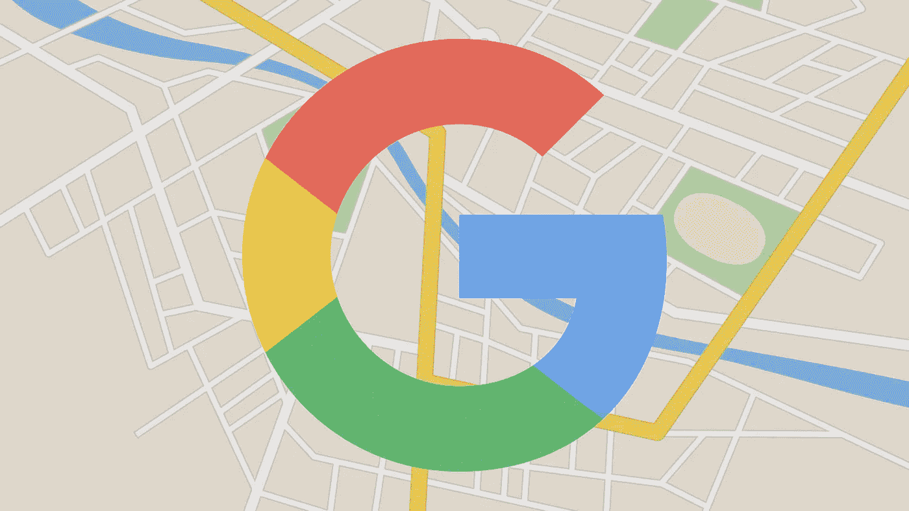

# 在 ReactJs 中实现谷歌地图

> 原文：<https://medium.com/hackernoon/implement-google-maps-in-reactjs-5bc218074689>



我在 ReactJs 中使用`npm`包实现谷歌地图时遇到了不少麻烦。希望这篇文章能帮助你避免我所经历的麻烦。

## 寻找最佳包装

最大的麻烦是找到一个包含好文档的最佳包，这样我就可以把我的谷歌地图放在我的页面上了。我发现最好的包是 [**伊斯塔科夫**](https://github.com/istarkov/google-map-react) 的`google-map-react`。

## 谷歌地图示例项目

他还做了一件非常好的事情，就是创造了一个反应。实施`google-map-react`的 Js 范例项目。这样你就可以在现实世界的应用中看到。

## 快速启动

他在帮助您快速了解他的文档方面做得很好，但是我加入了这个示例，以防您想要立即复制并粘贴它。

而以你目前的反应。JS 目录，在您的终端中运行下面几行代码。

```
npm i -S google-map-react
```

然后创建一个组件，我准备叫我的`map.js`。将以下代码行复制并粘贴到该文件中。

```
import React, { Component } from 'react'
import GoogleMapReact from 'google-map-react'const AnyReactComponent = ({ text }) => <div>{ text }</div>;export default class Map extends Component {
  static defaultProps = {
    center: { lat: 40.7446790, lng: -73.9485420 },
    zoom: 11
  }render() {
    return (
      <div className='google-map'>
        <GoogleMapReact
          defaultCenter={ this.props.center }
          defaultZoom={ this.props.zoom }>
          <AnyReactComponent
            lat={ 40.7473310 }
            lng={ -73.8517440 }
            text={ 'Where's Waldo?' }
          />
        </GoogleMapReact>
      </div>
    )
  }
}
```

现在你可以把这个文件导入到你拥有的任何其他组件/容器文件中，它应该会在你的项目中显示谷歌地图！为了更好地理解谷歌地图，我推荐阅读`google-map-react` GitHub [repo](https://github.com/istarkov/google-map-react) 和[谷歌地图 API 文档](https://developers.google.com/maps/documentation/javascript/adding-a-google-map)，同时使用[项目](http://istarkov.github.io/google-map-react/map/main/)作为参考。

希望这有所帮助！