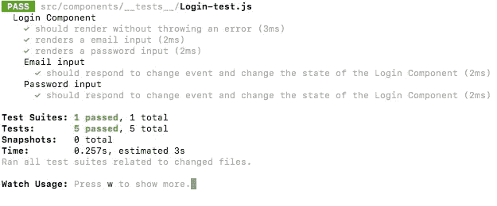

# 使用 Jest 和 Enzyme 实现基本组件测试

> 原文：<https://medium.com/hackernoon/implementing-basic-component-tests-using-jest-and-enzyme-d1d8788d627a>

这可能是我将要做的关于测试 React 组件和 TDD 的两篇文章中的第一篇。这一部分处理 Jest 和 Enzyme 库的设置，然后为登录组件编写几个基本测试。在我的下一篇文章中，我希望能更详细地介绍这些库，以及我们如何测试包含 Redux 的更复杂的组件。因此，让我们开始吧！

# 什么是玩笑？

Jest 是一个测试库，可以用来测试简单的 Javascript 代码或 React 组件。这是通过 Jest 提供给用户的简单 API 来完成的。使用这个 API，可以断言函数应该如何运行，然后根据测试结果测试我们的预期结果。它非常容易设置，开箱即可使用。这就是为什么它是脸书首选的测试库。Jest 的一个很酷的功能是快照。这将对组件及其渲染方式进行快照，然后在进行其他测试时进行比较，让您知道是否发生了意想不到的事情。我不会对快照进行过多的描述，因为我会在另一篇文章中介绍。使用 Jest 和 Enzyme 时，可以通过模拟 DOM 测试组件。

# 酶是什么？

酶是另一个常用于 Jest 或 Mocha 和 Chai 的库。有了 Enzyme，我们可以创建一个模拟 DOM 来测试组件是否被正确呈现，以及它们在被操作时是否表现正确。Enzyme 的模拟渲染既可以通过浅层渲染完成，也可以通过全 DOM 渲染完成。

**浅渲染**在对一个组件进行单元测试时使用。这允许测试只关注那个组件以及它是如何工作的，而不关心它可能与之交互的其他组件。

**全 DOM 渲染**包括渲染你的组件和所有子组件。允许进行更深入的测试，以了解 DOM 上的组件如何相互交互。

# 设置笑话和酶

首先，让我们将 Jest 和 Enzyme 添加到 React 应用程序中。要安装 Jest，只需运行以下代码，

```
npm install --save-dev jest
```

如果您使用 Create React App 来构建应用程序的基础，那么它可能已经安装了。Enzyme 需要安装几个包。首先，我们将安装酶和适当的适配器。我们必须指定使用哪个版本的 React 来获得正确的测试适配器。我使用的是 React 15.6.1，所以我将要安装的包是

```
npm install --save-dev enzyme enzyme-adapter-react-15
```

适配器包的完整列表可以在[这里](https://github.com/airbnb/enzyme#upgrading-from-enzyme-2x-or-react--16)找到。接下来我们将安装 Jest 酶包，这样我们就可以像这样一起使用它们，

```
npm install --save-dev jest-enzyme
```

现在我们已经安装了两个库，我们还需要设置一些东西。首先让我们建立我们的文件结构。通常最好让组件测试靠近组件代码。因此，让我们在组件文件夹中创建一个名为 __tests__ 的子文件夹。我们将在这里为每个组件创建一个文件来编写我们的测试。

我们需要设置的最后一件事是我们的适配器。为了将 Enzyme 与 React 一起使用，我们需要创建另一个文件，并告诉 Enzyme 根据我们的 React 版本使用什么适配器。这是我们将使用之前安装的软件包的地方，它对应于我们的 React 版本。因为我使用了 Create React App，所以我们可以在 src 文件夹中创建一个名为 setupTests.js 的文件。代码应该是这样的

```
// in app/src/setupTests.js fileconst Enzyme = require('enzyme');// this is where we reference the adapter package we installed  
// earlier
const EnzymeAdapter = require('enzyme-adapter-react-15');// This sets up the adapter to be used by Enzyme
Enzyme.configure({ adapter: new EnzymeAdapter() });
```

# 开始测试的时间

现在我们已经设置好了一切，我们可以开始编写测试了。我们将要测试的组件是一个简单的登录组件。我们将在之前创建的 __tests__ 文件夹中创建测试文件。它应该是这样的，

```
// path with the example test file name
app/src/components/__tests__/Login-test.js
```

如果您像我一样对这两个库都不熟悉，我建议查看它们的文档，以便确定用于您的测试的正确的 API 方法。我们要做的第一件事是从酶中导入我们的组件、反应和一些功能。我们将从 Enzyme 导入 shallow、mount 和 render，因为这些会模仿我们在 DOM 中的组件呈现。我们现在只使用 shallow，因为我们不需要测试这个组件和其他组件之间的交互。

```
// Login-test.jsimport React from 'react';
import { shallow, mount, render } from 'enzyme';
import Login from '../Login';
```

所以通常在测试驱动开发(TDD)中，我们首先编写测试，然后编写函数或组件来通过这些测试。但是由于这是一个例子，我将给出组件的示例代码，看看我们如何选择要测试的代码部分。

```
// app/src/components/Login.jsimport React from 'react';class Login extends React.Component {constructor() {
  super()
  this.state = {
   username: '',
   password: ''
  }
 }handleInputChange = (event) => {
  this.setState({
   [event.target.name]: event.target.value
  })
 }render() {
  return (
   <form className='login'>
     <label>Username</label>
     <input id='email' onChange={this.handleInputChange} name='email' type='text' />
     <label>Password</label>
     <input id='password' onChange={this.handleInputChange} name='password' type='password' />
     <button>Submit</button>
   </form>
  )
 }
}export default Login
```

因此，首先我们编写 describe 函数来描述我们正在测试的内容，然后我们编写关于组件某些部分的行为的断言。这个测试检查我们的组件是否正确地呈现在 DOM 中，

```
import React from 'react';
import { shallow, mount, render } from 'enzyme';
import Login from '../Login'// describe what we are testing
describe('Login Component', () => {

 // make our assertion and what we expect to happen 
 it('should render without throwing an error', () => {
   expect(shallow(<Login />).find('form.login').exists()).toBe(true)
 })
})
```

这个测试只是简单地呈现我们的登录组件，然后我们检查表单节点是否存在于呈现的 HTML 中。既然我们知道表单可以成功呈现，我们可以添加几个更简单的测试来确保表单上的输入也可以正确呈现。

```
// within the Login components describe functionit('renders a email input', () => {
  expect(shallow(<Login />).find('#email').length).toEqual(1)
 })it('renders a password input', () => {
  expect(shallow(<Login />).find('#password').length).toEqual(1)
 })
```

在这两个测试中，我们都使用了 Enzyme 提供的 find 功能，使用它们的 id 来查找我们的输入。由于 find 返回所有与我们的搜索词匹配的节点，我们只是检查以确保每个输入都有一个。我们可以简单地检查长度，看看节点是否存在。

现在让我们继续模拟输入变化。这是一个受控的表单，因此我们可以测试输入何时被更改，以查看它是否成功地更改了我们的登录组件的状态。为此，我们将使用 Enzyme 提供的 simulate 函数，并将模拟事件对象作为第二个参数传入。测试看起来会像这样，

```
// within the Login components describe functiondescribe('Email input', () => {

  it('should respond to change event and change the state of the Login Component', () => {

   const wrapper = shallow(<Login />);
   wrapper.find('#email').simulate('change', {target: {name: 'email', value: '[blah@gmail.com](mailto:blah@gmail.com)'}});

  expect(wrapper.state('email')).toEqual('[blah@gmail.com](mailto:blah@gmail.com)');
  })
 })

 describe('Password input', () => {

  it('should respond to change event and change the state of the Login Component', () => {

   const wrapper = shallow(<Login />);
   wrapper.find('#password').simulate('change', {target: {name: 'password', value: 'cats'}});

   expect(wrapper.state('password')).toEqual('cats');
  })
 })
```

因此，当我们在登录组件上调用 shallow 时，它不是返回呈现的组件，而是返回组件的包装版本。这就是为什么我将 wrapper 的值设置为浅层呈现的登录组件。接下来，我们用模拟的事件数据模拟一个调用我们的输入的变更事件。模拟功能的工作方式是它实际上并不模拟事件。相反，它在所选节点上寻找与该事件对应的属性，在本例中是 onChange，并调用它传递我们的模拟事件数据。

在我们模拟事件之后，我们检查整个登录组件的状态。我们确保在输入改变后，onChange 函数被正确调用并且行为正常。

所有这些测试都是这样编写的，终端中的输出应该是这样的，



# 摘要

这些例子只是一些简单的测试，你可以用 Jest 和 Enzyme 来编写。这些例子最重要的部分是它们的结构。无论何时编写测试，无论使用什么测试库，恰当地构建它们总是很重要的。这意味着在 describe functions 下逻辑地组织你的测试，一次只关注组件的一部分。注意我是如何为我的两个输入包含一个 describe 函数的，以便清楚地表明那些测试集中在组件的那些特定部分。这使得其他程序员更容易理解和阅读测试。希望现在您已经了解了如何安装这些库，以及如何开始为您的组件编写基本测试！查看下面的参考资料，了解 Jest 和 Enzyme 允许您使用哪些功能的更多文档！

*查看我的下一篇* [*帖子*](/@lukepierotti/snapshot-testing-react-components-with-jest-744a1e980366) *了解 Jest 的快照测试。有关如何测试 Redux 连接组件的信息，请查看我的新* [*帖子*](/@lukepierotti/unit-testing-redux-connected-components-692fa3c4441c) *。*

# 来源:

[](https://github.com/airbnb/enzyme#enzyme) [## Airbnb/酵素

### React 的酶- JavaScript 测试实用程序

github.com](https://github.com/airbnb/enzyme#enzyme) [](https://github.com/airbnb/enzyme/blob/master/docs/api/shallow.md) [## shallownrenderingapi

### React 的酶- JavaScript 测试实用程序

github.com](https://github.com/airbnb/enzyme/blob/master/docs/api/shallow.md) [](http://facebook.github.io/jest/) [## 笑话🃏愉快的 JavaScript 测试

### 🃏令人愉快的 JavaScript 测试

🃏令人愉快的 JavaScript 测试 facebook.github.io](http://facebook.github.io/jest/)