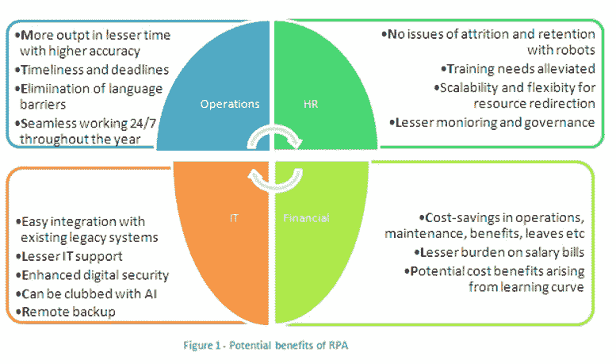
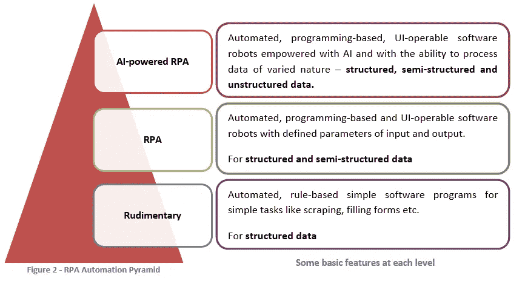
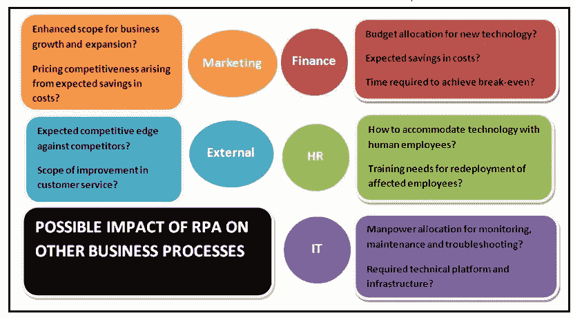

# 在您的企业中实施机器人流程自动化

> 原文：<https://medium.com/hackernoon/implementing-robotic-process-automation-in-your-business-752c077307c1>

机器人流程 [*自动化*](https://hackernoon.com/tagged/automation) *(RPA)对于那些熟悉商业和技术领域发展的人来说，不再是一个陌生的术语。* [*RPA*](https://hackernoon.com/tagged/rpa) *基本上是指一种软件技术，其中软件机器人通过在基于计算机和 UI 可操作的商业信息和通信系统上工作，来执行某些例行的和重复的任务和操作活动(通常由人类员工执行)。*

在本文中，我们将进一步深入探讨在商业企业中实施 RPA 的某些相关方面。

**RPA 的潜在优势**

业务流程的机器人自动化可以为商业企业提供竞争优势和最大优势。下图描述了 RPA 在业务管理中的一些潜在优势。RPA 的范围还可以扩展到其他职能，如营销、分析、供应链管理等。

## **在企业中实施 RPA 之前的重要考虑事项**

***为什么要自动化业务流程？***

了解了实施 RPA 可能带来的潜在好处，就不难理解 RPA 为什么会成为一项备受追捧的技术。但是，对于商业企业来说，明确说明选择业务流程机器人自动化的原因仍然很重要。同时，这也有助于发现业务实体中可以实施 RPA 的领域。了解为什么需要自动化以及可以在哪里实现自动化是开始走向 RPA 的理想起点。

可能有各种令人信服的原因，如更高的生产率、成本降低、效率提高、资源优化、降低管理人力资源职能的复杂性、改善客户服务、更好的合规性等，这些都可能吸引企业采用 RPA。

> 这也将引导企业发现他们寻求自动化的过程和操作活动。

例如，电信服务提供商的零售部门每天可能会收到数以千计的新连接申请。在必要的验证、法定合规性和成功订阅/注册之后，这些应用程序中的内容必须输入到公司的客户数据库中。对于后台部门来说，这可能是一项冗长乏味的任务，而 RPA 可以在此类数据输入过程中发挥高效的作用，同时节省 FTE 时间。

***自动化成熟度、目标自动化水平和正确的解决方案***

一旦明确确定了自动化的广泛目标和 RPA 实施的领域，企业就必须确定其当前的自动化成熟度、自动化的目标级别、所需的 RPA 解决方案是否可用，以及它是否能够满足已确定的自动化需求和目标。市场上有许多 RPA 解决方案。但在此之前，对于企业来说，根据自动化需求和目标，确定自己在(RPA)自动化层级中的位置至关重要。

> 在了解了自动化的目标水平和特定的自动化需求之后，找到合适的解决方案和确定潜在的供应商就变得更加容易了。

***潜在 RPA 解决方案的预计性能***

在确定潜在的 RPA 解决方案后，需要评估这些解决方案在一组给定条件/环境下的预期性能，并确定每个解决方案与预期结果的接近程度。

> 此阶段的主要目标是确定最接近成功执行目标操作/运营活动的自动化解决方案。

例如，电信服务提供商可能寻求将向其现有客户推销高价值因特网包的特定 CRM 操作自动化。让我们假设这个操作目前是由人类雇员执行的。一些自动化要求将包括验证客户订阅状态，从内部数据库中捕获他的互联网使用数据，评估他的互联网使用模式，如果他有资格，RPA 软件机器人将向客户发送促销通知，告知他更高价值的互联网包。

但是，如果自动化软件没有被配备来考虑在客户订购的互联网包的有效期结束时未使用的数据余额(在分配的总数据余额之外)的量的趋势参数，则公司可能最终也向可能对转移到更高的包不感兴趣的客户发送促销通知，特别是当他们的使用在数据余额和有效性方面始终保持在现有包的范围内时。

这种情况可能需要人工参与，但这可能与选择自动化的目标背道而驰。在相关的软件程序中可能有修改。

***RPA 实施对其他业务流程的影响***

到目前为止，我们主要讨论了自动化解决方案的操作方面。还需要提前评估实施 RPA 解决方案对其他业务流程(如财务、人力资源、IT、营销等)和外部业务环境的优先级、兼容性和必要一致性的影响。下图描述了 RPA 实施对其他业务流程可能产生的影响。

业务流程机器人化的想法并不陈旧。但软件机器人的出现是人类逐渐转向更具生产力、更高效的虚拟劳动力的一个重要里程碑，虚拟劳动力可以执行日常、重复和平凡的人类任务。自动化可以让企业在增值活动中更好地利用有限的资源，其好处最终可以传递给客户、员工和整个社会。但是，在加入自动化的行列之前，对于企业来说，重要的是要清楚地了解 RPA 范式，并为 RPA 实施制定可靠的计划和路线图，随后在必要的时间间隔进行审查和调整。

*免责声明:上述内容/出版物仅用于提供总体概述，不得用作任何商业或专业判断的依据。*

*阅读阅读更多相关文章:* [隆重促销的 ICO 投资安全吗？](/@obizcoin_90682/are-icos-with-grand-promotions-safe-to-invest-in-ef038f014252)、*、*、[商业管理中的颠覆性技术](/@obizcoin_90682/disruptive-technology-in-business-management-207ad40d0d1b)、*、*、[、 *ICO 投资变得有风险。投资前要检查的 10 件事——第一部分*](/@obizcoin_90682/ico-investments-have-become-risky-10-things-to-check-before-investing-part-i-7435eda597df) *，* [*清单能帮助你决定投资哪些 ICO 吗？，*](/@obizcoin_90682/can-a-checklist-help-in-deciding-which-icos-to-invest-in-1c2eb29381c0) [*如果你不变得有条理，为什么你还会是一个不成功的企业家？*](/@obizcoin_90682/why-will-you-remain-an-unsuccessful-entrepreneur-if-you-do-not-get-organized-e27e521ea873) *。*

*访问:*[*obizcoin . io*](https://www.obizcoin.io/)