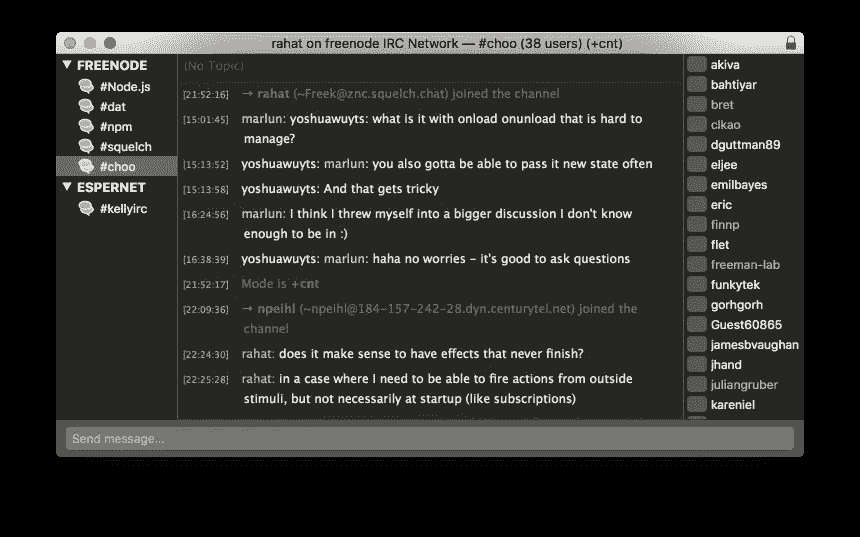

# 在 Node.js 中实现 IRC 规范

> 原文：<https://medium.com/hackernoon/implementing-the-irc-spec-in-node-js-c630b8cd5771>

## 为什么阅读 RFC 不一定是可怕的

IRC 一直是我生活中很重要的一部分。我的一些最牢固的友谊是在我十几岁时每天访问的 IRC 频道聊天中建立起来的。当我走在通往计算机科学的职业道路上时，我很自然会想知道它是如何在幕后工作的。但是你从哪里开始呢？

原来，互联网工程任务组(IETF)的人写了这些东西，叫做征求意见稿(RFC ),详细说明了不同系统和协议如何工作的确切规范。其中许多都设定了人们构建实现的标准。其中之一是 IRC 协议。听起来有点吓人，对吧？我们再说一遍。来自**互联网工程任务组**的一群**天才**编写**RFC**，这个星球上的**每个人都认为是**标准**。**

不过，不一定要很恐怖。我最初害怕阅读 RFC 1459，这是几乎所有 IRC 服务器和客户端都遵循的规范，因为我认为它太复杂了。我认为它们是由真正的工程师为真正的工程师写的，而不是像我这样的计算机科学学生。但是几年后，我潜入水中，发现水比我想象的要浅得多。

IRC 规范实际上是一个简单的协议，你不需要成为天才就能理解它。为了向您证明这一点，我将回顾 RFC 1459 的一些摘录，以了解该协议是如何工作的。然后，我们将使用我们所学的知识在 Node.js 中实现我们自己的简单 IRC 客户端。希望到最后应该清楚 RFC 是可接近的，任何人都可以编写自己的标准协议实现。了解这一点是您工具箱中的一项重要技能，因为您可以自由地用自己选择的语言实现协议。您不必一直等待其他人来实现它或使用一个糟糕的现有实现。

## 什么是 IRC？

如果你不知道 IRC 是什么，谢谢你留下来！让我们直接进入 RFC 1459 的摘要，而不是给出我自己的解释:

> IRC 协议是在过去的 4 年中发展起来的，因为它最初是作为 BBS 上的用户之间聊天的一种方式来实现的。现在，它支持一个世界范围的服务器和客户端网络，并在不断发展壮大。在过去的两年里，连接到 IRC 主网络的平均用户数量增长了 10 倍。
> 
> IRC 协议是一个基于文本的协议，最简单的客户端是任何能够连接到服务器的套接字程序。

是聊天室！你拿一个客户端，把它连接到一个服务器上，你就可以用不同的频道和其他人聊天。如果你熟悉的话，这和 Slack 的分散版本没什么不同。有许多不同的服务器和客户端应用程序。有些客户端完全在终端中运行。有些有图形用户界面。我每天使用的 IRC 客户端 Textual 是这样的:



Me, asking a question in the #choo Freenode IRC channel

让我们将显示的数据分解成关于协议的问题，我们可以使用 RFC 1459 来回答这些问题。

1.  左侧是我连接的服务器列表。您如何连接到服务器并与之通信？
2.  在每台服务器下，都有我加入的频道列表。**你如何加入一个渠道？**
3.  右边是焦点频道的人员列表，#choo。**你怎么知道谁在频道里？**
4.  在中间，有一个来自通道的消息日志。**你怎么知道频道里说的是什么？**
5.  在底部，我可以输入并向频道发送我自己的消息。如何发送自己的信息？

IRC 客户端通常可以做的事情还有很多，但是对于第一次阅读来说，这已经是相当多的功能了。

## 如何连接到服务器并与之通信？

让我们来看看 RFC 对于如何将服务器作为客户端有什么说法:

> 1.2 客户
> 
> **客户端是连接到一个服务器而不是另一个服务器的任何东西。**每个客户端通过一个最大长度为九(9)个字符的**唯一昵称**与其他客户端区分开来。请参阅协议语法规则，了解昵称中可以使用和不可以使用的内容。除了昵称之外，所有服务器必须具有关于所有客户端的以下信息:客户端运行的主机的**真实名称**，该主机上客户端的**用户名**，以及客户端连接到的服务器..

所以我们所需要做的就是连接到服务器，然后嘣，我们就是一个客户端…除非我们是另一个服务器。我们必须确保在继续阅读的同时，不要做服务器端的事情，而要做客户端的事情。

我们还了解到，客户有一个独特的昵称，也有一个真实的姓名和用户名。名字真多。让我们在继续时记住这一点。

一旦我们连接到服务器，我们发送什么，我们得到什么回报？如果我们继续读，我们会找到关于信息的那一章。

> 2.3 信息
> 
> 服务器和客户端互相发送消息，这些消息可能会也可能不会产生回复。如果消息包含有效命令，如后面章节中所述的
> ，客户端应期待指定的
> 回复，但不建议永远等待回复；客户端到服务器和服务器到服务器的通信本质上是异步的。

好的，这告诉我们不是所有的消息都会立即收到回复。也许我们可以发送消息并分别对服务器回复做出反应。更重要的是，什么是信息？

> 每条 IRC 消息最多可由三个主要部分组成:**前缀**T6(可选)、**命令**和**命令参数**(其中
> 最多可达 15 个)。前缀、命令和所有参数由一个(或多个)ASCII 空格字符(0x20)分隔。

一条消息由三部分组成，用空格隔开。那些部分是什么？

> 前缀**的存在用一个**单前导 ASCII
> 冒号字符**(':'，0x3b)表示，它必须是
> 消息本身的第一个字符。冒号
> 和前缀之间不能有空格。服务器使用前缀来表示消息的真实来源。如果前缀从消息中丢失，则它
> 被认为是从接收它的连接
> 中产生的。**客户端自己从
> 发送消息时不应使用前缀**；如果他们使用前缀，唯一有效的前缀是与客户端相关联的
> 注册昵称。如果无法从服务器的内部
> 数据库中找到前缀所标识的源
> ，或者如果该源是从与消息到达的
> 不同的链接中注册的，则服务器必须默认忽略消息
> 。**

我们在这里获得了很多信息，让我们列出我们所学到的:

1.  消息可以以前缀开头
2.  前缀以一个 ASCII 冒号(`:`)开始，然后是一些中间没有空格的文本。看起来有点像`:abcd`。
3.  客户端不应使用前缀。太好了，这对我们来说更容易！记住，我们想做客户端的事情，而不是服务器端的事情，这是其中之一。

> **命令**必须是有效的 IRC 命令，或者是用 ASCII 文本表示的三(3)位数字
> 。

我们还不知道什么是有效的 IRC 命令，但是现在我们知道它只是文本(或者 ASCII 中的 3 位数)。也许可以是`COOL`或者`123`。

> IRC 消息始终是以 CR-LF
> (回车-换行)对结束的字符行**，这些消息的长度不得超过
> 512 个字符，包括
> 结尾的 CR-LF 在内的所有字符。因此，命令及其参数最多允许有 510 个字符
> 。没有提供
> 延续信息行。有关
> 当前实施的更多详情，请参见第 7 节。**

CR-LF 在 JavaScript 和大多数语言中与`\r\n`相同。现在我们对客户机和服务器之间发送的消息有了一个小概念。它们可能看起来像这样:

```
WHATSUP these are params\r\nNOTMUCH i have params also\r\n:somekindaprefix 123 i have a prefix now\r\n
```

如果你一直在阅读，你可能会注意到我们跳过了一些段落和细节。这很好，我们不需要第一次就完全理解。你随时可以在以后再读一遍，以填补更多的知识空白。重要的一点是要意识到 RFC 是用简单的英语编写的，它们应该易于理解。

当我这么说的时候，下一章有一些奇怪的符号叫做 BNF。

> 2.3.1“伪”BNF 中的消息格式
> 
> 协议消息必须从连续的
> 八位字节流中提取。当前的解决方案是指定两个字符 CR 和
> LF 作为消息分隔符。空消息被无声忽略，
> 这允许在消息
> 之间使用序列 CR-LF 而没有额外的问题。
> 
> 提取的消息被解析成组件<prefix>，以及由<middle>或<trailing>组件匹配的参数列表。</trailing></middle></prefix>
> 
> 对此的 BNF 表示为:

```
<message>  ::= [':' <prefix> <SPACE> ] <command> <params> <crlf>
<prefix>   ::= <servername> | <nick> [ '!' <user> ] [ '@' <host> ]
<command>  ::= <letter> { <letter> } | <number> <number> <number>
<SPACE>    ::= ' ' { ' ' }
<params>   ::= <SPACE> [ ':' <trailing> | <middle> <params> ]

<middle>   ::= <Any *non-empty* sequence of octets not including SPACE or NUL or CR or LF, the first of which may not be ':'><trailing> ::= <Any, possibly *empty*, sequence of octets not including NUL or CR or LF>

<crlf>     ::= CR LF
```

如果你没有上过大学编程语言课程，你可能会想“啊，天哪，这是怎么回事？”。不要担心，一旦你知道它是什么，这个语法就很容易理解。BNF 代表 Backus-Naur 形式，它只是一种描述形式语法的方式，或者某种语言的一套规则。IRC 客户端和服务器使用的协议是一种语言，所以这是一种非常简短的方式来描述我们在之前的段落中读到的一切。

BNF 列出了一堆语法规则，其中每个元素由其他元素或文本组成。你可以这样读

```
<crlf>     ::= CR LF
```

上面写着“无论你在规则中的什么地方看到`<crlf>`，那都是一个 CR LF 或者`\r\n`。如果你看到方括号(`[]`)里的东西，那意味着它是可选的。

```
<message>  ::= [':' <prefix> <SPACE> ] <command> <params> <crlf>
```

这表示消息可能以冒号、`<prefix>`和`<SPACE>`开头，但也可能不是。这就像我们之前在 RFC 中对前缀的描述一样！

管道符号(`|`)分隔同一符号的多个规则。你可以把它理解成一个“或”。

```
<prefix>   ::= <servername> | <nick> [ '!' <user> ] [ '@' <host> ]
```

一个`<prefix>`要么是一个`<servername>`要么是一个带有一些可选的其他东西的`<nick>`。

最后，花括号(`{}`)表示“零个或更多”的内容。

```
<SPACE>    ::= ' ' { ' ' }
```

这意味着一个`<SPACE>`符号至少是一个空格，后跟零个或多个额外空格。

即使你还没有完全理解这里的 BNF，也没关系。我们已经从之前读过的所有材料中对信息的样子有了足够好的理解。现在我们知道了消息是什么样子，我们可以阅读第四章，这基本上是一个巨大的列表，列出了我们可以使用的所有不同类型的消息。具体来说，让我们看看需要发送什么来注册一个连接。

> 4.1 连接注册
> 
> 这里描述的命令用于将一个连接注册为一个用户或服务器，以及正确地断开连接。
> 
> 对于要注册的客户端或服务器连接，不需要**“通过”命令**，但它必须在服务器消息或 NICK/USER 组合的后者之前。强烈建议所有服务器连接都有密码，以便为实际连接提供一定程度的安全性。**客户注册的建议顺序如下**:
> 
> 1.传递消息
> 
> 2.尼克消息
> 
> 3.用户消息

哦，我们终于进入真正的 IRC 命令了！因为它说 PASS 命令是可选的，我们将跳过这一点(但是如果您想用密码连接到服务器，您可以自己阅读它)。让我们把重点放在 NICK 和用户消息上。

> 尼克消息
> 
> 命令:NICK
> 参数:<昵称> [ < hopcount >
> 
> NICK 消息用于**给用户一个昵称**或改变之前的
> 昵称。**服务器**仅使用< hopcount >参数来指示
> 一个缺口距离其主服务器有多远。本地连接的
> 跳数为 0。如果由客户端提供，则必须忽略它。
> 
> …
> 
> 示例:
> 
> `NICK Wiz`；介绍新的尼克“威兹”。
> 
> `:WiZ NICK Kilroy`；维茨把他的昵称改成了基尔罗伊。

我已经删掉了大部分描述，因为它只是实现服务器的人需要的信息。对于我们的客户来说，NICK 命令就是我们的昵称，这是我们之前读到的客户的众多名字之一。参数列表也以 BNF 格式给出，但是这里非常简单，所以很容易理解。客户端不使用`<hopcount>`，所以我们只需发送`NICK mycoolnickname`。

> 用户信息
> 
> 命令:用户
> 参数:<用户名>主机名>服务器名>真实名>
> 
> **用户消息在连接开始时用于指定新用户的用户名、主机名、服务器名和实名。**它也用于服务器之间的通信，以指示新用户到达 IRC，因为只有在从客户端接收到 user 和 NICK 之后，用户才被注册。
> 
> 在服务器之间，用户必须以客户的昵称为前缀。**注意，当用户命令来自直接连接的客户端**(出于安全原因)时，主机名和服务器名通常会被 IRC 服务器忽略，但是它们会在服务器到服务器的通信中使用。这意味着当一个新用户被介绍给网络的其余部分时，在伴随的用户被发送之前，NICK 必须总是被发送到远程服务器。
> 
> 必须注意，realname 参数必须是最后一个参数，因为它**可能包含空格字符，并且必须以冒号**(':')为前缀，以确保它被识别。
> 
> …
> 
> 示例:
> 
> `USER guest tolmoon tolsun :Ronnie Reagan`

啊，还有另外两个名字，用户名和真名，还有几个额外的名字！它说主机名和服务器名将被客户机忽略，所以我们可以把我们想要的东西放在那里。我们还学到了一些关于消息格式的新东西:如果最后一个参数以冒号为前缀，它可以有空格。如果你回头看看 BNF 消息格式规则，你会看到这里也有描述。

好吧。阅读量很大。但是现在我们已经知道了足够的信息来回答我们的第一个问题:如何连接到服务器并与之通信？要在服务器上注册一个客户端，我们需要连接到它，并接收它的消息。我们发送的第一条消息是尼克和用户消息。它们看起来像这样:

```
NICK rahat\r\nUSER rahat_ahmed whatever whatever :Rahat Ahmed\r\n
```

这花了很长时间，但是接下来的问题回答起来会快得多，因为我们已经知道消息格式是什么样子了。

## **如何加入渠道？**

现在我们知道如何连接，我们必须找到如何加入一个频道，以便我们可以在里面聊天。所有类型的信息都在第四章中列出，我们可以浏览目录来找到我们想要的东西。“4.2 通道操作”下的“4.2.1 加入消息”一节听起来很有希望。

> 4.2.1 加入消息
> 
> 命令:加入
> 参数:<通道> {，<通道> } [ <键> {，<键> }]
> 
> 客户端使用 JOIN 命令**开始监听特定频道** …
> 
> 一旦用户加入了一个频道，他们就会收到关于他们的服务器收到的影响该频道的所有命令的通知。这包括**模式、踢、部分、退出，当然还有特权/通知** …
> 
> 如果加入成功，用户将收到频道主题(使用 RPL 主题)和频道用户的**列表(使用 RPL 回复)，其中必须包括加入的用户。**
> 
> 示例:
> 
> `JOIN #foobar`；加入#foobar 频道。
> 
> `JOIN &foo fubar`；使用键“fubar”加入通道& foo。
> 
> `JOIN #foo,&bar fubar`；使用键“fubar”连接通道#foo，不使用键连接& bar。

那似乎很容易！要加入一个频道，我们只需发送`JOIN #channelname`，然后我们开始接收该频道的所有消息。这也有助于我们找到下一个问题的答案:

## **你怎么知道谁在频道里？**

JOIN 命令的描述说，在我们加入一个频道后，我们会自动收到一个 RPL_NAMREPLY 消息，其中包含该频道中的用户列表。如果你用 Ctrl+F 搜索 RFC 中的“RPL_NAMREPLY ”,你会在第六章回复中找到。

> 6.答复
> 
> 以下是为响应上述命令而生成的数字回复列表。每个数字都有其编号、名称和回复字符串。
> 
> …
> 
> 353 RPL_NAMREPLY
> `<channel> :[[@|+]<nick> [[@|+]<nick> [...]]]`

这不是严格的 BNF，但我们可以告诉 353 回复将有一个通道参数，后跟一个空格分隔的昵称的最终参数，这正是我们想要的！昵称前面可选的`@`和`+`在 RFC 的另一部分有描述，现在它们不是很重要。我会把它留给你，作为一个练习，找出他们的意思。

## **你怎么知道一个频道里说的是什么？**

我们希望从服务器接收的最后一组信息是在特定通道中发送的消息。检查 JOIN 命令中列出的命令列表可能是个好主意，一旦我们加入一个频道，就会自动收到这些命令。我们想要的是 PRIVMSG:

> 4.4.1 私人信息
> 
> 命令:PRIVMSG
> 参数:<接收方> {，<接收方> } <待发送文本>
> 
> PRIVMSG 用于**发送用户之间的私信**。<接收者>是消息接收者的昵称。<接收者>也可以是用逗号分隔的**或**频道列表。
> 
> 示例:
> 
> `:Angel PRIVMSG Wiz :Hello are you receiving this message ?`；天使给巫师的信息。
> 
> `PRIVMSG Angel :yes I'm receiving it!`；
> 给天使的信息。

完美。为了检查是谁发送了传入的 PRIVMSGs，我们读取了消息的前缀。为了查看消息发送给了谁或发送到了哪里，我们检查第一个参数。示例显示了用户之间的直接消息，但是描述说它也可以是频道名称。

## 如何发送自己的信息？

这是免费的。如 PRIVMSG 部分所述，我们将自己的 PRIVMSG 发送到服务器，并将目的地和消息作为参数。

## 好吧，让我们做一个客户！

读够了。现在我们对协议的基础有了足够的了解，我们可以开始实现了。

首先，我们需要连接到服务器。在此之前，我们需要连接一台服务器。我将使用流行的 Freenode(托管官方#node.js 通道的地方)。因为我们使用 node.js，所以我们可以使用`net`模块来打开一个连接。

```
var net = require('net')var client = net.connect({
  host: 'irc.freenode.net',
  port: '6667'
})
```

现在我们想看看服务器向客户机发送了什么，所以让我们将连接通过管道传输到 stdout，以便它打印到屏幕上。

```
client.pipe(process.stdout)
```

最后，我们希望能够向服务器发送命令。最简单的方法是通过管道将 stdin 连接到该连接，但有一点需要注意。终端输入使用`\n`换行，而 IRC 消息由`\r\n`分隔。没问题，我们只要用`npm install stream-replace`从 npm 抓取一个流替换包就可以了。

```
var replace = require('stream-replace')process.stdin.pipe(replace('\n', '\r\n')).pipe(client)
```

好的，看起来像这样。

```
var net = require('net')
var replace = require('stream-replace')var client = net.connect({
  host: 'irc.freenode.net',
  port: '6667'
})client.pipe(process.stdout)
process.stdin.pipe(replace('\n', '\r\n')).pipe(client)
```

就是这样。我们完了！

## 什么？

你可能在想，我现在让你白读了这篇文章。不要关闭标签，听我说完。

经历这一切的目的不是向您展示如何编写 IRC 客户端。真正的目的是表明任何人都可以阅读 RFC，希望现在他们看起来没有以前那么可怕。你看，上面那个程序不是真正的客户。IRC 客户端一直在你体内！代码仅仅是为了让你自己能够用你刚刚学过的语言和服务器交流。让我们试一试，好吗？

将脚本保存到一个文件中，然后用`node script.js`运行它。您应该会立即在屏幕上看到一些来自服务器的文本。

```
:sinisalo.freenode.net NOTICE * :*** Looking up your hostname...
:sinisalo.freenode.net NOTICE * :*** Checking Ident
:sinisalo.freenode.net NOTICE * :*** Found your hostname
```

是一堆通知信息。我们以前没见过，但你不知道的不会伤害你，你以后也可以读到。让我们坚持我们所知道的。

如果您让脚本运行一段时间，最终您会得到以下错误:

```
ERROR :Closing Link: 127.0.0.1 (Connection timed out)
```

这意味着我们花了太长时间什么都不做，服务器关闭了连接。我们可以再试一次，但这次我们将尝试注册一个连接，就像我们在第 4 章中读到的那样。我们需要发送的命令是 NICK 和 USER。这些命令的参数设置了您的昵称、用户名和真实姓名，因此可以选择您喜欢的任何内容(可以随意向上滚动以复习哪个参数是哪个参数)。

```
NICK rahat
USER rahat_ahmed these_params dont_matter :Rahat Ahmed
```

在上面每一行之后按 enter 键，您将从服务器收到大量数据。戴上你的室内黑客墨镜，因为*我们在*了。

```
:verne.freenode.net 001 rahat2 :Welcome to the freenode Internet Relay Chat Network rahat2
:verne.freenode.net 002 rahat2 :Your host is verne.freenode.net[185.30.166.37/6667], running version ircd-seven-1.1.4
:verne.freenode.net 003 rahat2 :This server was created Thu Sep 22 2016 at 20:50:37 UTC
:verne.freenode.net 004 rahat2 verne.freenode.net ircd-seven-1.1.4 DOQRSZaghilopswz CFILMPQSbcefgijklmnopqrstvz bkloveqjfI
:verne.freenode.net 005 rahat2 CHANTYPES=# EXCEPTS INVEX CHANMODES=eIbq,k,flj,CFLMPQScgimnprstz CHANLIMIT=#:120 PREFIX=(ov)@+ MAXLIST=bqeI:100 MODES=4 NETWORK=freenode KNOCK STATUSMSG=@+ CALLERID=g :are supported by this server
:verne.freenode.net 005 rahat2 CASEMAPPING=rfc1459 CHARSET=ascii NICKLEN=16 CHANNELLEN=50 TOPICLEN=390 ETRACE CPRIVMSG CNOTICE DEAF=D MONITOR=100 FNC TARGMAX=NAMES:1,LIST:1,KICK:1,WHOIS:1,PRIVMSG:4,NOTICE:4,ACCEPT:,MONITOR: :are supported by this server
:verne.freenode.net 005 rahat2 EXTBAN=$,ajrxz WHOX CLIENTVER=3.0 SAFELIST ELIST=CTU :are supported by this server
:verne.freenode.net 251 rahat2 :There are 144 users and 82040 invisible on 29 servers
:verne.freenode.net 252 rahat2 33 :IRC Operators online
:verne.freenode.net 253 rahat2 19 :unknown connection(s)
:verne.freenode.net 254 rahat2 53193 :channels formed
:verne.freenode.net 255 rahat2 :I have 4729 clients and 2 servers
:verne.freenode.net 265 rahat2 4729 5738 :Current local users 4729, max 5738
:verne.freenode.net 266 rahat2 82184 92341 :Current global users 82184, max 92341
:verne.freenode.net 250 rahat2 :Highest connection count: 5740 (5738 clients) (579387 connections received)
```

记住我们读到的消息格式，这些似乎是一堆带有各种服务器数据的数字服务器回复。其中一些很容易阅读，另一些有点难，但没有什么比快速搜索 RFC 第 6 章中的回复列表更能找到它们的真正含义。既然我们已经加入了，我们可以尝试加入一个频道并在里面聊天。让我们尝试加入#node.js

```
JOIN #node.js
```

(如果没有立即得到响应，请按 Enter 键一堆次。节点可能会在发送之前缓冲您的输入)。你应该再次收到一些数据，这一次我们收到了大量的 353 (RPL_NAMREPLY)回复，其中包含频道中的一堆昵称，以及我们输入#node.js 的确认加入。如果有人在频道中发言，你会看到他们的 PRIVMSG。你可以尝试向频道发送消息，但你会得到 404 回复，因为#node.js 已经限制只向在 Freenode 注册了昵称的人发送消息。你可以随时加入另一个频道或加入你自己的频道，在那里玩，只要确保你没有打扰任何其他用户。一件很酷的事情是使用另一个 IRC 客户端加入同一个频道，和自己聊天。您可以看到您所做的一切的原始协议消息！

不言而喻，在 IRC 服务器上你还可以做更多的事情，在 RFC 1459 中你还可以阅读更多的内容并尝试理解更多的内容。我希望这个对 IRC 内部工作的快速探究能给你继续阅读的信心。即使你对 IRC 不是特别感兴趣，如果你想了解其他的协议或系统，那就去找 RFC 吧！

快乐阅读！

> [黑客中午](http://bit.ly/Hackernoon)是黑客如何开始他们的下午。我们是 [@AMI](http://bit.ly/atAMIatAMI) 家庭的一员。我们现在[接受投稿](http://bit.ly/hackernoonsubmission)，并乐意[讨论广告&赞助](mailto:partners@amipublications.com)机会。
> 
> 要了解更多信息，请[阅读我们的“关于”页面](https://goo.gl/4ofytp)、[在脸书上点赞/给我们发消息](http://bit.ly/HackernoonFB)，或者简单地说， [tweet/DM @HackerNoon。](https://goo.gl/k7XYbx)
> 
> 如果你喜欢这个故事，我们推荐你阅读我们的[最新科技故事](http://bit.ly/hackernoonlatestt)和[趋势科技故事](https://hackernoon.com/trending)。直到下一次，不要把世界的现实想当然！