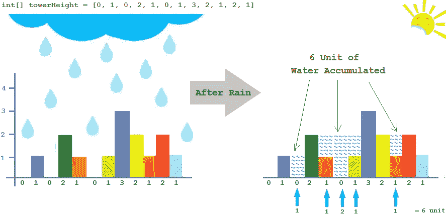
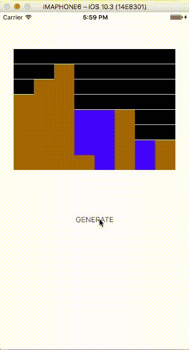

# 在 Swift 中使用 UIImageGraphics 实现 Twitter 的面试问题“捕捉雨水”

> 原文：<https://medium.com/hackernoon/implementing-trapping-rain-water-twitters-interview-question-using-uiimagegraphics-in-swift-5783885f6d42>

在我的第一篇文章中，我将告诉你如何实现[*Google*](https://www.youtube.com/watch?v=UzeL2GcLx3Y)*[*Twitter*](http://www.businessinsider.com/twitter-job-interview-question-rainfall-walls-2013-12)*与使用**Swift****ui imagegraphics**在*采访中问到的**收集雨水**问题。***

## **问题是什么？**

****

**Photo is taken from [http://javabypatel.blogspot.com.tr/2016/10/trapping-rain-water-between-towers.html](http://javabypatel.blogspot.com.tr/2016/10/trapping-rain-water-between-towers.html)**

**首先，我想解释一下这个问题。将给出 n 个非负整数来表示塔的高度，每个塔的宽度只有 1 个单位。我们假设下雨了，问题是:**

> **所有塔之间填充了多少单位水？**

## **怎么解决？**

**首先，我会告诉你如何解决它，然后我会解释如何实现它的快捷和核心形象。**

**我们总是假设在一个可用的结构(在一个数组中)中，条形高度是可用的。例如，塔的高度是[ 3，0，0，2，0，4 ]。**

**对于每一座塔，我们必须弄清楚在它的左边是否有一座比它高的塔，在它的右边是否有一座比它高的塔。如果其中一座塔不存在，我们假设那座塔所在的地方，不会带走任何水。**

**如果有两座塔，我们可以选择左边最高的一座和右边最高的一座，然后我们必须选择两座塔中最小的一座。放置塔的单元，总共将消耗最少数量的水。**

**如果我们从这个最小值中减去塔的高度，我们将会发现每个塔单元有多少水。**

**作为场景中第一个塔的第一个索引和作为最后一个塔的最后一个索引将没有水，因为在第一个塔的左边没有塔，同样的，在最后一个塔的右边也没有塔。**

# **快速实施**

**UIViewController 有一个用于生成的 ***UIButton*** 和一个用于表示被处理图像的 ***UIImageView*** 。这里是存储所有塔高度的结构，我将向您展示我已经将 ***UIImage*** 划分并表示为 ***8x8*** 部分。因此，对于这个问题，将有 8 个塔，每个塔最多 8 个高度单位。**

```
**struct WallHeights  { var wallHeights : [Int] = [0,0,0,0,0,0,0,0];}**
```

**现在，随机生成塔高的时间到了。**

```
**var testWall : WallHeights = WallHeights();for iterator in 0..<8{testWall.wallHeights[iterator] = Int(arc4random_uniform(256)) % 8; }**
```

**然后，我开始使用 UIGraphics 函数开始处理图像，并实现了许多功能，以找出它是否可以填充水，处理图像以生成场景和填充塔之间的水。**

**以下是随机场景:**

****

**Generating Random Scenarios for this Problem**

**这个问题的最后一部分，实现图像的水填充功能。这是这个问题的最终状态:**

****

**Filled water into towers**

**如果这篇文章有帮助，你可以在 Github 上开始这个项目。**

**[](https://github.com/eliakorkmaz/Trapping-Rain-Water-with-Swift) [## eliakorkmaz/用雨燕收集雨水

### 用 Swift 和 UIImageGraphics 实现的雨水问题

github.com](https://github.com/eliakorkmaz/Trapping-Rain-Water-with-Swift)** 

**如果你想问问题，请直接在 [Twitter](https://hackernoon.com/tagged/twitter) 上评论或给我发消息。我会分享一些关于[编程](https://hackernoon.com/tagged/programming)，算法，尤其是 Swift 的文章，所以你可以关注我，喜欢这篇文章。**

**[](http://bit.ly/HackernoonFB)****[](https://goo.gl/k7XYbx)****[](https://goo.gl/4ofytp)**

> **[黑客中午](http://bit.ly/Hackernoon)是黑客如何开始他们的下午。我们是 [@AMI](http://bit.ly/atAMIatAMI) 家庭的一员。我们现在[接受投稿](http://bit.ly/hackernoonsubmission)并乐意[讨论广告&赞助](mailto:partners@amipublications.com)机会。**
> 
> **如果你喜欢这个故事，我们推荐你阅读我们的[最新科技故事](http://bit.ly/hackernoonlatestt)和[趋势科技故事](https://hackernoon.com/trending)。直到下一次，不要把世界的现实想当然！**

****