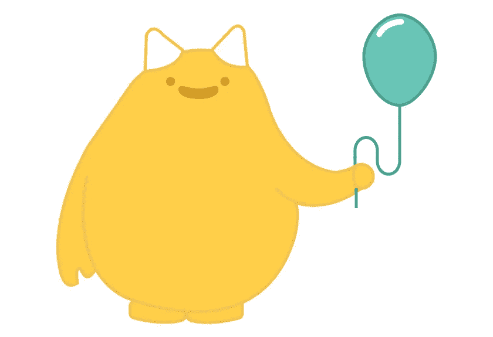
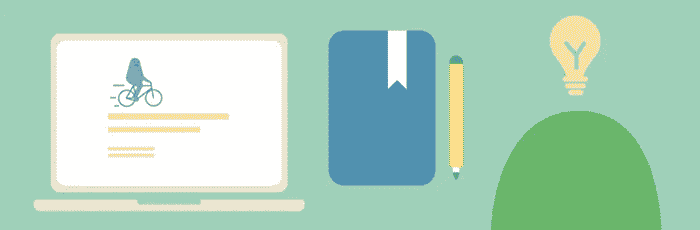

# 不可能的人去开源

> 原文：<https://medium.com/hackernoon/impossible-people-goes-open-source-3e992f27863f>

我们一直知道我们想让我们的社区平台开源。对于一个根植于礼品文化的平台来说，让代码免费供人们使用和贡献似乎是合乎逻辑的下一步。事实上，互联网最优秀部分的增长很大程度上依赖于开源运动的增长:从维基百科到 WordPress(拥有 24%的网站！)到互联网本身的最开始——当蒂姆·伯纳斯·李爵士把这种语言交给全世界使用的时候。

试图创造一种强大的送礼文化，以及支持这种文化的技术，是一个巨大的挑战(我们没有无缘无故地说这是不可能的！)经过四年的尝试、错误和学习，我们终于找到了一个有价值的、简单而稳定的平台来帮助促进社区捐赠。

作为一个开源产品，你可以通过多种方式与不可思议的人交流。你可以继续正常使用不可能的人应用程序( [iOS](https://itunes.apple.com/us/app/impossible-people/id1116732589?mt=8&utm_source=Impossible+Newsletter&utm_campaign=342dfa5e6a-EMAIL_CAMPAIGN_2017_03_10&utm_medium=email&utm_term=0_c657a8a665-342dfa5e6a-227550177&mc_cid=342dfa5e6a&mc_eid=58b72c7325) 和 [Android](https://play.google.com/store/apps/details?id=com.impossible.gnome.prod&hl=en&utm_source=Impossible+Newsletter&utm_campaign=342dfa5e6a-EMAIL_CAMPAIGN_2017_03_10&utm_medium=email&utm_term=0_c657a8a665-342dfa5e6a-227550177&mc_cid=342dfa5e6a&mc_eid=58b72c7325) )，或者如果你技术熟练，你可以[下载代码](https://github.com/iampossible/gnome?utm_source=Impossible+Newsletter&utm_campaign=342dfa5e6a-EMAIL_CAMPAIGN_2017_03_10&utm_medium=email&utm_term=0_c657a8a665-342dfa5e6a-227550177&mc_cid=342dfa5e6a&mc_eid=58b72c7325)，用它来建立你自己的社区网络。或者你可能想做些贡献。我们已经设计了一个很长的功能列表，有人可以构建，我们总是对你认为可能缺失的新想法持开放态度。

如果没有杰出人士和组织的支持和投入，从[内斯塔](http://www.nesta.org.uk/?utm_source=Impossible+Newsletter&utm_campaign=342dfa5e6a-EMAIL_CAMPAIGN_2017_03_10&utm_medium=email&utm_term=0_c657a8a665-342dfa5e6a-227550177&mc_cid=342dfa5e6a&mc_eid=58b72c7325)，到 [Pivotal Labs](https://pivotal.io/labs?utm_source=Impossible+Newsletter&utm_campaign=342dfa5e6a-EMAIL_CAMPAIGN_2017_03_10&utm_medium=email&utm_term=0_c657a8a665-342dfa5e6a-227550177&mc_cid=342dfa5e6a&mc_eid=58b72c7325) ，到像吉米·多纳尔·威尔士、布莱恩·博伊兰和许多其他人这样的顾问，我们迄今所取得的一切都是不可能的。所以就当这是我们给你(世界)的礼物吧。我们希望你能参与进来，成为我们不可能的故事的一部分。

在这里下载代码[。](https://github.com/iampossible/gnome?utm_source=Impossible+Newsletter&utm_campaign=342dfa5e6a-EMAIL_CAMPAIGN_2017_03_10&utm_medium=email&utm_term=0_c657a8a665-342dfa5e6a-227550177&mc_cid=342dfa5e6a&mc_eid=58b72c7325)

> [黑客中午](http://bit.ly/Hackernoon)是黑客如何开始他们的下午。我们是 [@AMI](http://bit.ly/atAMIatAMI) 家庭的一员。我们现在[接受投稿](http://bit.ly/hackernoonsubmission)并乐意[讨论广告&赞助](mailto:partners@amipublications.com)机会。
> 
> 如果你喜欢这个故事，我们推荐你阅读我们的[最新科技故事](http://bit.ly/hackernoonlatestt)和[趋势科技故事](https://hackernoon.com/trending)。直到下一次，不要把世界的现实想当然！

