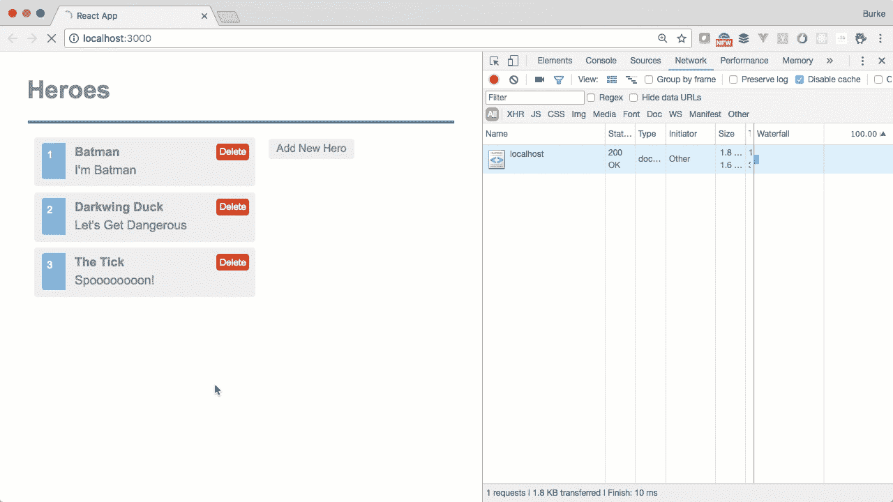

# React 中的代码分割让您的朋友印象深刻

> 原文：<https://medium.com/hackernoon/impress-your-friends-with-code-splitting-in-react-9f9a3ca2ae6e>

几周前，在准备 [DevUp](http://devupconf.org/) 主题演讲时，我花了一些时间学习在 React 中演示[代码](https://hackernoon.com/tagged/code)分裂的最小可能量。现在你的第一反应大概是…

> 伯克。你为什么要做主题演讲？主题演讲不再有任何意义了吗？

让我通过说两件事来回答这个问题…

1.  哎哟
2.  有人被邀请做主题发言。他们只是让我帮忙。

作为主题演讲的一部分，我正在研究如何优化 React 构建。这是我们在开始吐槽代码拆分之前应该回答的问题。

# 优化 React 构建

当我说“优化”一个构建时，我指的是任何使代码**更小**和**更快**的东西。有一些技术被用于整个 JavaScript 领域来实现这一点…

*   集束
*   缩小
*   提前编译
*   树晃动(当你的孩子的无人机再次卡在树上时——呃——我的意思是移除死代码)
*   代码分割(按需加载代码块)

create-react-app 默认会发生上述三种情况:由于 Webpack，create-react-app 免费提供捆绑、缩小和树抖动。

React 不做 AoT，因为 AoT 主要用于将字符串模板编译成可执行的 JavaScript，所以浏览器不需要做这部分工作。React 已经在 JSX 这样做了。这也是 React 人们喜欢说“这只是 JavaScript”的原因之一。声明一下，字符串也是有效的 JavaScript。随便说说。这不像 Angular 和 Vue 的人使用一些只有专有编译器才能理解的预处理器语言——你知道，像 JSX。


**但无论如何**

这就给我们留下了代码分割。这只是一个简单的想法，你想把你的代码分成可以延迟加载的块，这样你就不会加载可能永远不会用到的 JavaScript，这取决于用户在你的应用程序中的位置。

在*为什么*你会想在 React 中进行代码拆分的背后有很好的和深刻的技术原因。这些具体原因包括…

*   你是个潮人
*   所有酷小孩都这么做
*   “代码分割”是一个性感的词
*   你不能强迫用户加载他们不会使用的代码

让我们通过检查一个您在现实生活中永远不会使用的演示应用程序来看看这在现实生活中是如何工作的。

# 代码分割 IRL

在下面的 GIF 中，你会看到一个追踪英雄列表的应用程序。这只是一个简单的 CRUD 应用程序。这个应用程序的一个有趣的部分是有一个编辑表单，它只在添加一个新项目或选择一个现有项目时显示。这意味着，如果用户来到这个应用程序，并且从来没有添加或修改过一个英雄，他们已经加载了一大块他们永远不会使用的 JavaScript。


我们可以延迟加载这个小表单，这样它只在有人点击编辑一个项目或者点击“添加新英雄”时才显示。这两个动作都显示了编辑表单。

首先，我将在我的状态中为这个“EditForm”组件添加一个点。

```
class Heroes extends Component {
  constructor(props) {
    super(props);
    this.state = { 
      ...,      
      lazyEditHero: null 
    }
  } ..., render() { 
    return ( 
      ...
    )
  }
}
```

我把我的放在一个叫做`lazyEditHero,` 的房产里，但是你可以随便叫它什么。给事物命名是很难的，无论你做什么，你都有 100%的可能会后悔。

接下来，每当有人选择“添加新英雄”或选择一个现有的英雄来编辑它时，我们需要实际加载这个组件。然后，我们将在州中设置组件引用，以便稍后在 JSX 中使用它。我把它放在一个名为 **LoadEditForm** 的函数中

```
class Heroes extends Component {
  constructor(props) {
    super(props);
    this.state = { 
      ...
      lazyEditHero: null 
    }
  } async LoadEditForm() {
    const { default : EditHero } = await import('./EditHero');
    this.setState({ lazyEditHero: EditHero })
  } render() { 
    return ( 
      ...
    )
  }
}
```

现在我们只需要从触发编辑器组件显示的两个函数中调用这个 **LoadEditForm** 。

```
class Heroes extends Component {
  constructor(props) {
    super(props);
    this.state = { 
      ...
      lazyEditHero: null 
    }
  } async LoadEditForm() {
    const { default : EditHero } = await import('./EditHero');
    this.setState({ lazyEditHero: EditHero })
  } handleSelect = async hero => {
    await this.LoadEditForm();
    this.setState({ selectedHero: hero });
  }

  handleEnableAddMode = async () => {
    await this.LoadEditForm(); this.setState({
      addingHero: true,
      selectedHero: { id: '', name: '', saying: '' }
    });
  } ... render() { 
    return ( 
      ...
    )
  }
}
```

一些需要注意的事项…

*   我们的函数都标记为 async，因为我使用了 async/await 语法。简而言之，async/await 允许我们在不显式使用 promise 语法的情况下同步进行某些操作——比如通过 HTTP 调用加载文件。它超级棒，你应该[看看](https://developer.mozilla.org/en-US/docs/Web/JavaScript/Reference/Statements/async_function)。
*   `./EditHero`文件被加载并分配(通过析构)给一个名为“EditHero”的变量。指定“default”的原因是，这是组件在加载文件的异步调用返回的响应中的实际位置。

最后，我们需要将组件添加到我们的 JSX 中，但前提是它不为空。如果为空，我们将只显示一个空字符串。这也允许我们在组件延迟加载时向组件传递任何道具。

```
class Heroes extends Component {
  constructor(props) {
    super(props);
    this.state = { 
      ...
      lazyEditHero: null 
    }
  } async LoadEditForm() {
    const { default : EditHero } = await import('./EditHero');
    this.setState({ lazyEditHero: EditHero })
  } handleSelect = async hero => {
    await this.LoadEditForm();
    this.setState({ selectedHero: hero });
  }

  handleEnableAddMode = async () => {
    await this.LoadEditForm(); this.setState({
      addingHero: true,
      selectedHero: { id: '', name: '', saying: '' }
    });
  } ... render() { 
    const EditHero = this.state.lazyEditHero;
    return (
      <div>
        ...
        <div className="editarea">
          <button onClick={this.handleEnableAddMode}>Add</button>
          {EditHero ? (
            <EditHero
              addingHero={this.state.addingHero}
              onChange={this.handleOnChange}
              selectedHero={this.state.selectedHero}
              onSave={this.handleSave}
              onCancel={this.handleCancel}
            />
          ) : (
            <div></div>
          )}
        </div>
      </div>
    );
  }
}
```

现在你知道了！现在，当我们运行这个应用程序时，它只会加载英雄列表，直到我们点击一个或尝试添加一个新的。一旦我们这样做了，您就可以打开开发人员工具，观察浏览器对浏览器加载和执行的新 JavaScript 块发出 HTTP 请求。



好俏皮！还要注意，即使我们在添加或选择一个项目时一遍又一遍地调用那个`LoadEditForm`，Webpack 也足够聪明，不会尝试重新加载组件，因此不会进行后续调用。

# 我应该在哪里进行代码拆分

嘿，这是你的世界。我不是来告诉你该做什么的。

但是如果我是，我会推荐在你有特别重的组件的地方(字节方面)和你有组件的地方使用代码分割，你的用户有很大的不使用的统计可能性。

React Router 是另一个使用代码分割的好地方，因为你可以在 URL 改变时加载内容。按需加载 SPA 的页面是有意义的，而不是一次全部加载。事实上，[大部分代码拆分的例子](https://serverless-stack.com/chapters/code-splitting-in-create-react-app.html)都会涉及到 React 路由器。

# 临别时的告诫

代码拆分很酷，但是不要忘乎所以。如果你的整个应用程序是一堆懒惰的组件，你就 **a)** 违背了捆绑器的目的， **b)** 过早地优化和 **c)** 使你的代码更加难以阅读和调试。

所以小心使用代码分割，然后告诉你所有的朋友你知道怎么做。你听起来会非常酷，每个人都会喜欢你。这已经足够了。