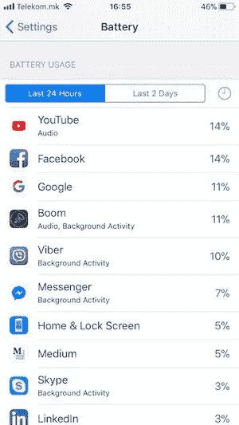
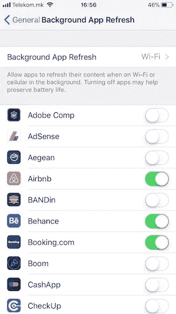
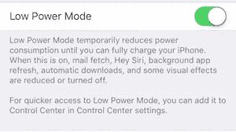
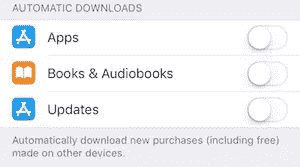
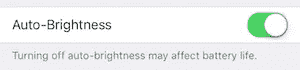
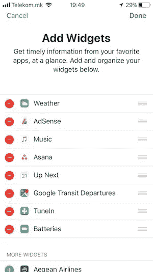
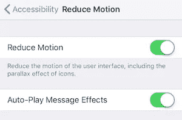

# 在 iOS 11 中提高 iPhone 的电池寿命

> 原文：<https://medium.com/hackernoon/improve-battery-life-on-your-iphone-in-ios-11-b4aa92c958ca>

## 10 个有用的技巧，将大大延长您的电池寿命…

当 [iOS](https://hackernoon.com/tagged/ios) 11 宣布的时候我是如此的激动。我在 iPhone 6s 上市的同一天升级了它。新功能和用户界面真的很棒，绝对是有史以来发布的最好的 iOS 版本。但是，每样东西都有它自己的价格。

我开始每小时损失 30-40%的电池寿命，在大多数情况下，我不得不每天充电两次。你可能会认为我一直在使用我的 iPhone，但事实并非如此。大多数时候，我的手机都是锁定的，只有在接到电话或信息时才会使用。此外，你可能会认为电池是旧的，但它在 iOS 10 上工作得很好。

## 丰富🔋

我的挫败感越来越大，我必须为此做点什么。我开始通过测试各种功能来寻找改进，并观察电池在有和没有这些功能时的表现。我的测试是成功的，我发现了一些有用的技巧，现在我将向您展示。

# 1.检查电池使用情况

你需要做的第一件事是发现什么最消耗你的电池。在`Settings -> Battery`下，你可以查看 24 小时间隔内哪些应用是最大的消费者。通过点击时钟图标，您将获得特定应用程序在使用时和在后台消耗电池的时间信息。

这非常重要，因为一些应用程序可能会在后台工作很长一段时间。如果我们知道应用的电池消耗，我们可以更好地管理应用。要做到这一点，请阅读下一点。👇

# 2.禁用后台应用刷新

检测到电池的最大敌人后，导航到`Settings -> General -> Background App Refresh`并关闭这些应用的后台应用刷新。你也可以禁用所有应用的这个功能，但我建议只对最消耗的应用禁用。

# 3.定位服务

定位服务真的会很快耗尽你的电池。它以非常频繁的频率探测你的位置。我们需要做的是确保所有安装的应用程序都使用“使用中”选项，可以在`Settings -> Privacy -> Location Services`下找到。这样，只有当应用程序处于焦点时，定位服务才会被激活。

# 4.启用低功耗模式

我从不关闭这个功能，因为我发现它真的很有帮助。当电池电量为 20%或更低时，建议激活此模式。但是，我总是保持激活状态，即使我的 iPhone 已经满了。该功能限制了电子邮件更新、后台应用刷新、自动锁定、Siri、亮度和视觉效果。

您可以在`Settings -> Battery -> Low Power Mode`下找到该功能，或者直接从您的控制中心找到。

# 5.禁用自动下载

另一个耗电大户是自动下载选项。如果启用此功能，它将在后台检查新更新时一直处于活动状态。你可以随时去 App Store，一两天手动更新一次所有的应用。

你可以在`Settings -> iTunes & App Store`下找到这个功能。

# 6.仅使用静态壁纸

请尽量避免“动态”或“实时照片”壁纸，因为它们对你的电池寿命有很大影响。相反，使用静态壁纸，因为它们没有需要更多 GPU 能力的移动效果。

你可以在`Settings -> Wallpaper`下找到这个功能。

# 7.启用自动亮度调节

我喜欢一直把我的亮度调到最高。一切都很明亮，很适合我的眼睛。但是，如果我想我的电池持续更长时间，我必须改变这一点。自动亮度功能将自动调节亮度。它会考虑到你当前的环境，是晴天还是在黑暗的房间里。

从 iOS 11 这个功能被移到了`Settings -> General -> Accessibility -> Display Accommodations`。

# 8.管理 Siri

如果你不是热情的 Siri 用户，可以考虑禁用`Settings -> Siri & Search`下的“嘿，Siri”选项。它基本上让你通过说出她的名字来访问 Siri，但为了听到名字和关键词，它必须听你的声音，并一直处于活动状态。我不太喜欢语音助手，所以我禁用了 Siri。

# 9.减少小部件的数量

小工具为你提供关于天气、日历事件、货币更新等快速信息。你可以通过从屏幕顶部向底部滑动来找到你的小部件。iOS 使用电池来保持这些小工具的最新状态。考虑移除任何您不使用的 widget。

# 10.启用减少运动

我知道你喜欢新的过渡和动画。但是，它们也会影响电池寿命。[苹果](https://hackernoon.com/tagged/apple)意识到了这一点，并为你提供了一个叫**减少运动**的功能来禁用它们。

减少运动可以在`Settings -> General -> Accessibility -> Reduce Motion`下找到。

## 我已经向你提供了 10 个延长电池寿命的技巧。你可以自己决定使用哪些技巧。如果你觉得这个故事有用，请不要忘记👏或者共享它，这样其他人也可以找到它。干杯！

## 查看我的最新项目:

 [## 足球比分预测赌注

### 我们提供专业的足球比分预测投注提示，胜率高。每个比赛模拟包含一个…

apps.apple.com](https://apps.apple.com/app/football-score-prediction-bets/id1517623538)  [## 足球博彩技巧和比分——赌进球 Google Play 上的应用程序

### 我们提供高胜率的专业足球技巧。每个比赛模拟包含一个预测，代表…

play.google.com](https://play.google.com/store/apps/details?id=betting.tips.goals)  [## 缩放个人资料图片和故事

### ZoomPic for Instagram 是匿名查看大型高清个人照片和故事的最简单、最方便的方式…

apps.apple.com](https://apps.apple.com/app/zoom-profile-picture-stories/id1514925024)  [## Instagram 的长视频故事

### Instagram 的 Long Story 是一个非常棒的工具，允许您录制或选择任意长度的视频并进行转换…

apps.apple.com](https://apps.apple.com/app/long-video-story-for-instagram/id1511499427) 

## 阅读更多我在媒体上的作品:

 [## 引入干净的 Swift 架构(VIP)

### 忘了 MVC 吧，现在！

hackernoon.com](https://hackernoon.com/introducing-clean-swift-architecture-vip-770a639ad7bf)  [## 使用 Swift 4 在 iOS 上使用 Google Maps SDK 的终极指南

### 许多 iOS 应用程序使用谷歌地图。这是一个非常普遍的特点，所以我决定准备一个终极指南…

medium.freecodecamp.org](https://medium.freecodecamp.org/how-you-can-use-the-google-maps-sdk-with-ios-using-swift-4-a9bba26d9c4d)  [## SWIFT —带有 XIB 文件的自定义 UIView

### 用 XIB 文件定制 UIView 是 iOS 开发中非常常见的做法。自定义 UIView 类不包含 XIB 文件…

medium.com](/theappspace/swift-custom-uiview-with-xib-file-211bb8bbd6eb)  [## 如何将 Spotlight 支持添加到您的 iOS 应用程序

### Swift 教程将使您的应用程序在 Spotlight search 中可用

hackernoon.com](https://hackernoon.com/how-to-add-spotlight-support-to-your-ios-app-4a89054aff89)  [## 核心数据关系

### 理解一对一和一对多关系

hackernoon.com](https://hackernoon.com/core-data-relationships-d813ed66ba8c)  [## 了解 Xcode 9 中的自动布局

### 所有你需要知道的关于自动布局

hackernoon.com](https://hackernoon.com/understanding-auto-layout-in-xcode-9-2719710f0706) 

## 订阅我的时事通讯: