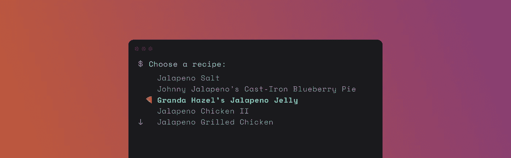

# 使用 Promptui 改进您的命令行 Go 应用程序

> 原文：<https://medium.com/hackernoon/improve-your-command-line-go-application-with-promptui-258ebe9eed1>



promptui 是一个 Go 库，它提供了一个简单的界面来创建 cli 提示符。该库有两种主要模式:*提示*——为用户输入提供单行，以及*选择*——显示可供选择的项目列表。两种模式都有几个定制选项，并利用强大的 [readline](https://github.com/chzyer/readline) 支持多个终端。

在这篇文章中，我们将创建一个食物食谱命令行应用程序，它询问菜肴类型，从 API 中检索信息，并显示相关的食谱。

如果你想跳到完整的应用程序源代码，去:[https://github.com/luizbranco/promptui-demo/](https://github.com/luizbranco/promptui-demo/)

# 初始提示

在我们开始应用之前，我们首先需要获得库:

```
go get -u github.com/manifoldco/promptui
```

有了这个，我们就可以开始写我们的`main.go`文件了。

如果您随后运行该程序，您应该会看到一个要求搜索的提示:

```
go run main.go
```

这看起来不错，但是如果我们只是按下 enter 而不输入信息，它仍然可以工作。如果我们能防止空搜索就好了。因此，让我们在提示中添加一个验证:

这是一个非常简单的验证。但是您可以使用 regexp 或 [govalidator](https://github.com/asaskevich/govalidator) 创建更复杂的。

# 检索数据

对于这个 cli 应用程序，我们将使用棒极了的 [RecipePuppy](http://www.recipepuppy.com) 来搜索食谱。它的 [API](https://hackernoon.com/tagged/api) 不需要认证，所以非常适合我们的[实验](https://hackernoon.com/tagged/experiment)。

首先，我们定义如何请求数据:

那很简单！现在我们必须解析响应 JSON。首先，我们需要一个返回数据的示例:

正如我们所看到的，有一个带有标题、链接和每个食谱的成分列表的结果数组。这样，我们可以定义一些结构来解析主体:

# 显示数据

既然我们已经解析了食谱列表，我们可以使用 *Select* 向用户显示它。

嗯，那有点难看。这里的问题是 promptui 通常期望显示一部分字符串。但是我们有配方结构。我们必须教 promptui 如何展示它们。这时模板就派上了用场:

如果你使用过 Go [模板/html](https://golang.org/pkg/html/template/) ，你应该对语法很熟悉。Promptui 开箱即用支持一些模板功能，如颜色和样式，但您可以定义自己的助手。

好多了！注意这里的披萨 unicode 符号。Go 支持 UTF-8 源代码👍。

# 其他详细信息

因为我们也有一个成分列表，所以当用户使用`Details`模板选项悬停在一个元素上时，我们可以显示它。但首先，让我们成为良好的 cli 公民，避免一长串的成分！

这定义了一个定制的助手函数，它截断长度超过 X 个字符的字符串。然后我们将模板更改为:

# 搜索

最后，允许用户在列表中搜索菜谱名称或配料:

与验证示例一样，这是一个简单的字符串搜索，但是您可以根据需要进行复杂的搜索。

# 最后的想法

promptui 是我们的[命令行工具](https://github.com/manifoldco/manifold-cli) [歧管](https://www.manifold.co/)的一部分，当用户没有输入命令所需的所有标志时，我们主要使用它作为后备。这个小应用程序展示了 promptui 的一些特性，但是这个库还能提供更多。确保查看 [Github 项目页面](https://github.com/manifoldco/promptui)。