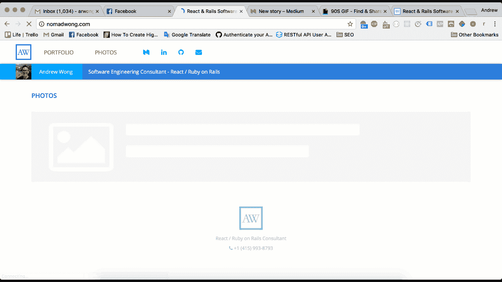
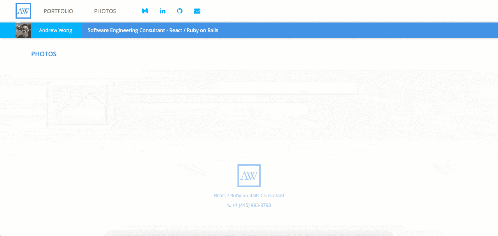

# 通过 React 动态渲染图像来提高 UX

> 原文：<https://medium.com/hackernoon/improve-your-ux-by-dynamically-rendering-images-via-react-onload-393fd4d0d946>

现在外面是一个竞争激烈的世界。众所周知，仅仅有一个好主意不足以让一家公司成为下一个 10 亿美元的 IPO。执行力同样重要，而对于产品来说，这可以归结为一个因素——用户体验。

用户体验不仅仅是我们产品的美学外观。还有它的性能如何，它有多直观——它有多让我们的用户*高兴*。

我们都有过这样的经历，第一次发现一个新的应用程序或网页，看到这样的东西:


有了高分辨率的照片和视网膜屏幕，我们常常不得不坐下来，看着图像煞费苦心地渲染。看到一个图像从上到下慢慢渲染是很常见的景象。

**这个问题可以解决。**

前两个明显的优化是使用 CDN 和利用缓存(你的浏览器自动这样做)使图像加载更快。然而，我们也可以*欺骗*我们的用户对加载时间的感知，从而导致用户体验的整体积极提升。

这里有两个技巧，我们可以用来提高我们在富媒体应用上的 UX:

## 1.使用占位符:



use a placeholder to indicate media is loading

占位符是经典装载旋转器的现代变形。我们没有使用通用的微调器来指示应用程序正在加载，而是使用一个占位符来告诉用户正在加载什么类型的内容——图像。

脸书和 LinkedIn 都是使用这种方法提高 UX 的很好的例子。

## 2.向 DOM 动态添加图像:

第二个优化是在屏幕上显示之前完全下载我们的图像。这将避免我们习惯于在下载图像时看到的经典的自上而下的渲染。我们通过使用 React 的`[onLoad](https://facebook.github.io/react/docs/events.html#image-events)`事件来实现这一点；我们可以向服务器请求图像文件，但是在下载完整个文件之前，不能在 DOM 中呈现图像。



the end result: smooth as butter

最终的结果是一个应用程序可以加载高分辨率的图像，并且永远不会让用户等待。占位符*戏弄*用户，让他们知道图像正在被加载。此外，我们推迟渲染图像，直到它们从服务器上完全下载，这样我们的用户就不必在浏览器中看到从上到下绘制的图像。

[***查看现场演示***](http://nomadwong.com)

# 给我看看代码！

## 呈现占位符

对于占位符组件(本例中为`LoadingItem`)，我们只需渲染图像并应用我们想要的任何动画效果:

```
export default function () {
  return (
    <ReactCSSTransitionGroup
      transitionName="loadingItem"
      transitionAppear={true}
      transitionAppearTimeout={500}
      transitionEnterTimeout={500}
      transitionLeaveTimeout={300}>
      
    </ReactCSSTransitionGroup>
  )
}
```

在我们的 Feed 组件的渲染中，只要还在加载`FeedItems`，我们就简单地渲染`LoadingItem`:

```
export default class Feed extends Component { ... render() {
    return (
      <div className="feed"> ... {this.props.items.length > this.state.loadedItems.length &&
          <LoadingItem />
        } ... </div>
    )
  }
}
```

## 通过“加载”动态渲染图像

我们的`Feed`组件工作如下:

```
export default class Feed extends Component {
  constructor(props) {
    super(props)
    this.state = { loadedItems: [] }
  } onLoad(feedItem) {
    this.setState(({ loadedItems }) => {
      return { loadedItems: loadedItems.concat(feedItem) }
    })
  } render() {
    return (
      <div className="feed">
        <h1 className="feed__h1">{this.props.name}</h1>
        {this.state.loadedItems.map((item, i) =>
          <FeedItem
            imgPath={item.imgPath}
            name={item.name}
            renderModal={this.props.renderModal}
            key={i} />
        )}
        {this.props.items.length > this.state.loadedItems.length &&
          <LoadingItem />
        }
        <div className="hidden">
          {this.props.items.map((item, i) =>
            
          )}
        </div>
      </div>
    )
  }
}
```

这里发生了什么？我们在底部有一个隐藏的`<div>`，负责下载图像文件。当文件下载完成后，会触发`onLoad`事件，更新状态中新加载的项目。当状态更新时，新加载的项目被呈现到 DOM 中，图像已经完全下载。

# 就是这样！

*   [观看现场演示](http://nomadwong.com)
*   [查看完整的源代码](http://github.com/arwong09/portfolio)(如果您觉得这有帮助，请开始回购！)

[](http://bit.ly/HackernoonFB)[](https://goo.gl/k7XYbx)[](https://goo.gl/4ofytp)

> [黑客中午](http://bit.ly/Hackernoon)是黑客如何开始他们的下午。我们是阿妹家庭的一员。我们现在[接受投稿](http://bit.ly/hackernoonsubmission)并乐意[讨论广告&赞助](mailto:partners@amipublications.com)机会。
> 
> 如果你喜欢这个故事，我们推荐你阅读我们的[最新科技故事](http://bit.ly/hackernoonlatestt)和[趋势科技故事](https://hackernoon.com/trending)。直到下一次，不要把世界的现实想当然！

