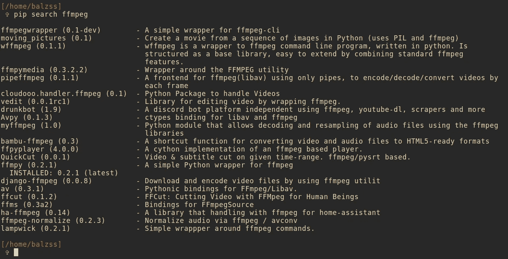
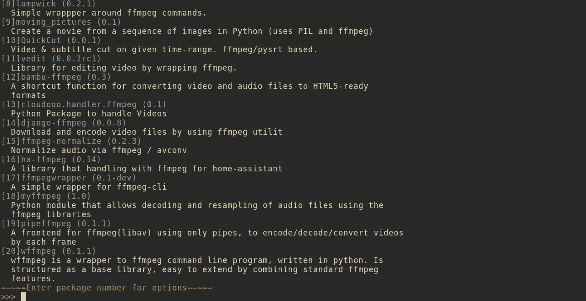

# 改进和扩展 Python 的 pip 的搜索功能

> 原文：<https://medium.com/hackernoon/improving-and-extending-the-search-functionality-of-pythons-pip-50d01a4a344f>

如果你是一个 Python 开发者，你可能会经常使用 pip。用法简单明了。但是你试过它的搜索功能吗？*丑陋。*



我喜欢 Python 的主要原因是这种语言设计的优雅和美丽。为什么不在 pip 搜索上做一点改进来符合审美呢？所以我创造了叶。起初，我只想添加一些格式和颜色，以及一个菜单(就像 yaourt 拥有的那个)来轻松地从搜索结果中选择一个包并安装它。大概是这样的:



我对这个结果非常满意，所以我把它放到了 GitHub 上，并在 Reddit 上分享了它。来自 python 社区的反应非常积极，但是有人建议我也应该加入一些*额外的*特性。在研究了 PyPI API 之后，这似乎是可以实现的。所以我没有解析 pip 的搜索结果，而是用

*   一个**自定义排名**系统
*   额外信息如大小、上传日期、许可证和主页
*   **正则表达式**搜索
*   可选的**配置文件**
*   选择一个包后，尼斯**选项菜单**

我尽量让语法对用户友好:

```
yip <search_term> <optional_flags>
```

您可以应用于搜索的标志有:
**-日期**:显示包的上传
**-主页**:显示主页
**-许可证**:显示许可证
**-大小**:以人类可读的格式显示大小
**-限制<号>** :将结果限制为与<号>最相关的

例如，如果你想显示与关键字 *ffmpeg* 最相关的 10 个搜索结果的大小和上传日期，你可以这样做:

```
yip ffmpeg -size -date -limit 10
```

您可以从配置文件中设置其他一些内容:

*   默认搜索限制
*   默认情况下，使用任何标志
*   禁用颜色
*   用 sudo 自动安装软件包

这就是它的作用:


如果你觉得有趣的话[可以去 GitHub](https://github.com/balzss/yip) 看看，在那里你可以找到更多的信息和安装说明。

非常欢迎任何建议、想法、意见、问题或功能要求！感谢您的阅读！

[](http://bit.ly/HackernoonFB)[](https://goo.gl/k7XYbx)[](https://goo.gl/4ofytp)

> [黑客中午](http://bit.ly/Hackernoon)是黑客如何开始他们的下午。我们是 [@AMI](http://bit.ly/atAMIatAMI) 家庭的一员。我们现在[接受投稿](http://bit.ly/hackernoonsubmission)，并乐意[讨论广告&赞助](mailto:partners@amipublications.com)机会。
> 
> 如果你喜欢这个故事，我们推荐你阅读我们的[最新科技故事](http://bit.ly/hackernoonlatestt)和[趋势科技故事](https://hackernoon.com/trending)。直到下一次，不要把世界的现实想当然！

[](https://goo.gl/Ahtev1)