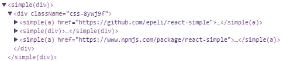

# 改进 React 开发工具中的组件名称

> 原文：<https://medium.com/hackernoon/improving-component-names-in-react-developer-tools-4894247510c5>

React 开发者工具是 React.js 开发者体验中令人敬畏的一部分，当你挖掘未知的代码库时——或者过一会儿你自己的代码库。

但有时它会失败，并显示您的组件名称为`<Unknown>`。为什么？让我们浏览一下不同的组件类型，看看它们的名称是如何设置的，并检查一下为什么有时它不在那里。最后，我们将看看对此能做些什么。

我这里假设 EcmaScript spec 2015 或更高版本。

# 函数声明

```
function MyFun(){
  return <div>function component</div>;
}
```

[JavaScript](https://hackernoon.com/tagged/javascript) 有一个简单的函数名反射 API

```
MyFun.name === “MyFun”
```

# 班级

```
class MyClass extends React.Component {
  render() {
    return <div>class component</div>;
  }
}
```

正如你可能知道的，JavaScript 类只是原型继承的语法，这意味着类只是函数。所以函数反射 API 在这里也可以工作

```
MyClass.name === “Myclass”
```

# 箭头函数表达式

```
const ArrowFn = () => (
  <div>arrow fn</div>
);
```

这也像预期的那样工作。这个名称是由 JavaScript 引擎从变量声明中推断出来的

```
ArrowFn.name === “ArrowFn”
```

# React.createClass()

```
var OldClass = React.createClass({
  render() {
    return <div>old class</div>
  }
});
```

在这种情况下，JavaScript 引擎无能为力。幸运的是，Babel 的`babel-plugin-transform-react-display-name`在这里对预设的步骤做出反应，并将变量名转换成组件的`displayName`属性

```
var OldClass = React.createClass({
 **displayName: “OldClass”,**
 ...
});
```

# 失败

当您动态生成组件时，如

```
const simple = (Component, styles) => (
  props => <Component {...props} style={styles} />;
);const Button = simple("b", {
  padding: 20,
});
```

`Button.name`和`Button.displayName`将为空，因为在这种情况下，JavaScript 引擎或 Babel 插件无法推断出它们的名称。他们不知道`simple()`函数返回一个 [React](https://hackernoon.com/tagged/react) 组件。

# 自定义名称

为了解决这种情况，您可以手动设置`displayName`属性。在函数组件上，devtools 将优先选择属性`displayName`上的名称，而不是属性`name`上的名称，如果两者都设置了的话。

```
const simple = (Component, styles) => {
  const Wrapped = props => <Component {...props} style={styles} />;
  **Wrapped.displayName** = `simple(${getName(Component)})`;
  return Wrapped;
};
```

但是这样你可以得到最好的名字，比如



受显示名称转换插件的启发，我创建了一个额外的显示名称巴别塔插件:

# 巴别-插件-显示-名称-自定义

使用它，您可以配置项目中的哪些函数创建新的 React 组件，并自动为它们推断显示名称。

它将把上面的例子转换成

```
const Button = simple("div", {
  padding: 20,
});
**Button.displayName = "Button";**
```

查看 Github 页面了解更多信息

[https://github.com/epeli/babel-plugin-display-name-custom](https://github.com/epeli/babel-plugin-display-name-custom)

附言

如果你喜欢上面的 API 风格的`simple()`例子——在 Github 上检查 [react-simple](https://github.com/epeli/react-simple) ,为 web 和 React Native 实现它。巴别塔插件最初是作为它的一部分创建的。

> [黑客中午](http://bit.ly/Hackernoon)是黑客如何开始他们的下午。我们是 [@AMI](http://bit.ly/atAMIatAMI) 家庭的一员。我们现在[接受投稿](http://bit.ly/hackernoonsubmission)并乐意[讨论广告&赞助](mailto:partners@amipublications.com)机会。
> 
> 要了解更多信息，请[阅读我们的“关于”页面](https://goo.gl/4ofytp)、[在脸书上点赞/给我们发消息](http://bit.ly/HackernoonFB)，或者简单地说， [tweet/DM @HackerNoon。](https://goo.gl/k7XYbx)
> 
> 如果你喜欢这个故事，我们推荐你阅读我们的[最新科技故事](http://bit.ly/hackernoonlatestt)和[趋势科技故事](https://hackernoon.com/trending)。直到下一次，不要把世界的现实想当然！