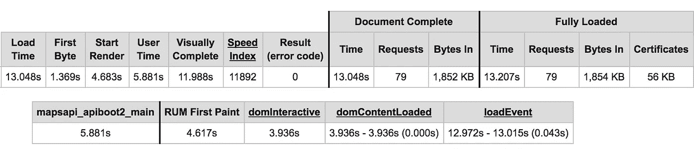
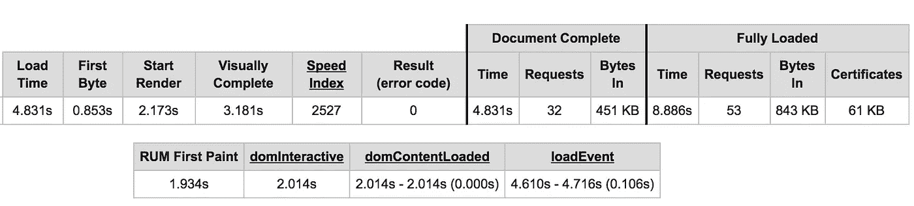
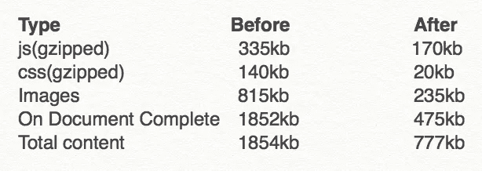

# 改善生产 React 应用程序的首次加载(第 1 部分，共 2 部分)

> 原文：<https://medium.com/hackernoon/improving-first-time-load-of-a-production-react-app-part-1-of-2-e7494a7c7ab0>

这是一个关于 UrbanClap 网站的加载时间如何在一个月内从 13+秒下降到不到 5 秒(3G 新加坡移动服务器)的故事。为了证实这一点，让我先来看一些截图。

这是我们开始这个性能练习之前的情况:



Webpage Test(urbanclap.com/delhi-ncr-wedding-photographers), Singapore — EC2 — **Chrome** — **Emulated Nexus 5–3GFast** — Mobile (Dec 2016)

下面是我们取得的进展。



Webpage Test(urbanclap.com/delhi-ncr-wedding-photographers), Singapore — EC2 — **Chrome** — **Emulated Nexus 5–3GFast** — Mobile (Jan 2017)

# 背景

我们是一个(大部分)响应迅速的 webapp，使用 ReactJs 和服务器端渲染，使用 [webpack](https://webpack.github.io/) (v1)作为我们的捆绑工具。我们也有一个[清漆缓存层](https://varnish-cache.org/)在上面，以减少我们的服务器负载，并进一步减少我们的[时间到第一个字节(TTFB)](https://en.wikipedia.org/wiki/Time_To_First_Byte) 。关于我们的技术堆栈和选择的细节，你可以[阅读这篇文章](/urbanclap-engineering/building-web-at-urbanclap-the-react-way-aa81d69f0ad9#.rb7g23p2c)。

2017 年初，我们开展了一个为期一个月的项目来改善我们的网站性能，特别是我们的上市页面的首次加载(例如[www.urbanclap.com/delhi-ncr-wedding-photographers](http://www.urbanclap.com/delhi-ncr-wedding-photographers))。*我们为什么选择这些页面？*这些是我们的谷歌搜索列表页面，这意味着我们网站的大部分流量都通过这里进入。*为什么专门第一次加载？*大部分用户都是独一无二的，通过谷歌搜索而来。所以当用户没有任何期望的访问时，特别注意第一次加载是非常关键的。第一印象确实可能是最后的印象。此外，有充分的证据表明，谷歌搜索引擎更喜欢性能更好、加载时间更短的网站。

我们研究了很多资源，尝试了很多想法，做了很多事情。艰巨的任务结束后，我列出了我们为社区其他人做的所有事情(包括有用的资源)。

> 需要注意的重要一点是**我们不能被网站表现**所蒙蔽。我们仍然需要确保我们不会妨碍产品、用户体验、分析等。我怎么强调都不为过。在工程上走极端是很容易的，但是在一天结束的时候，你是在用最终用户和商业头脑解决一个商业问题。

考虑到这一点，我试图把我们在大致两个领域所做的事情进行分类:减少资产，改变事情的顺序。在这个由两部分组成的系列的第 1 部分中，我将讨论减少运费。

# 装运较少的资产

关于如何排序发送的资源，您可以想多聪明就有多聪明，但是在某些时候，瓶颈将是您发送的资源的数量。您编写的每一行 js 代码、包含的外部脚本、添加的 css 标签、呈现在页面上的图像不仅要下载，还要由浏览器处理。这在手机上变得尤其重要([大约一半的流量来自手机](http://searchengineland.com/its-official-google-says-more-searches-now-on-mobile-than-on-desktop-220369)，所以不要这样做)——连接通常是劣质的(3g 连接是一个很好的场景；还有 2g 和 edge)，硬件可能很便宜，手机需要时间处理 css 和 js——所有这些都不能忽视。



Stats for urbanclap.com/delhi-ncr-wedding-photographers

我会试着列出我们所做的所有事情，以减少我们对浏览器的影响。这些步骤的总体结果在相邻的图像中得到了很好的总结。

# 1.JS 组块

如果你使用 react-router，通过 [webpack 的代码分割](https://webpack.github.io/docs/code-splitting.html)创建路由特定的块相对容易。这里有一个很好的[教程](http://mxstbr.blog/2016/01/react-apps-with-pages/)告诉你如何用 require.ensure 来达到这个目的。确保给你的程序块命名。当你有很多路线时，事情就简单多了。

```
// creates a code split, and then asynchronously gets the js file 
// for that route.
<Route name="details" path="/details" getComponent={(location, cb) => {
    require.ensure([], (require) => {
        cb(null, require('./containers/Details/DetailsPage'));
    }, 'detailsChunk');
}}/>
```

# 2.CSS 分块

虽然 webpack 自带 js 分块，但对于 css 分块(即每条路线使用不同的 css)，您需要一些变通方法。对于小型应用程序，进行 css 分块可能不值得。但对于我们这种规模的应用来说，这几乎成了必需品。为了实现这一点，首先你必须在 webpack 配置中设置多个入口点,每个入口点对应一个你想拥有单独 css 的路由。每个入口点现在都会产生自己的 js 和 css。

```
// produces detailsChunk.js and detailsChunk.css
entry: {
 ...
 'detailsChunk' : [
      './src/containers/Details/DetailsPage.js'
    ],
    ...
}
```

最后，在路由中包含 css 需要一点技巧。不仅要获得该路径的 css 文件名，还要将它作为样式表(确保其浏览器兼容)插入到文档中。

```
// requireStyle - gets the name of the css file (detailsChunk.css)
// and adds it as a stylesheet to the document as here:
// [https://github.com/guybedford/require-css](https://github.com/guybedford/require-css)<Route name="details" path="/details" getComponent={(location, cb) => {
    require.ensure([], (require) => {
        requireStyle('detailsChunk', () => {
            cb(null, require('./containers/Details/DetailsPage'));
        })
    }, 'detailsChunk');
}}/>
```

注意:一个显而易见的问题是，一些常见的应用程序和供应商库(如 React)将包含在每个块中。解决方法是为它创建一个单独的块。CommonsChunkPlugin 是你的朋友。

# 3.移动与桌面

古老的问题:是去响应还是去适应。我们可以就此进行更长时间的辩论，但无论你选择哪种方式，你都需要一款专为手机设计的 UX。因此，无论您是像在 responsive 中那样处理大量的媒体查询(这意味着为某种设备类型发布了更多不需要的代码)，还是将 js 和 css 分别用于移动和桌面(这意味着可能需要更多的开发资源)，都取决于您。但是由于我们的页面有明显不同的设计(甚至不同的封面图片用于移动和桌面，这意味着我们必须下载两个平台的图片)，我们决定最终完全分离我们的移动和桌面组件，并将它们分开捆绑。这帮助我们建立了一个基础设施，默认情况下我们的页面是响应性的，但是如果需要的话，我们可以改变任何路由来服务特定于设备的组件。

首先，我们必须将代码本身分成桌面和移动两部分。一个简单的如下文件结构帮助实现了这一点，为桌面/移动组件之间的代码重构提供了空间。

```
containers
     --- Details
             ---DetailsPageDesktop.js
             ---DetailsPageDesktop.scss
             ---DetailsPageMobile.js
             ---DetailsPageMobile.scss
             ---DetailsPageCommon.js **DetailsPageDesktop.js**import {} from 'DetailsPageCommon.js';
var styles = require('DetailsPageDesktop.scss');class DetailsPageDesktop extends Component {
    .
    .
    .
}
```

然后，我们必须为路线的移动和桌面版本创建单独的块(js 和 css)。我们通过调整 webpack 配置中的入口点做到了这一点。

```
// this will create detailsChunkDesktop.js, detailsChunkDesktop.css,
// detailsChunkMobile.js, detailsChunkMobile.css
// detailsPageCommon will be automatically included in both the js 
// chunks.entry: {
 ...
 'detailsChunkDesktop' : [
      './src/containers/Details/DetailsPageDesktop.js'
    ],
  'detailsChunkMobile' : [
      './src/containers/Details/DetailsPageMobile.js'
    ],
    ...
}
```

最后，我们必须调整我们的 routes 配置，以解析移动和桌面的不同组件。

```
// isMobile() -> Make sure this function works on both client and
// server side. Easiest way is a regex on user agent.<Route name="details" path="/details" getComponent={(location, cb) => {
    if (isMobile()) {
        require.ensure([], (require) => {
            requireStyle('detailsChunkMobile', () => {
                cb(null, require('DetailsPageMobile.js'));
            })
        }, 'detailsChunkMobile');
    } else {
        require.ensure([], (require) => {
            requireStyle('detailsChunkDesktop, () => {
                cb(null, require('DetailsPageDesktop.js'));
            })
        }, 'detailsChunkDesktop');
    }
}}/>
```

我们面临一个额外的问题:我们基于 url 在 varnish 上缓存我们的标记。由于桌面和移动设备会有不同的标记，我们必须让[清漆缓存设备知道](https://www.singlemindconsulting.com/2011/02/08/configuring-varnish-to-cache-per-user-agent-in-pressflow/)。

# 4.按需组块

有时，即使是同一条路线，我们也可能会有较重的部件，不需要按照当前路线运输。这些可以按需加载，既可以在访问页面后加载，也可以在事件处理程序(单击按钮)后加载。任何种类的对话框/模态(其中路线不会改变)或底层组件都是这种情况的主要候选对象。对于这样的组件，我们可以创建单独的块(有自己的 js 和 css)，只在需要的时候下载。

首先，如前所述，我们在 webpack 配置的条目中为这样的组件创建单独的块。然后，我们在需要时触发这些块的异步检索。

```
// splits code for this component, and also asynchronously gets the 
// component. Returns a callback with the component.function loadHeavyDialog(cb) {
  require.ensure(['./components/HeavyDialog/HeavyDialog'], (require) => {
    requireStyle('heavyDialogChunk', () => {
      const dial = require('./components/HeavyDialog/HeavyDialog');
      if (cb) {
        cb(dial);
      }
    });
  }, 'heavyDialogChunk');
} **DetailsPage{Desktop}.js**// on a button click to load the dialog asynchronously and ensuring // this component doesn't get shipped with the parent route.
function onLoadHeavyDialogButtonClick() {  
   // show loader possibly
   loadHeavyDialog((dialogComponent) => {
       // do something with the component now.
       // hide loader.
   });
}
```

为了进一步优化，您可以让这个组件在为路由加载文档后自动下载。这将确保您的用户体验不会受到负面影响；现在，用户不必等到真正需要的时候才下载程序块。

```
<Route name="details" path="/details" getComponent={(location, cb) => {
    require.ensure([], (require) => {
        requireStyle('detailsChunk', () => {
            cb(null, require('./containers/Details/DetailsPage'));
            // pre-emptively get a component which we know we might 
            // use later.
            loadHeavyDialog(null); 
        })
    }, 'detailsChunk');
}}/>
```

同样的策略也可以用于基于路线的块，这些块很有可能从当前路线被访问。

# 5.图像的大小/质量

对于媒体重的页面，减少你运送的图像的尺寸。除了通常的图像压缩，请确保您请求的图像大小是您所需要的。对移动设备要格外严格，你会惊讶地发现你可以用更小的图像处理这么多东西。我们能够在不影响任何产品指标的情况下，将手机上下载的媒体内容减少一半以上。

# 6.删除不需要的字体

我们之前使用了 3 种自定义字体，2 种用于渲染文本，1 种用于图标。为了防止字体被浏览器视为渲染阻塞资源。在与设计团队合作后，我们削减到只有一个自定义文本字体和一个图标字体。我们对移动字体更加严格，不再需要自定义文本字体，只使用系统字体。手机的外形尺寸非常小，使用自定义字体的额外好处可以忽略不计。因此，我们能够在手机上更快地呈现内容。

# 7.对第三方/开源库要挑剔

第三方库很棒。但是它们通常具有比你需要的更多的功能。要挑剔。用它们来激励自己，然后要么实现你自己的，要么小心你需要它们做什么。需要了解其用法的一些常见第三方库示例如下:

1.  **洛达什:**每当你看到*从洛达什*进口*时，这是一个不好的迹象。lodash 库的大小是 10kb (gzipped ),通常你只需要几个函数，而不是整个库。幸运的是， [lodash 提供了这方面的支持，并且在这里有很好的记录](https://lacke.mn/reduce-your-bundle-js-file-size/)。
2.  **Material UI:** 毫无疑问 Material UI 是一个很好的起点，但是它很重。我们有几个组件使用了 material ui，但是我们能够很容易地模仿它们，在这个过程中节省了相当多的空间。
3.  **babel-polyfill(或 babel-runtime):** 需要 babel-polyfill 吗？简短回答:不会，如果你已经在用 babel-runtime 的话。消除对 babel-polyfill 的依赖可以显著减小包的大小。这里有一篇[精彩的文章，解释了两者的用法](/@jcse/clearing-up-the-babel-6-ecosystem-c7678a314bf3#.d7y3dvh6v)。
4.  再一次，这是一个非常受欢迎的库，但是考虑到你实际使用的代码量，这是一个沉重的库。这里有一个[很好的讨论](https://github.com/moment/moment/issues/2373)如何规范它的大小。

# 8.减少 api 内容/反应减少存储内容

这仅适用于在服务器端渲染的情况。如果你是，你应该熟悉服务器在文档的底部粘贴它的 redux(或者你正在使用的任何存储)的副本。如果你的页面依赖于一个强大的 api(我们的曾经是)，那么初始文档的有效载荷将会大大增加。经过仔细检查，我们意识到我们的商店中有许多不需要的数据，并能够对其进行删减。

# 9.继续分析你的组块

虽然所有这些都是一次性的努力，但是经过一段时间，开发人员通常会变得粗心(尤其是在一个更大的团队中)，并且不会遵守纪律或者意识到包大小的含义。以下是一些有用的工具/技巧:

1.  [Webpack Analyzer](https://webpack.github.io/analyse/) :查看捆绑包大小的最佳方式。
2.  webpagetest.org[(或者 Chrome 开发工具):给出了你的网站需要的所有资产的概要，以及不同类型资产的大小。](http://webpagetest.org)
3.  定期监控:我们编写了一个[快速实用程序来跟踪发行版中的包大小](https://gist.github.com/kanavarora/cc767dd2918fbcef3d6ce2357674aced)。Housing 也有一个关于持续集成的[大帖子](/engineering-housing/continuous-integration-using-webpagetest-and-webpack-1f4465d95405#.8vsf6zrd7)。

目前就这些。当然，很多这些东西只会增加很小的价值。但是绩效很少仅仅通过一件事来实现。这是许多小事的综合和持续的努力。如果你有其他这样的技巧来减少网站代码的大小，请在下面的评论中告诉我！

本系列的下一部分将讨论如何链接您的资产，以便尽可能快地下载/执行最重要的资产，进一步提高性能。

[](http://bit.ly/HackernoonFB)[](https://goo.gl/k7XYbx)[](https://goo.gl/4ofytp)

> [黑客中午](http://bit.ly/Hackernoon)是黑客如何开始他们的下午。我们是 [@AMI](http://bit.ly/atAMIatAMI) 家庭的一员。我们现在[接受投稿](http://bit.ly/hackernoonsubmission)并乐意[讨论广告&赞助](mailto:partners@amipublications.com)机会。
> 
> 如果你喜欢这个故事，我们推荐你阅读我们的[最新科技故事](http://bit.ly/hackernoonlatestt)和[趋势科技故事](https://hackernoon.com/trending)。直到下一次，不要把世界的现实想当然！

