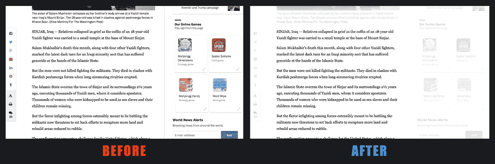
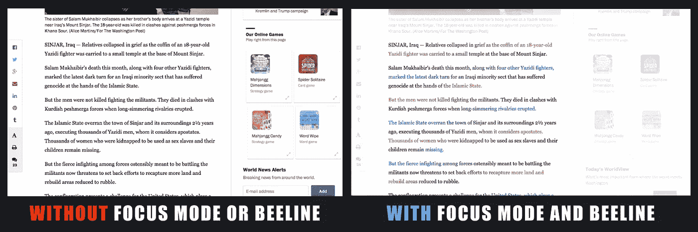
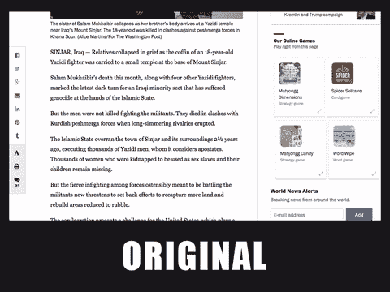

# 通过减少网上干扰来提高阅读的专注度

> 原文：<https://medium.com/hackernoon/improving-reading-focus-by-dimming-online-distractions-ae52726abe1>

## 信息高速公路两旁都是广告牌——我们是来帮忙的

在网上阅读会让人分心。你不仅会受到电子邮件提醒、日历提醒和空闲通知的狂轰滥炸，你正在阅读的网站也会让你无法集中注意力。

怎么会？通过用旋转的彩色图标包围你所关心的东西——页面上的正文——向你呼唤:

> 在 FACEBOOK、LINKEDIN 和 GOOGLE PLUS 上分享这篇文章吧！有时间吗？玩蜘蛛纸牌或麻将！别忘了订阅我们的新闻提醒邮件列表！

## 聚焦模式:互联网的眼罩

我们正在帮助人们在阅读时集中注意力，减少网上的干扰。它是这样工作的:

Focus Mode dims the distractions that surround the article

*   您可以自定义 1%到 100%的调光级别
*   只要你移动鼠标，变暗的效果就会消失——这样你就可以点击链接或者浏览网站了(*这也是为什么它比使用某些浏览器提供的“阅读器模式”要好的原因，在你可以继续浏览之前，必须关闭“阅读器模式”*
*   您可以禁用任何不支持聚焦模式的网站

## 直线阅读器+聚焦模式:翻转脚本使网站更具可读性

聚焦模式是直线阅读器 [Chrome 扩展、](http://bit.ly/1b5QMur)的最新成员，世界各地的人们每周都要使用数百万次。BeeLine Reader 的主要功能是通过对文本应用换行颜色渐变来增强阅读的便利性、速度和焦点(如果这是您第一次听说 BeeLine，请参见下面的演示)。

随着焦点模式的加入，我们进一步提高了网站的可读性。我们没有让你专注于无聊的黑色文本——这是页面上最没有视觉趣味的东西——而是以读者为中心的方式来格式化网页。我们减弱了干扰，并在正文中应用了增强注意力的颜色渐变，这使得阅读时非常容易集中注意力。

[数百万人仍然喜欢在纸上而不是在屏幕上阅读书籍，部分原因是在纸上阅读不那么令人分心。但是互联网有这么多有用的信息，我们显然离不开它。在 BeeLine Reader，我们正在努力让数字阅读不那么令人分心，更有效率。](https://www.nytimes.com/2016/09/03/business/no-the-internet-has-not-killed-the-printed-book-most-people-still-prefer-them.html?smid=fb-nytimes&smtyp=cur&_r=0)

准备好测试分心-调暗聚焦模式了吗？抓住直线阅读器 [Chrome 扩展](http://bit.ly/1b5ZxyK)，看看它对你在线聚焦有多大帮助！

想了解更多关于 BeeLine Reader 的信息，这家公司已经获得了斯坦福大学和创新技术博物馆颁发的社会影响力奖，请看[BeeLineReader.com](http://bit.ly/AeDJ8M)。有问题吗？给 contact@BeeLineReader.com 发邮件

> [黑客中午](http://bit.ly/Hackernoon)是黑客如何开始他们的下午。我们是 [@AMI](http://bit.ly/atAMIatAMI) 家庭的一员。我们现在[接受投稿](http://bit.ly/hackernoonsubmission)并乐意[讨论广告&赞助](mailto:partners@amipublications.com)机会。
> 
> 如果你喜欢这个故事，我们推荐你阅读我们的[最新科技故事](http://bit.ly/hackernoonlatestt)和[趋势科技故事](https://hackernoon.com/trending)。直到下一次，不要把世界的现实想当然！

