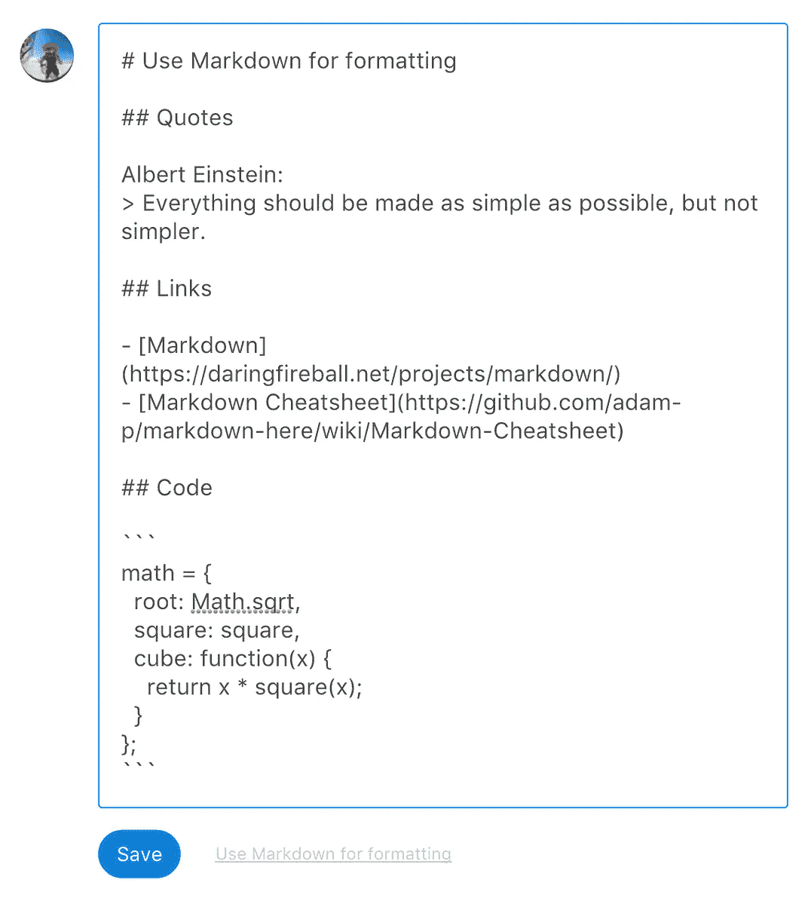
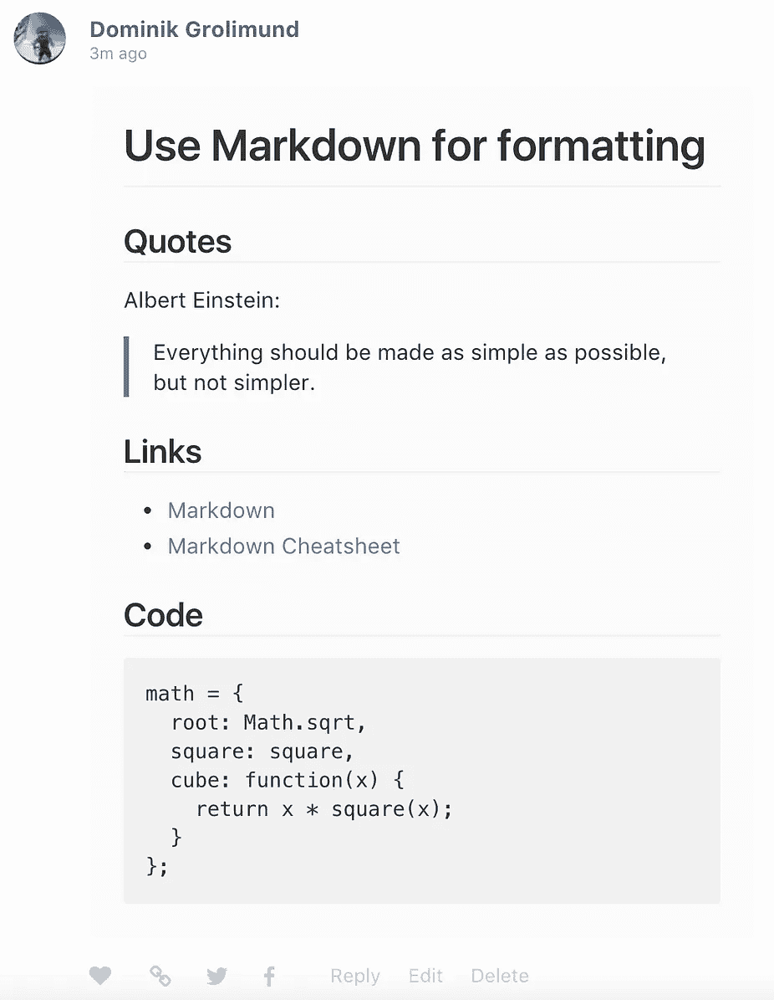
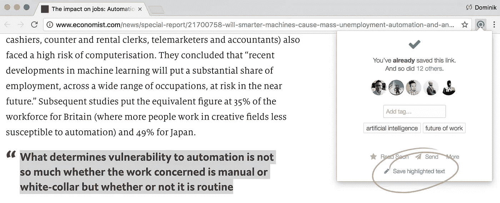

# 改进 Refind 的评论

> 原文：<https://medium.com/hackernoon/improving-refinds-comments-14cafe70606b>

## 降价、亮点、提及、分享等等。

Stowe Boyd 是 Refind 评论的先驱。当评论很难时，他还是做了——但要求更多。我们终于听进去了，改进了。斯托喜欢它，他答应我们你也会喜欢它…

总之，我们改进了以下内容:

*   **降价**:你现在可以使用[降价](https://daringfireball.net/projects/markdown/)来格式化你的评论。

*   **feeds 中的评论**:我们将在 feeds(和电子邮件)的链接下面显示一条评论。在个人资料页面上，这是该用户的第一条评论。在其他地方，这是有史以来的第一个评论。

*   在网上分享:在你写了一篇好的评论后，你可能想在推特或脸书上分享它。这个用例现在得到了很好的支持:有一个评论 URL 在第一个位置显示你的评论，高亮显示，并显示一个很好的预览文本。

*   **高亮显示**:当你在 Chrome 中选择网页上的文本时，你可以使用 Chrome 扩展将其保存为高亮显示。现在还可以编辑精彩部分。

*   **通知**:你会收到某些评论的通知，例如，当一个好朋友对你保存的链接发表评论时(神经网络会学习你与所有朋友的关系有多亲密——互动越多，共同的链接越多，关系就越密切。)
*   **提及**:你可以在评论和回复中提及某人(例如，“看看这个，@twitter_name”)。如果你提到关注你的人，他们会收到通知。
*   **回复**:可以回复评论。
*   **私密/公开**:你可以将你的评论私密或公开。
*   搜索:在你的链接中搜索，你会找到你自己的评论。
*   **摘要**:当你以“*摘要*或“ *tl”开始评论时；dr* ”，它被认为是一个总结，并被区别对待(例如，不同的预览文本)，我们有一些想法如何使它们更有用。

祝评论愉快。还要写总结——人们喜欢！

> [黑客中午](http://bit.ly/Hackernoon)是黑客如何开始他们的下午。我们是 [@AMI](http://bit.ly/atAMIatAMI) 家庭的一员。我们现在[接受投稿](http://bit.ly/hackernoonsubmission)，并乐意[讨论广告&赞助](mailto:partners@amipublications.com)机会。
> 
> 如果你喜欢这个故事，我们推荐你阅读我们的[最新科技故事](http://bit.ly/hackernoonlatestt)和[趋势科技故事](https://hackernoon.com/trending)。直到下一次，不要把世界的现实想当然！

