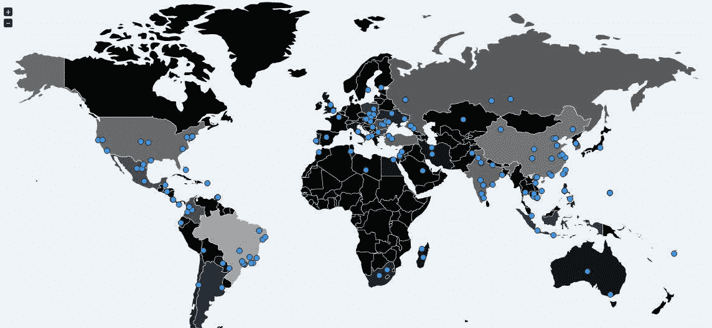

# 2016 年，这是机器人改变历史的四种方式

> 原文：<https://medium.com/hackernoon/in-2016-these-are-the-four-ways-how-bots-altered-history-dd7b95535ba8>

超过 980 起网络安全违规事件涉及所有在线业务，3500 万个账户被曝光。*雅虎*在 2016 年的一份报告中，披露[超过 10 亿个账户](http://securityaffairs.co/wordpress/51833/breaking-news/yahoo-data-breach-2.html)被盗。据报道，今年所有行业因网络攻击损失了 4000 亿美元。按照这种趋势，到 2019 年，损失将达到约 2.1 万亿美元。

现在，让我们来看看 2016 年改变历史的 4 大僵尸程序。

1.  [**Dyn 网络攻击(Mirai 未来组合)**](http://securityaffairs.co/wordpress/52558/hacking/dyn-dns-service-ddos-2.html)**—2016 年 Dyn 网络攻击发生在 2016 年 10 月 21 日。这次攻击是由一种名为 Mirai 未来组合的恶意软件发起的。Mirai 未来组合(日语中“未来”的意思)是一种恶意软件，它将物联网(IoT)变成了机器人，后来被用于破纪录的利用。自 2010 年以来，连接到互联网的设备数量翻了一番，从 125 亿台增加到 250 亿台。Mirai 未来组合恶意软件的工作原理是用默认的*用户名*和*密码*识别易受攻击的物联网设备，并将恶意软件植入其中。一旦设备变坏，串联的机器人能够产生超过 1.2 兆字节/秒的攻击。Amazon.com、网飞、美国有线电视新闻网、英国广播公司等主要网站被坏机器人关闭。这是迄今为止对免费互联网最大的攻击。这是理解 Dyn 网络攻击期间通过 DNS 路由的[服务意味着什么的恰当例子。](https://www.shieldsquare.com/dyn-dns-attack-what-it-means-for-services-routed-through-dns/)**
2.  ****用于影响公众的机器人:**社交媒体机器人在 2016 年最为活跃。随着重大事件如[英国退出欧盟](http://securityaffairs.co/wordpress/48941/laws-and-regulations/brexit-cyber-security.html)和[美国大选](http://securityaffairs.co/wordpress/55130/hacking/putin-cyber-attacks.html)，社交媒体机器人成为最具影响力的。**

**英国退出欧盟:辩论双方产生的自动化社交媒体账户创造了这些机器人，对公投投票产生了巨大影响；特别是在那些最后一刻“犹豫不决”的人身上，牛津大学的研究人员发现，机器人在辩论中发挥了战略性作用。社交媒体机器人帮助传播“重复的”政治内容，以操纵公众的思维。社交媒体机器人在英国退出欧盟期间扮演了一个非常简单的角色，他们不得不一遍又一遍地发推文支持*或*反对*英国退出欧盟，或者只是转发/分享双方有影响力的人的消息。这帮助他们在社交媒体平台上传播他们想要的信息的时间比需要的时间长得多。***

**美国大选:根据 twitter 审计，唐纳德·特朗普的 Twitter 账户有近 40%的不活跃、虚假和垃圾粉丝，而希拉里·克林顿有大约 37%。这个数字大约加起来超过 700 万个虚假/不活跃的僵尸账号在全球传播信息。这些机器人账户有助于为相关的两个候选人传播信息，并极大地影响了犹豫不决的选民。**

**在扫描仪下，Twitter、脸书和其他社交媒体的影响可能不会被视为严重威胁。但是使用社交媒体的记者通常会遇到传播宣传的机器人。反过来，记者将这些机器人传播的信息解读为人们之间的一种趋势，并进行报道。这更增加了这些不良社交媒体机器人的影响。去年，机器人如何影响和改变两个主要国家的历史进程真是疯狂，而这仅仅是个开始。德国总理安格拉·默克尔对机器人操纵即将到来的德国选举的担忧并非空穴来风。**

1.  ****聊天机器人的崛起:** 2016 年被认为是聊天机器人的崛起。每一个主要的电子商务服务提供商都在生产聊天机器人。2016 年初，各公司开始了一场创造聊天机器人的竞赛。聊天机器人被认为是新的自动化智能趋势。这些机器人被创建来与用户交互，以提供信息或执行简单的任务。**

****好的聊天机器人变坏:**当微软在 2016 年 3 月 23 日推出 Tay (AI Twitter 聊天机器人)时，这是一个新时代的开始。Tay 被编程为从它与 twitter 上真实用户的互动中学习。然而，Tay 在几个小时内就变成了一个粗俗的种族主义机器人。然而，该机器人在 16 小时内被微软移除。渐渐地，Tay 在下线前发了 96000 条推特。**

1.  ****美国参议院通过机器人法案(倒票机器人)**:2016 年 12 月，倒票机器人在美国被定为非法。奥巴马总统已经签署了 2016 年 T2 法案。这项法案的意义在于，任何用于倒票的软件或自动化机器人程序现在都是完全非法的。最后，倒票是联邦罪行。[今年的倒票事件是由百老汇秀《汉密尔顿》中的明星林·曼努尔·米兰达曝光的。汉密尔顿的门票被机器人在网上倒卖，并在另一个网站上以更高的价格转售。在参议员和主流媒体的帮助下，国会得以通过该法案。票倒卖机器人因在几秒钟内买完数千张票而臭名昭著。这让访问网站的真正用户感到沮丧，从长远来看也伤害了制作者。](https://www.shieldsquare.com/everything-about-ticket-scalping/)**

> ***据某著名在线售票网站 TicketMaster 报道。2016 年，机器人试图在其网站上购买*[*50 亿张门票，或一分钟 1 万张*](http://www.economist.com/news/united-states/21713869-2016-bots-tried-buy-5bn-tickets-or-10000-minute-ticketmasters-website?fsrc=scn/tw/te/bl/ed/thewaronticketbotsisunlikelytobewon) *。这导致 60%的门票被机器人倒卖。***

**随着恶意机器人的激增，有必要在它们危害您的在线业务之前阻止它们。机器人变得越来越恶意，对所有在线业务造成损害。**

**那么，你有没有想过你的在线业务可能会被不良机器人无声无息地盯上？您的 2017 年 IT 路线图如何应对 bot 威胁？**

****关于作者本杰明·拉杰·库马尔****

**数字营销专家，ShieldSquare，[LinkedIn](https://in.linkedin.com/in/benrkumar)|[Twitter](https://twitter.com/benrkumar)|[shield square 网站](https://goo.gl/m0oZVY)**

**[**帕格尼尼**](http://www.linkedin.com/pub/pierluigi-paganini/b/742/559)**

****(** [**安全事务**](http://securityaffairs.co/wordpress/) **—僵尸程序、恶意软件)****

**[分享一下吧……](https://simplesharebuttons.com/)**

********************************

***原载于 2017 年 1 月 12 日*[*【securityaffairs.co*](http://securityaffairs.co/wordpress/55266/cyber-crime/2016-bots.html)*。***

************

> **[黑客中午](http://bit.ly/Hackernoon)是黑客如何开始他们的下午。我们是阿妹家庭的一员。我们现在[接受投稿](http://bit.ly/hackernoonsubmission)并乐意[讨论广告&赞助](mailto:partners@amipublications.com)机会。**
> 
> **如果你喜欢这个故事，我们推荐你阅读我们的[最新科技故事](http://bit.ly/hackernoonlatestt)和[趋势科技故事](https://hackernoon.com/trending)。直到下一次，不要把世界的现实想当然！**

****