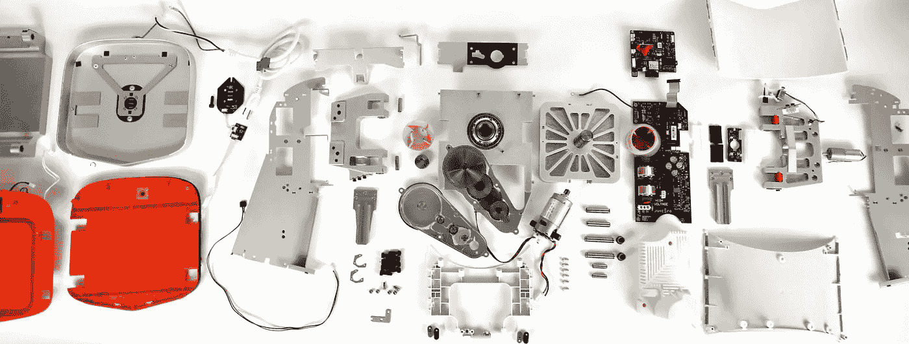

# 为 Juicero 和其他真正愚蠢的食品创业公司辩护

> 原文：<https://medium.com/hackernoon/in-defense-of-juicero-and-other-really-dumb-food-startups-29a5a754eb1a>

Juicero 刚刚关闭了。他们筹集了 1.18 亿美元，他们的产品是“一种连接互联网的设备，可以将一包包切碎的水果和蔬菜转化为提神健康的饮料。”

All this makes juice

一小时前，我[同意在推特上为他们](https://twitter.com/NickParkerPrint/status/903703320681963520)辩护。

在我继续之前，我只想说这不是《T4》的真实写照。据我所知，创始人道格·埃文斯非常喜欢果汁。

这是我试图理解为什么 KPCB、谷歌风投和其他 15 个合格投资者给了他们那么多钱。也许这是他们的筹款团队正在推销的故事，或者投资者正在听到的故事，即使这不是埃文斯的愿景。

# 如果我们追踪所有的食物会怎么样？

想象一下，你吃的或喝的所有东西都可以被你的电器数字化识别。你的冰箱知道里面有什么。你的烤箱、火炉、微波炉或烤面包机知道如何烹饪一切，而且它们都是联网的，所以如果你买的鸡蛋含有沙门氏菌，它会警告你。或者，如果你镇上昨天买寿司的其他人都因为某种原因生病了——也许货物在太阳下晒了 6 个小时。

现在我和你在一起，这一切听起来很愚蠢，几乎和 Juicero 一样轻浮。你有鼻子，你能辨别食物什么时候坏了，什么样的白痴看不懂一袋热袋上设置烤箱温度的说明？

然而，我打赌这无论如何都会发生，原因如下:

1.  数字追踪只会越来越便宜。事实上，证明这一点的门槛将会降低，最终会达到。
2.  尽管我们有鼻子，每年仍有成吨的人生病，3000 名美国人死于食源性疾病。
3.  有一天你的厨房可能会完全自动化。Robochef 更喜欢数据库里的说明，而不是袋子边上印刷的小说明。
4.  如果 Robochef 和 Robofridge 知道你吃过什么，他们就知道下一步该买什么。他们可以把你从[这个周期](https://xkcd.com/854/)中拯救出来。
5.  如果有人设法将你锁定在他们的食物追踪系统中，他们可以从你的食物支出中削减利润，这是巨大的。仅在美国，每年国内消费的食品就超过 7000 亿美元。

简而言之，软件真的要吃掉这个世界，其中一部分就是吃掉食物。

# 回到愚蠢的创业公司

那么，究竟为什么 Juicero 价值 1.18 亿美元？为什么会有这个 [$1500 的烤箱](https://www.fastcodesign.com/3065667/this-1500-toaster-oven-is-everything-thats-wrong-with-silicon-valley-design)存在？为什么会有这么多可笑的饭盒公司在烧钱呢？

我认为投资者看到了这一点，由于疯狂的非直觉权力法，他们愿意为拥有食品配送[网络](https://hackernoon.com/tagged/network)的一个疯狂本垒打接受 300 次打击。

在这个[的未来](https://hackernoon.com/tagged/future)中，Juicero 可能是一个非常奇怪的银行镜头。六月烤箱完全是在 Robochef 真正准备好之前尝试启动这个未来。即使是 mealkit 创业公司也可能有“但是自动化就要来了！”在他们乐观的收入地图中。

我喜欢烹饪，我仍然可以承认这一点:一个能为我做所有“厨房工作”的厨房会很棒。可能会让我觉得自己像个婴儿——某个橙色论坛[今天早些时候严厉嘲笑了这个想法](https://news.ycombinator.com/item?id=15151430)——但是我会每天节省一个小时，这样累积起来。Juicero 看起来超级傻，但如果这是他们拍摄的目的，我会哀悼他们的死亡。

# 谁会赢？

杰夫·贝索斯，废话。这家伙已经有了运输网络和机器人手臂。在任何时候，他都可以说‘嘿，仅供参考，我们的新家电系列可以自动烹饪通过亚马逊生鲜购买的任何东西’，他们拥有这个市场。