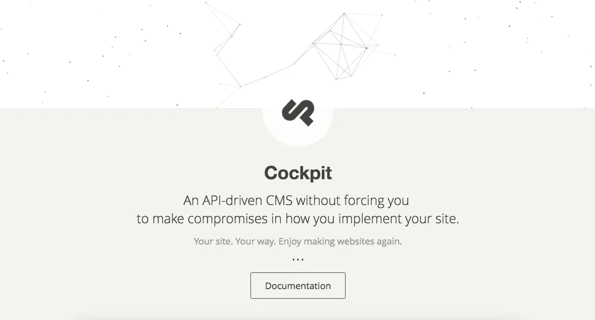
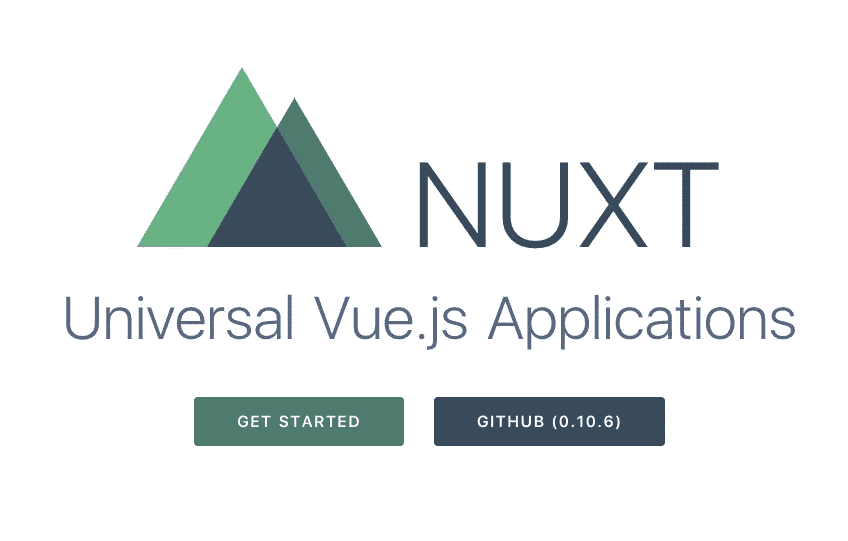
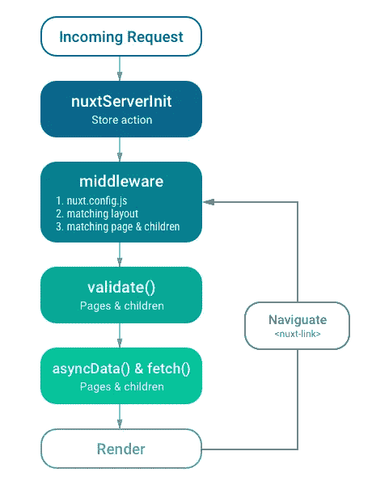
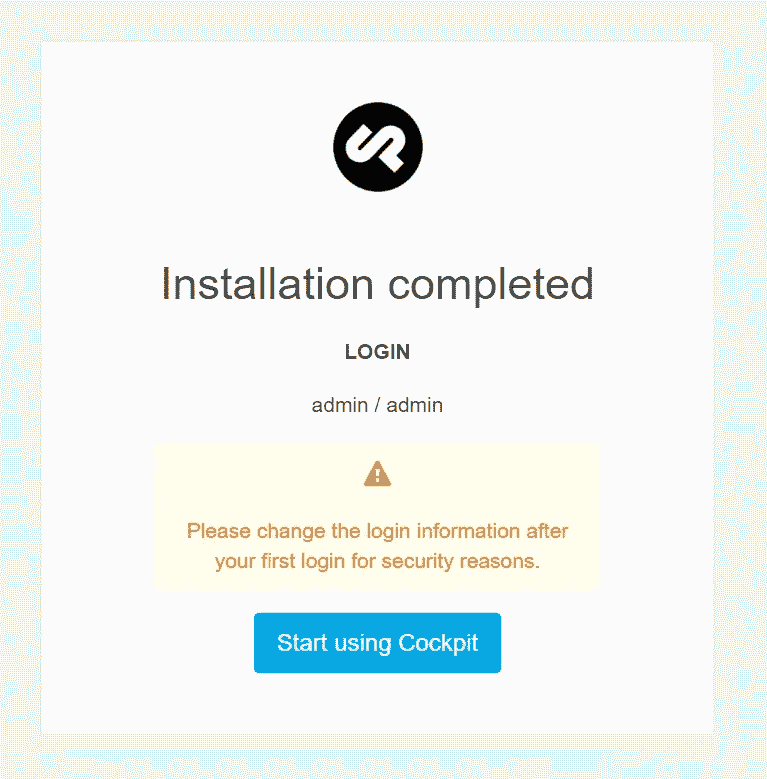
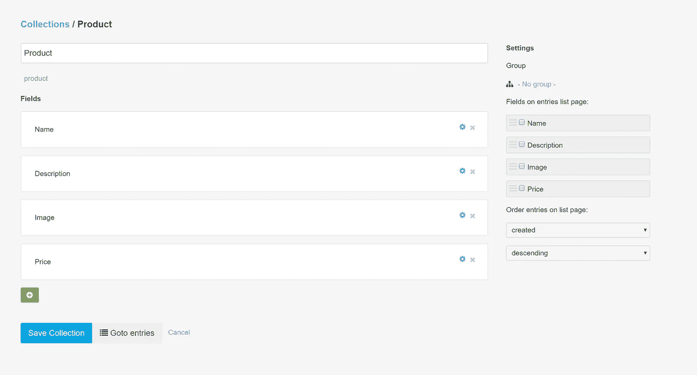
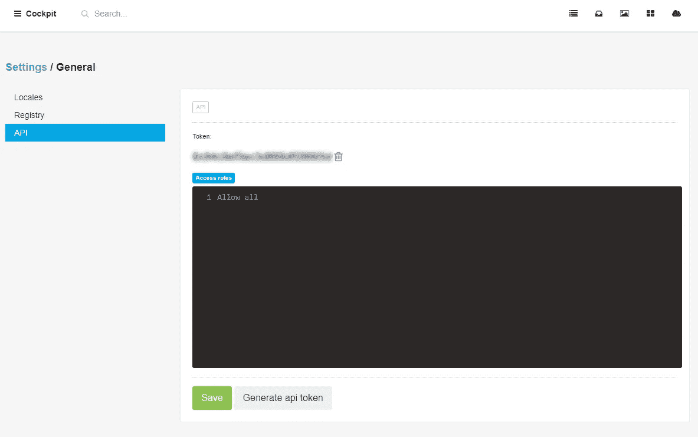
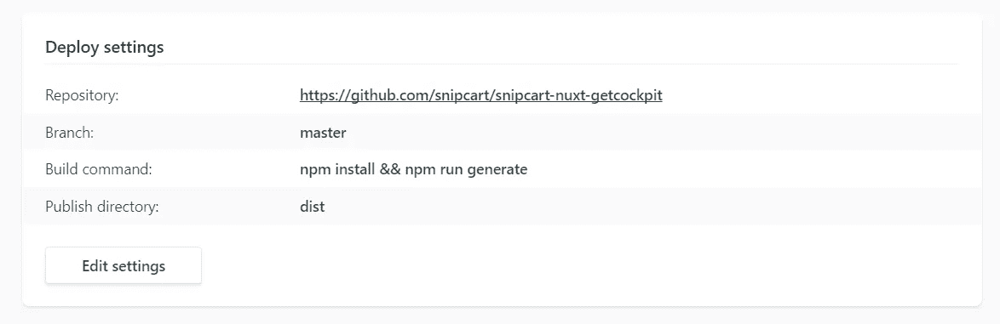
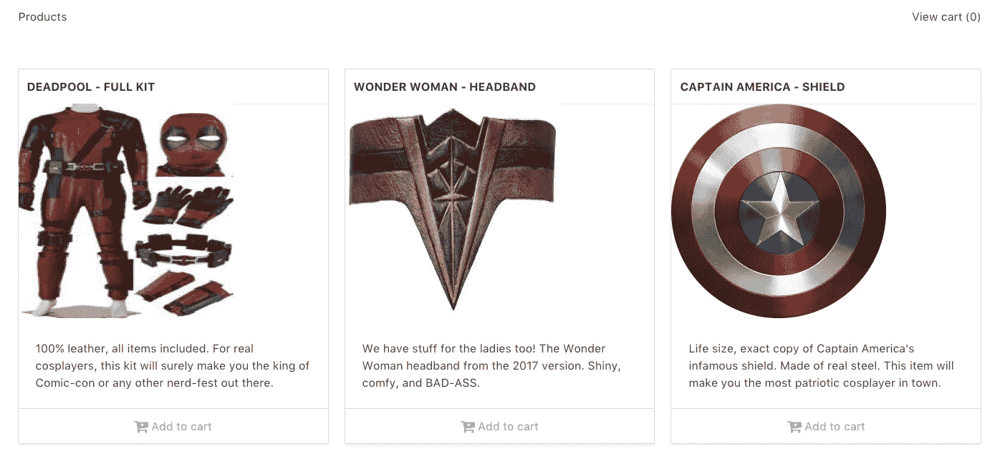

# 在完整的 JAMstack 中捆绑 Cockpit CMS & Nuxt.js 的教程

> 原文：<https://medium.com/hackernoon/in-depth-cockpit-cms-tutorial-with-a-nuxt-js-app-live-demo-4809e7cd1218>


Photo by [Austin Neill](https://unsplash.com/photos/4pHcmcPsP8A?utm_source=unsplash&utm_medium=referral&utm_content=creditCopyText) on [Unsplash](https://unsplash.com/?utm_source=unsplash&utm_medium=referral&utm_content=creditCopyText)

三年前，我们掉进了兔子洞。

我们进入了一个奇怪的网络开发的前沿。

关于“静态”和“无服务器”网站、专用 API 和新兴前端奇迹的讨论非常普遍。JavaScript 无处不在。开发者们兴奋地再次建设网站。我们已经进入了 [JAMstack](https://jamstack.org/) 宇宙。

在我们的博客上，我们已经讨论了无数的[无头](https://snipcart.com/blog/netlify-cms-react-git-workflow)CMS 来存储内容和 JS 框架来呈现内容。

今天我们继续探索:1) **Cockpit CMS** ，一个朋友推荐的 API 优先的 CMS，2) **Nuxt.js** ，一个 kickass Vue.js 框架(从爱上 Vue 开始我们就想用它[)。](https://medium.freecodecamp.org/vue-js-tutorial-a-prerendered-seo-friendly-example-live-demo-771e974e909c)

我们将涵盖:

*   如何设置驾驶舱 CMS 安装&用 Snipcart 插入它。
*   如何使用 Nuxt.js 静态生成来渲染我们 app 的前端？

结果呢？一个完整的 JAMstack 应用程序:无头内容管理，JS 框架中呈现的前端，以及通过电子商务 API 购物。我们还将在最后提供现场演示和代码回购！

但首先，几个重要的定义。

# 什么是驾驶舱 CMS？



我们的内容数据将存储在[驾驶舱](https://getcockpit.com/)中:

> Cockpit 是一个开源的、API 驱动的 CMS，它可以让你毫不妥协地实现你的站点。

开发者 Artur Heinze 精心制作了一个系统，用来构建简单的动态网站，而不需要通过 WordPress、Drupal 等网站的束缚。

其 API 优先的方法(又名“headless”)允许内容管理从内容呈现中分离出来*。你可以在这本关于无头 CMS 的入门书中了解更多。*

*Cockpit 运行在 PHP 上，其核心是一个开发者优先的 CMS。*

*以下是它的一些很酷的功能:*

*   ***自主持***
*   ***快速&轻量级**:在[轻量级数据库引擎](https://www.sqlite.org/)上运行，不需要完整的 SQL server*
*   ***灵活**:在你的网站上以你想要的方式实现*
*   ***可扩展**:开发者可以轻松创建自己的模块*
*   ***现代&简单 UI***
*   ***内置工具**:降价、资产、缩略图等。*

# *Nuxt.js 是什么？*

**

*Nuxt.js 将负责我们的前端。*

*我们最近有机会用 Vue.js 玩[游戏](https://css-tricks.com/creating-vue-js-transitions-animations/)和[，自然对 Nuxt 的 Vue 应用框架感兴趣。](/@udyux/a-killer-vue-js-blog-demo-launch-in-2-hours-tops-6a59199eb2b1)*

*简而言之，Nuxt 允许你创建*通用* [Vue.js](https://hackernoon.com/tagged/vue-js) 应用，你的 [JavaScript](https://hackernoon.com/tagged/javascript) 可以在客户端和服务器上执行。*

> **它的主要范围是 UI 渲染，同时抽象出客户机/服务器分布。* ***和 Vue 一样，它可以用来从头开始一个项目，或者对现有的项目进行改进。****

*受 React 的 Next.js 的启发，Nuxt 是构建 SSR(服务器端渲染)Vue 应用的首选解决方案。由于它的`generate`命令，它在生成静态站点方面也非常出色。*

*以下是这个小奇迹实际工作原理的一瞥:*

**

*Nuxt.js rendering process [[source]](https://nuxtjs.org/guide)*

*我们最近已经看到全面的 Nuxt.js 示例&教程弹出([此处](https://css-tricks.com/simple-server-side-rendering-routing-page-transitions-nuxt-js/) & [此处](https://www.sitepoint.com/nuxt-js-universal-vue-js/))。在这一篇中，我们将看到 Nuxt.js 与 API 优先的 CMS 的实际集成是如何工作的。*

# *使用 Nuxt.js 和 Snipcart 的驾驶舱 CMS 教程*

## *先决条件*

*在构建我们令人敬畏的 cosplay 商店演示之前(是的，没错)，您需要:*

**如果您在本地托管驾驶舱**

*   *PHP >= 5.4*
*   *支持 SQLite 的 PDO(或 MongoDB)*
*   *GD 扩展已启用*

**如果你在某个地方托管它**

*   *具有上述规格的 web 服务器*
*   *一个 Snipcart 账户(测试模式下永远免费)*

## *1.安装驾驶舱 CMS*

*转到 CMS [下载页面](https://getcockpit.com/download)。为了避免不稳定的特性，我们将在这里使用“官方版本”。*

*我将在它自己的实例上安装驾驶舱。然后就可以用`cockpit.local`访问它，用`snipcart-shop.local`访问公共网站。*

*一旦安装完成，去`cockpit.local/install`完成。*

**

*如果您打算实时推送此安装，**您应该更改您的用户名和密码**。*

## *2.使用 Snipcart 创建要销售的产品*

*我们将首先在 CMS 中创建产品。*

*开始名为`Product`的新*收藏*。集合是一种保存数据结构中所有内容的方式。在某种程度上，这是驾驶舱 CMS 的面包和黄油；许多操作都在这个部分完成。*

*在这个集合中，我们添加了以下字段:*

*   *一片名为`Name`的`text`田地。*
*   *名为`Description`的字段`text`。*
*   *名为`Image`的字段`media`。*
*   *名为`Price`的字段`text`。*

**

*我们现在必须生成一个 API 密钥来使用 Cockpit 的服务，为此，进入设置(汉堡包菜单，左上角)，然后通用> API >生成 API 令牌。*

**

*最后，我们只需将产品添加到我们商店的内容回购中:*

*对于这个演示，我们在 Azure 免费网站上安装了 Cockpit。这很容易设置:我们在 GitHub 上推送代码，并在 Azure 中启用自动 Git 部署。*

## *3.使用和理解 Nuxt.js*

*对于面向客户的商店本身，我们将深入研究 Nuxt。*

*首先，我必须说我喜欢和 Nuxt 一起工作。这非常简单，他们的文档非常整洁，而且，正如你已经知道的，我们目前正在与 Vue.js 度蜜月。*

*首先要做的是安装 Nuxt 并搭建我们的项目。我们需要安装`vue-cli`。如果没有，运行:`npm install vue-cli -g`。*

*然后，我们将使用 Nuxt starter 模板搭建项目:*

*安装到此为止。您可以使用以下命令启动开发服务器:*

```
*npm run dev*
```

***Nuxt.js 关键概念***

*让我们谈一谈 Nuxt 是如何工作的。首先要明白的是`pages`。Nuxt 中的页面是一种`route`。这是一个会自动添加到应用程序路由中的 Vue 组件。例如，在默认文件中，你有这个组件:`pages/index.vue`。当您在`http://localhost:3000`点击您的应用程序根 URL 时，这个组件将被呈现(如果您正在运行开发服务器)。*

*如果你想创建一个产品页面，你可以在`pages`文件夹中添加一个名为`products.vue`的组件，然后你会得到这个 URL:`[https://localhost:3000/products](https://localhost:3000/products.)`[。](https://localhost:3000/products.)*

*Nuxt 自动负责路由；不用登记路线什么的。该组件将被立即挂载，您甚至可以用它来呈现一个静态生成的站点。我们将在教程的后面做这件事。*

*Nuxt 中还有另一个重要的概念:`components`。您将在由 starter 模板创建的项目中看到此文件夹。在其中，您将希望添加要在页面中使用的子组件。我们将在邮件中创建一个。*

*我们将看到的另一件事是`layouts`。布局是用来定义你的网站的框架，例如，它通常是你添加导航和页脚的地方。*

*我们要处理的最后一件事是`nuxt.config.js`文件。它允许你定义你想要全局包含哪些库或 CSS 以及更多的内容。*

*如果需要，您还可以添加自己的配置设置。这是我们首先要做的，驾驶舱设置。我们将在调用 Cockpit CMS API 来检索产品数据时使用这些。*

***配置 Nuxt.js***

*打开`nuxt.config.js`并添加:*

*我们将用我们自己的 URL 替换`<cockpit-url>`,用我们在 Cockpit 中生成的 API 令牌替换`<api-token>`。*

*现在，您可以在页面中访问这些环境变量。*

***创建我们的布局***

*在创建第一页之前，我们需要对布局进行一些修改。除了`pages`和`components`，Nuxt 还有一个布局的概念。将它视为“主”页面。这个页面必须包含一个特殊的标签:`<nuxt />`。*

*我的看起来像:*

*页面组件将在`<nuxt />`标签中呈现。*

***创建页面***

*现在是我们的第一页。打开`index.vue`并移除所有东西。让我们从头开始。*

*我们将从创建组件的模板部分开始。这个模板将负责渲染所有产品。*

*问问自己`columns, is-mobile, is-multiline, is-centered, etc.`类来自哪里？我使用了`[Bulma](http://bulma.io/)`，一个用于演示的 CSS 框架。它提供了有用的组件和样式来快速获得好看的演示。*

*为了添加对`Bulma`的引用，我打开了`nuxt.config.js`并将这个对象添加到了`link`数组中:*

*在这里，我们还将添加 Snipcart 的默认 CSS:*

*我们的头部对象现在应该看起来像:*

*在那里添加的任何样式表都将自动包含在所有页面中。*

*注意到`small-product`标签了吗？这是我们稍后将创建的组件。*

*现在，我们需要取回我们的产品。Nuxt 为 pages 组件提供了一个非常棒的方法:`asyncData`。**要知道这个方法不能在子组件中使用，只能在 pages 组件中使用。***

*这个方法将允许我们在呈现页面本身之前远程获取数据。这在创建静态站点时特别有用！*

*为了与 Cockpit API 交互，我们将使用 [Axios](https://github.com/mzabriskie/axios) ，这是一个流行的 JavaScript HTTP 客户端:*

```
*npm install axios --save*
```

*我们的组件应该看起来像:*

*在`asyncData`方法中，我使用 Axios 获取我的产品并生成缩略图。Cockpit 为此提供了 API 端点。注意该方法接收的参数:`{env, params}`。`env`对象将包含在`nuxt.config.js`中设置的设置。*

*您的页面组件将在挂载时收到一个产品列表。太棒了，对吧？*

***创建组件***

*为此，我们需要创建组件`SmallProduct.vue`。在`components`文件夹中，创建一个名为`SmallProduct.vue`的新文件。*

*该组件将呈现产品细节和 Snipcart 的购买按钮。*

*现在运行:*

```
*npm run dev*
```

*打开你的浏览器到`http://localhost:3000`，你应该会看到一些很棒的东西！*

## *4.部署我们的 JAMstack 包*

*工作(几乎)完成了！我们的 Cockpit + Nuxt 商店缺少最后一样东西:部署。正如我们经常做的那样，我们将使用 Netlify 进行托管。只需在 Netlify 中创建一个新站点，并使用:*

```
*npm install && npm run generate*
```

*我们将发布目录设置为`dist`。*

**

*给 Netlify 一些时间来建立你的网站，你就大功告成了！*

# *GitHub 回购和现场演示*

**

*去吧，看看这个 tuts 的演示和代码报告！*

> *[*参见 GitHub 代码回购*](https://github.com/snipcart/snipcart-nuxt-getcockpit)*
> 
> *[*见直播驾驶舱+ Nuxt.js 演示*](https://snipcart-nuxtjs-getcockpit.netlify.com/)*

# *结论*

*嗯，这是一个漫长的。我会尽量简短。；)*

*虽然 Cockpit 不提供托管实例，但它为开发人员提供了一个可塑性很强的内容 API。尤其是如果你是一个 PHP 爱好者。根据我的测试，perf 看起来相当不错&也很稳定。它仍然是一个年轻的，免费的无头 CMS，从视觉和功能上来说，还有改进的空间。好消息是:是[开源](https://github.com/agentejo/cockpit)！因此，不要犹豫，立即加入合作。*

*至于 Nuxt，嗯，我喜欢它！我想这件事在邮报上已经曝光了。如果您想快速跟踪 SSR 或静态 Vue 应用程序开发，请尝试一下。*

**如果你喜欢这篇文章，请花点时间在推特* *上分享一下。评论，问题？下面的部分都是你的了！**

*我最初在 Snipcart 博客上发表了这篇文章，并在我们的时事通讯上分享了它。*

*[https://upscri.be/hackernoon/](https://upscri.be/hackernoon/)*