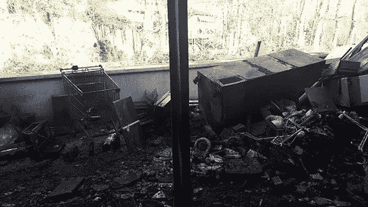
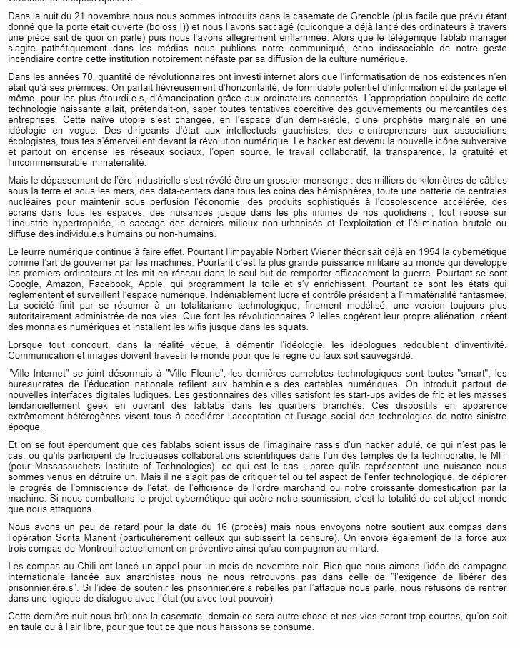

# 在法国，随着“积极分子”焚烧私人实验室以抗议数字文化的传播，网络批评变成了暴力

> 原文：<https://medium.com/hackernoon/in-france-cyber-criticism-turns-violent-as-activists-burn-a-fablab-to-protest-the-diffusion-of-4ad378251c5b>

## 大型科技公司道德失败的后果是什么？

The fablab “La Casemate” after it was destroyed by the group of Grenoble

人们不再向谷歌巴士扔石头了。那些是过去的美好时光。

[周二，位于格勒诺布尔的私人实验室 La Casemate 遭到破坏并被烧毁](https://www.francebleu.fr/infos/faits-divers-justice/l-incendie-de-la-casemate-de-grenoble-revendique-1511540523)，因为它被描述为“因传播数字文化而臭名昭著的有害机构”。

支持数字化转型的公共政策也被批评为*“城市管理者通过在时尚街区开设私人实验室来满足急需资金的初创企业和极客，这些看似极端异质的设备都旨在加速我们灾难性时代的技术的接受和社会使用”。*

这不是人们第一次诉诸暴力抗议自动化和计算机。

从 1979 年到 1983 年，在法国，计算机清算或颠覆委员会(CLODO)在图卢兹地区非常活跃，他们在那里放置炸弹并焚烧建筑物(1980 年的 CII-霍尼布尔，1980 年的国际计算机有限公司，1983 年的斯佩里-尤尼瓦茨，等等)。)当时，他们向法国媒体解释说，他们是*“数据处理领域的工作者，因此非常了解数据处理和电信当前和未来的危险。”*而在他们看来，*“计算机是占统治地位的人最喜欢的工具。它被用来剥削、归档、控制和镇压。”*

还有其他人。1983 年，在西德，一个为潘兴导弹设计软件的计算机中心被一个叫 Rotte Zellen 的组织摧毁。1984 年，比利时一个名为“共产主义战斗组织”(CCC)的组织轰炸并摧毁了几家公司在比利时和德国的总部。在伦敦，一个名为愤怒旅的组织试图做同样的事情。亚洲、南美，当然还有美国也有类似的行动。

人们很容易将这些数字“抗议者”的行为视为纯粹的卢德分子幻想。但是他们的观点并不是计算机行业会抢走人们的工作。

1983 年 8 月，CLODO 给了[一个罕见的采访，用英语采访了 Processed World](http://www.processedworld.com/Issues/issue10/i10clodo.htm) ，他们解释道:“*既不是倒退，也不是新奇。回顾过去，我们只看到奴役和非人化，除非我们回到某些所谓的原始社会。尽管我们可能并不共享同一个“社会项目”，但我们知道试图让时光倒流是愚蠢的。*“更确切地说，这些工具“*在它们的起源上被扭曲了*”，例如“*计算机化程度最高的部门是军队，而 94%的民用计算机时间被用于管理和会计*”。明确地说，在他们 1983 年的观点中，“*如果微处理器造成失业，而不是减少每个人的工作时间，那是因为我们生活在一个残酷的社会中，这绝不是摧毁微处理器的理由。*”

自从 1983 年的电影“战争游戏”以来，人们已经将计算机相关的恐怖主义和暴力行为分离开来。通过坚持黑客和黑客，看起来数字政治、抗议和暴力只发生在某种虚拟世界中，它们属于道德价值观遥远而模糊的灰色地带。事实上，他们关于“白帽子”(好黑客)和“黑帽子”(坏黑客)的词汇似乎更像是指环王，而不是共产党宣言。自从史蒂文·利维 1984 年的开创性著作《[黑客:计算机革命的英雄》问世以来，数字世界就被这种新的叙事方式迷住了，这种方式声称能够打破社会规则。它的领导人总是想以革命者的身份出现。他们总是从车库开始。他们总是以前的黑客。他们都想改变世界。](https://en.wikipedia.org/wiki/Hackers:_Heroes_of_the_Computer_Revolution)

但似乎这个讲故事已经告一段落了。

The text posted by the group of Grenoble on Indymedia

在周五发布的文本中，格勒诺布尔集团和克洛多一样感到失望。他们称数字承诺是“公然的谎言”。

他们呼应最近的数字评论家，如道格拉斯·拉什科夫(Douglas Rushkoff)或甚至 T2 本人(Dominic my)，问自己在一个依赖老派资本主义、垄断、微观工作、国家法规和金钱作为基本价值的行业中，什么是革命性的或预言性的。当他们拒绝黑客神话时，他们最终把一个受尊敬的地方，比如麻省理工学院，称为“*技术统治的圣殿*”。但是对这个资格感到惊讶、被冒犯或震惊的人应该记得艾伦·施瓦茨在被这个机构虐待后被逼自杀的方式。

暴力应该受到谴责。我为 La Casemate 的人们感到难过。他们是仇恨和痛苦发泄的受害者。但他们也是进步和技术宗教的受害者，这种宗教被作为每个人不可避免的未来来出售。

这不是事实，但数字世界确实需要祛魅。

最后，CLODO 的成员再也没有被抓到。他们被一种新的讲述方式所抛弃，这种方式将数字转型本身描述为一场革命。但是没有新的故事可讲。由于这场所谓的革命的承诺现在无法实现，因此可以预见的是，人们将会回到真正的抗议和真正的暴力之中。毫不奇怪，在默默无闻 20 年后，人们开始记住他们。随着公民越来越强烈地感受到数字产业的负面影响，行动将不会局限于在精英会议上发言的前大型科技公司员工，或由科技公司资助撰写愤怒论文的聪明的社会科学研究人员。

技术不是中立的，也不存在虚拟世界。

更新:我应该提到“[工业社会及其未来](http://www.washingtonpost.com/wp-srv/national/longterm/unabomber/manifesto.text.htm)”，又名《尤那邦摩宣言》，但那需要另一个帖子，甚至可能是一系列帖子……如果你以前从未读过它，就自己去读吧……[维基百科上关于泰德·卡钦斯基](https://en.wikipedia.org/wiki/Ted_Kaczynski#Industrial_Society_and_Its_Future)的文章可能是一个很好的条目来理解它的内容。

更新 2:我已经忘记了，但这实际上是短时间内第二次私人实验室在法国被烧毁。上一次是去年南特的拉坎廷大火。当时没有任何证据，但这被认为是一种犯罪行为。