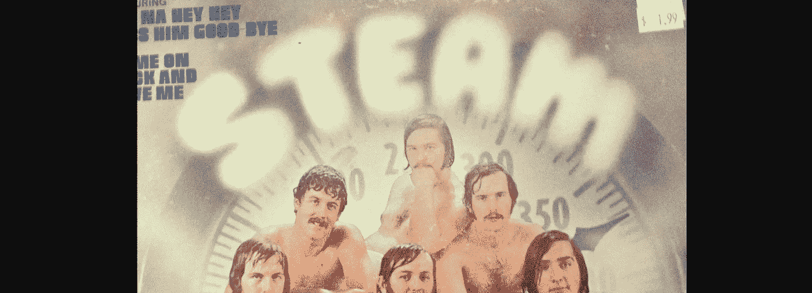
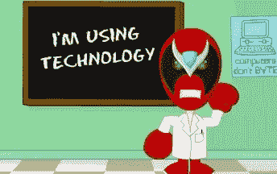
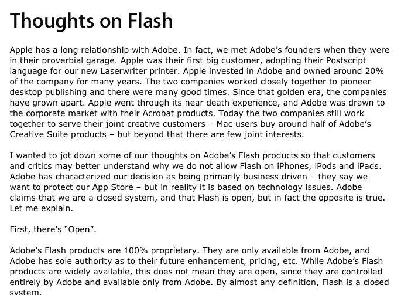

# 为了纪念闪电侠的终结

> 原文：<https://medium.com/hackernoon/in-honor-of-the-end-of-flash-8a683767607f>

那那那那嘿嘿嘿再见。一些庆祝卡通！

Techcrunch 今天报道说 Adobe Flash 终于要结束了。

为了纪念 Adobe Flash 的终结，我将整天听这些！

再见，Strongbad，我们会想念你的。

但是我不会错过网络上的专有技术，所以…

乔布斯[不相信](https://www.apple.com/hotnews/thoughts-on-flash/)在闪:

我也不知道。

我相信这两种技术:

它们是开放和免费的。

到 preview.simmerindustries.com[找我](http://preview.simmerindustries.com)。