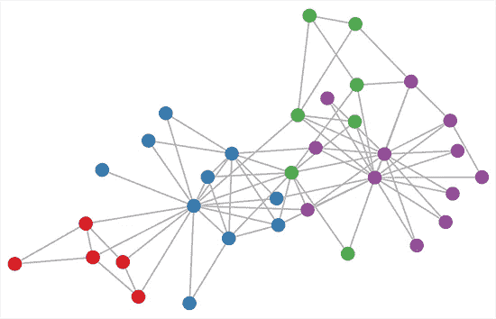

# 将来，你透露的所有信息都将公之于众

> 原文：<https://medium.com/hackernoon/in-the-future-all-information-you-disclose-will-become-public-30ee76f5f6a1>

# Equifax 和 2017 年的混乱

如果您最近没有密切关注信息安全新闻，美国的信用检查公司 Equifax 的所有“客户”数据都被攻击者窃取了。

我把客户放在引号中(你看不到我这样做，但我做了)，因为大多数人没有意识到 Equifax 正在记录他们的数据。它们是通过面向消费者的公司的庞大网络提供给 Equifax 的，这些公司希望验证买家是否能够跟上他们的信用支付。信用卡是显而易见的一种，但商店信用是美国常见的购买方式，或者即使当你选择每月而不是每年支付汽车保险费时，你实际上是在与保险公司达成信用安排。他们会进行信用检查，并与 Equifax 共享他们收集的一些信息。

除了数据被泄露。不对不对。

现在最让我吃惊的是，人们似乎仍然对它被泄露感到震惊。这种情况每隔一个月就会发生，一些大公司有数百万条客户记录从后门偷偷溜走。

如果你看了前首席执行官参加的特别委员会听证会的前 20 分钟，原因就很明显了。他对数据安全一无所知，*如果这是一个听证会，比如说税务欺诈*，将会有一个关于欺诈过程和影响的深入的技术讨论。甚至委员会都没有真正理解补丁是什么，它是否相关，也没有人暂停听证会去问为什么他们运行 Apache Struts 的[内部系统甚至被暴露在互联网上？或者为什么静态数据没有正确加密。](http://www.zdnet.com/article/equifax-confirms-apache-struts-flaw-it-failed-to-patch-was-to-blame-for-data-breach/)

在这个世界上，大多数组织对他们持有的客户数据的操作、安全性和安全性完全一无所知，因此任何有理智的攻击者都不会对这些数据感到惊讶。他们把这个问题推卸给一个资金不足、资源不足的“安全团队”，这个团队的工作就是希望确保这种情况不会发生在他们身上，并导致他们的股价在一夜之间减半。

**嗯，这种方法显然行不通**

Equifax 被指为阶级傻瓜，因为他们陷入了疏忽的境地。

# 黑暗网络的全球公民数据库

通过追踪 21 世纪最大的数据泄露事件，模式很明显。它们变得越来越大，暴露出越来越多的私人数据。雅虎[30 亿客户记录](http://thehill.com/opinion/cybersecurity/354432-yahoos-3-billion-breached-accounts-are-a-boon-to-identity-thieves)被突破，领英[1.67 亿客户记录被突破](http://fortune.com/2016/05/18/linkedin-data-breach-email-password/)。

我的电子邮件账户已经遭到 6 次不同的攻击，包括我的旧密码，因为这些组织似乎都不能正确加密私人数据。我不太在乎密码，使用一个简单的密码管理器，你可以避免每个网站都有相同的密码。

我确实关心其他私人数据。我不会每隔 90 天就换一次地址..或者我母亲的娘家姓。这一点没有改变。但是我在网上系统或电话中被问到的其他问题呢？

我申请了一张信用卡，它询问了我的雇主，我的工资，我的奖金结构，我在公司工作了多久。汽车保险的另一个应用-我如何和在哪里使用车辆。Waze 跟踪我在哪里，我去哪里。所有这些数据对那些组织来说都是有价值的。

> 过去两年创造的数据比人类过去 5000 年创造的数据还要多。2017 年，我们将在一年内创造更多的数据。
> 
> 在数据成为最有价值资源的时代，为什么没有人会毫不犹豫地交出数据？

## 你的一切终将被攻破。

如果你的私人数据在数据驱动的组织中被自由出售和共享，并且有一部分(比如说 10%)被攻破，那么有了足够广泛的网络，所有的信息最终都会公开。

Just hack the red dots and you have all the data

# 如果我的所有数据都是公开的，那会怎样？

考虑到所有这些不断增加的泄露数据，非法数据挖掘者可以开始建立一个镜像数据库，其中包含世界各地所有泄露的信息。所有关于你和任何与数字记录系统互动的人的事情。

通过 LinkedIn、Yahoo、Equifax，甚至是 AdultFriendFinder，我可以找到你是谁，你在哪里工作，你的工资有多少，你和谁约会(和谁结婚)，你的性兴趣，你的可靠性，你的位置，模式，你的性格。

如果所有信息最终都公开，那么就不再有数据隐私这种东西了。