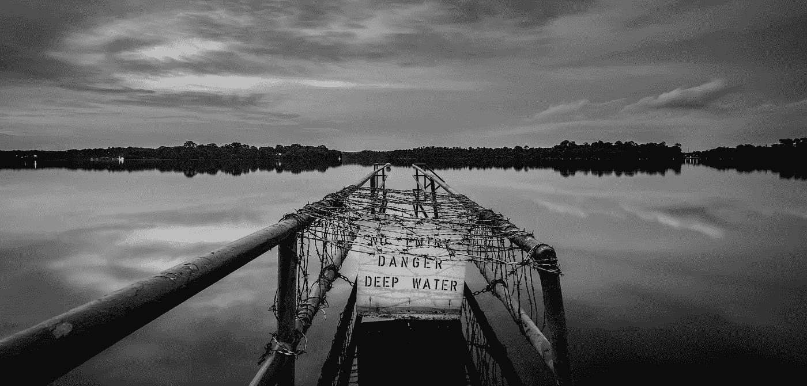

# 当企业家到达河中央时

> 原文：<https://medium.com/hackernoon/in-the-middle-of-the-river-3121f8d50cf0>

## 你是向后看还是继续向前看？

Photo by [@darkroomsg](https://unsplash.com/@darkroomsg) on [Unsplash](https://unsplash.com/?utm_source=unsplash&utm_medium=referral&utm_content=creditCopyText)

> “没人知道你过去的样子和你现在的样子之间会发生什么。没有人能描绘出地狱中那忧郁而孤独的部分。没有变化的地图。
> 
> 你只要从另一边出来。或者你没有。"
> 
> ― **斯蒂芬·金**

没有什么比和成功到达另一边的人交谈更令人满足的了。我刚刚遇到了乔，他是一位企业家，也是我以前的客户，最近刚从西海岸两周的自行车旅行回来。

乔卖掉了自己的公司，看起来轻松多了。他很享受自己的转变，在没有生存压力的情况下思考下一步该做什么。**但几个月前可不是这样。**

今年早些时候，乔睡不好觉。他压力很大，濒临破产。乔觉得自己被困在了河中央。当水变得太深，而*的水*快速上涨时，就不好玩了。

但是当你致力于你的事业时，事情就像往常一样发生了变化。乔卖掉了他的公司，取消了他所有的债务，赚了一些钱。有时候，让事情有条不紊地进行**是任何企业家都梦想得到的最佳退出策略。**

# 开始时，过河感觉很容易

> "但最终，一个人活着比自杀需要更多的勇气."―阿尔贝·加缪

我们都有一个梦想。这就是我们要过河的原因。

我们想离开“现状”的土地，做出改变。我们梦想到达彼岸。

你为什么要过河？

创业不容易，但也不是最难的部分。这需要信念的飞跃。有风险；但是，在游戏的早期，你可以随时返回。

启动是热的。成为企业家比以往任何时候都更性感。书籍、电视节目、电影、杂志和[媒体员工](https://medium.com/u/a32c340ea342?source=post_page-----3121f8d50cf0--------------------------------)，展示、赞美和颂扬创业公司的创始人。从车库故事到数百万美元的交易，企业家已经步入流行文化的聚光灯下

创业故事充满了魅力、金钱和成功。但是很少有人谈论企业家在胸高的时候。

对一个企业家来说，关键时刻是当你走到河中央的时候。你在游戏中有皮肤。你的企业不仅仅是一个 MVP:它有真正的产品和真正的客户。人们喜欢你做的事情，你在赚钱，在成长。

当你开始的时候，你就处于不利地位。但是当你在中间的时候，你有 50/50 的机会长期成功。两个河岸距离相同。你的大脑试图欺骗你。回去似乎是最合理的选择。

是我们的熟悉感在告诉我们回到浅水区吗？还是对齐胸高的水的恐惧让我们错过了一切开始的彼岸？

乔今年早些时候在河中央。他挣扎了几个月，以为自己不会成功，但他不顾水流坚持前进。他的韧性得到了回报。

> *大多数人在即将成功的时候会放弃*

当你怀念*舒适的时候，*你就在投降的边缘。除了放弃充满可能性的生活。我不是说完美。没有这种事。我指的是充满探索、学习和个人成长的生活。

辞职就像搬回父母家一样。你试着按照自己的方式生活，但没有成功。我说的不是失败。这发生在每个人身上，希望我们能从中吸取教训。我说的是你不再相信自己梦想的那一刻。因为舒服而放弃的时候。

即使你现在还看不到，但你离对岸越来越近了。大多数人在即将成功的时候就放弃了。成功的企业家学会了克服这种心理障碍。

# 我目前的旅程

> **“知道我们在这么危险的海域冒险**。如果我们创造了我们的生活，那么十有八九是这样的；。然而**我们冒险**，为了提议的收益。”—威廉·莎士比亚

一旦你跨越了舒适区的边界，更好的生活在等着你。今天，我又一次站在了河中央。今年早些时候，50 岁的我辞去了一份舒适高薪的工作，创建了自己的公司。

当我创办解放者组织时，我有一个简单的目标:帮助人们和组织在变革中茁壮成长。

推动个人和组织转型充满了悖论。每个人都想改变，但大多数人都害怕，他们不想离开自己的舒适区。

我们用更人性化和更有效的行为改变方法来挑战老一套的改变管理方法。我们的客户是见证人。但我们最大的不同是，我们清楚地知道我们想和谁(或不想)一起工作。

我有目的地定义了我们想要合作的客户类型。客户不是为我们的服务付费的人，而是那些遵守相同原则和规则的人。

首先，我不偏袒任何一方。我主要和团队一起工作，CEO 通常会雇佣我们。但是最终的客户是团队中的每个人，不管他们的头衔如何。当高管成为问题的一部分时，我会把他们叫出来。我从个人经历中了解到，如果领导者希望他人改变，他们也需要改变。如果他们不想和其他人玩同样的规则，那对所有人来说都是浪费时间。

**第二，我们将个人发展方法引入组织变革。我相信我们是一个整体:我们的工作和个人生活是交织在一起的。我不买[成浅动机](https://betterhumans.coach.me/your-life-is-not-a-trip-to-the-supermarket-2451f2d11d50)。分享励志名言和[让团队感到‘快乐’是不够的](https://betterhumans.coach.me/is-happiness-at-work-a-good-thing-eaf3fcebcd11)。我想帮助改变人们的行为。我们让人们超越他们的舒适区，将他们与他们深层的身份、信仰和心态重新联系起来。这需要领导者和员工都拿出很大的勇气。如果人们不愿意挑战自己，那么我们就不是一个合适的人。**

**第三，我们与*真正*想要改变的组织合作。**如果一家公司想雇人仅仅是为了取悦团队或者好看，我们不想浪费时间。我不是说一切都应该完美。大多数人在领导变革中挣扎，这就是我们存在的原因。但是我不想和那些不致力于改变的组织或领导者一起工作。

**第四，我们将现实生活中的项目和实验置于教条之上。**我们的方法论结合了不同的方法和途径:神经科学、设计思维、冥想、社会心理学、游戏，应有尽有。我们是方法论不可知论者，相信结果。问题应该决定方法，而不是相反。我们喜欢和喜欢尝试的客户一起工作，即使是在一个项目上。当同样的老方法不能产生效果时，组织会召唤我们。

**第五，我们认为组织需要为人们提供一个安全的成长空间。我们都知道，公司就像家庭一样，充满了缺陷和疯狂。这些在一定程度上是可以接受的，但当它们变得不正常和有毒时就不行了。人们不需要忍受他们的工作。我们与致力于提供心理安全的客户合作。当然，没有一个地方是完美的。这就是为什么我们帮助领导者在他们的组织中创造合适的条件。**

经营自己的公司给了我决定如何经营的自由。我对自己的选择完全负责；这不能怪别人。

今天，当我在河的中央反思时，我的决定让我有信心跨过高水位。我清楚并确信我们想要如何运作。最重要的是，我们如何为客户带来改变。

因为我的条款，我不得不拒绝一些商业机会。我不后悔。**简单的决定或捷径永远不会让你到达我们渴望的海岸。但是当水越来越深的时候，你的信念会让你变得更强大。**

# 过河需要勇气

> "你的恐惧 100%依赖于你才能生存."
> ― **史蒂夫·马拉波利**

今天，当我回头看的时候——就一分钟——我开始的河岸看起来很熟悉。感觉更安全，规则熟悉，我知道我每个月能挣多少钱，我知道我能做什么，我的(前)雇主不允许我做什么。过去感觉更安全，因为我在那里花了很多时间。

河的中间是最难的部分。当它变得更深时，我们害怕自己会被淹没，并开始思考我们可能需要做出改变。比如回到过去或者应用一种新的方法。

重复是一回事，出于恐惧做出反应是另一回事。不要在艰难的事业中改变策略或方向。不要因此改变你的球队或你的马。尤其是当马是你的时候。你拥有一切，让河流来考验你。

> "不要在河中间换马。"—匿名

我一直喜欢这句谚语。现在它比以往任何时候都更有价值。这是一个很好的提醒。如果我走了这么远，我也需要同样的努力才能到达另一边。你知道吗，我越进步，水就会变得越浅。

# 前方的海岸

自从我开始我的新公司，我已经能够从事让我兴奋的项目，这是我多年来从未有过的。

当然，我去过美国很多地方，但也去过欧洲、以色列、土耳其和墨西哥。努力改变社交社区中的网络欺凌行为。帮助有毒文化转变为人类文化。或者帮助首席执行官们放下自我。或者“推动”人们跟随自己的梦想而不是别人的梦想做出改变人生的决定。

我没有吹牛。意识到我在河的中央为我提供了一个自我反省的空间。要意识到，尽管旅程有时会变得艰难，但它也充满了机遇和满足感。所以我想继续穿越。

**河中央是大部分人退出的转折点。那是因为他们总是向后看，而不是向前看。**

我的海岸依然遥远，但我会继续前行。我现在还看不到它，但是它的形象在我的脑海里越来越清晰。我没有时间去后悔，去想我是否会留在最初的河岸——安全地带。

我的目标不是成功、金钱和成就。

我的彼岸叫“我想要的生活值得追求。我相信我自己。”

你正在追寻的河岸叫什么名字？

# 在你离开之前

您想了解我们如何帮助您点燃并加速变革文化吗？伸手:【stretch@liberationist.org】T2

如果你喜欢这篇文章，[注册获取我们的每周变革者洞察](https://liberationist.org/insights-for-changemakers/)。