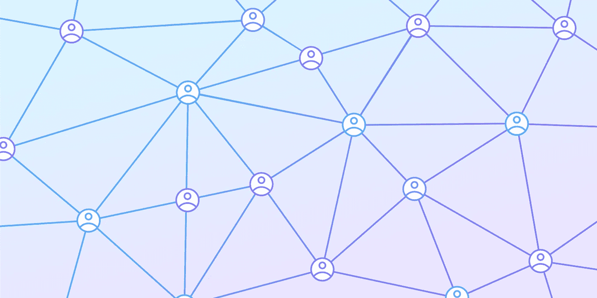
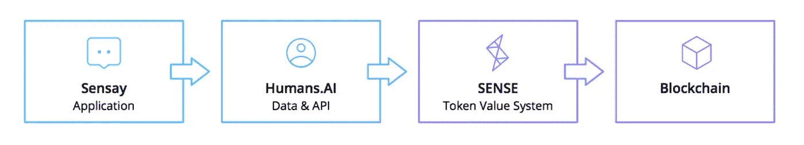
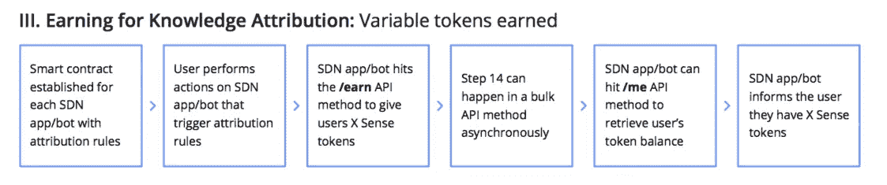

# 在新的零工经济中，每个人都有意义

> 原文：<https://medium.com/hackernoon/in-the-new-gig-economy-everyone-makes-sense-413c0c70299b>

In the new gig economy, everyone makes SENSE ⚡️

> 想象一下，如果你能和世界上任何一个人联系，并知道他们现在知道什么——[*阿里尔·贾拉里*](https://medium.com/u/968325b55f73?source=post_page-----413c0c70299b--------------------------------)

# 零工经济 2.0

工作的未来与人类目标的未来密不可分，两者都在发展。

目前，三分之一的千禧一代住在家里，重视体验胜过资产所有权。同样比例的人参与到所谓的“零工经济”中，用他们的时间换取金钱，同时分享他们的实物资产，比如汽车和公寓。

五年内，一半的人口将参与到这种“零工经济”中，做一些项目，而不是为一个雇主做一份工作。这一趋势似乎正处于自动化趋势的恰当关头。

预计到 2025 年，机器人和人工智能将使 30%的劳动力实现自动化。人类必须加快步伐，通过终身学习获得新技能，并不断定义和完善自己的目标。

有些技能需要由工作的人来验证，有些技能需要被分析来证明这些人的能力。每个行动都在一个公平奖励贡献的系统中获得价值。

## 通过分散的网络释放人力资本

我们将人力资本定义为知识、技能和经验的结合，然而它却不能被自由分享。我们仍然在谷歌上寻找问题的答案，然而答案并不包含丰富的知识、技能和经验。

这就是我们推出感知分散网络(SDN)的原因；我们相信所有人类的知识、技能和经验都是有内在价值的。

SDN 是一个使用和共享人力资本的网络，建立在基于以太坊的智能合约上，使用 SENSE 令牌为网络上使用和共享的信息分配价值。

这将人力资本带出筒仓，并使人力资本全球化经济成为可能。为了更快实现这一愿景，我们正在制造人类。AI——首个基于 SDN 协议构建的应用编程接口。

In the SENSE Decentralized Network, the knowledge, skills and experience of every human is inherently valuable.

# 与人类一起获取人力资本。AI API

智力不应该是人工的——它应该被增强。

人类。人工智能是筒仓中的人力资本和普遍人类知识之间缺失的一环。编程接口使应用程序能够奖励用户在各种平台上共享知识的 SENSE 令牌。

开发者可以使用人类。AI 的 API 使用超越社交图的工具来创建一代 dApps。

作为人类的一部分。AI 应用程序，一些 API 端点即将发布，开发者可以使用它们来构建基于知识的应用程序。

开发人员可以通过公共 SDN 和人来访问和操作可用的数据。AI APIs，并且可以通过对网络做出贡献来赚取 SENSE。

Sensay is one of many SENSE dApps taking advantage of the Humans.AI API.

作为一款应用，Sensay 通过向人类发送对话数据来赚取 SENSE。AI，并依次为它请求的每个对话向 API 支付 SENSE。

本质上，这意味着其他人类的用户。人工智能驱动的应用程序能够在参与这些应用程序的同时检查知识并获得意义。

用户能够有意地(自我检查)或被动地(基于事件的检查)检查知识；流入和流出应用程序的用户知识的集合表达了他们的技能和声誉。

通过这种方式，用户的技能和知识将得到回报，而无需改变他们日常使用应用的方式。每当人类或机器人访问他们的人力资本时，他们的地址就会自动记入。

这代表了人们赚钱方式的彻底转变，并引领了一个新的零工经济的开始，在这个经济中，无形的贵重物品(如智力)可以被交易。

# **感官的实际应用**

SDN 发布时:

**(I)**10 亿代币的固定供应量被创建；

**(ii)** 其中 2.75 亿个代币可供用户购买，以换取[加密货币](https://hackernoon.com/tagged/cryptocurrency)(BTC/ETH)；和

**(iii)** 人类的某些 API 终点。AI API 可以在 SDN 上使用。

为了在发布时向客户展示新 SENSE token 的消费效用，Sensay 提供了新 SENSE token 的以下功能:

*   通过外部钱包将 Sensay 硬币一对一转换为新的 SENSE 代币
*   通过知识属性智能合同登记知识属性
*   在聊天中赚钱和开始聊天需要一个象征性的平衡——对人类或机器人来说

在发布时，SDN 功能涉及主令牌契约以及感知网络上的附加契约的功能。

**第 1 天可用的前 3 个 SENSE 智能合约是:**

*   Mainnet 上的 SENSE 令牌
*   Testnet 上的知识归属*(用户已经提供了知识，并且这些知识仍然属于用户)*
*   Testnet 上的知识访问*(用户已经搜索了知识，并且可以通过搜索的知识访问其他用户)*

这些合同形成了一个完整的循环，即感应令牌如何进入用户的钱包并用于访问网络上的功能。

以太坊网络上的一个用户账号，可以认为是用户的以太坊钱包地址。此钱包地址可以保存各种以太网和一个或多个关联的智能合约，包括用于跟踪令牌的 ERC-20 智能合约，如 SENSE。

用户可以访问 SDN 上的任何应用，创建一个感知钱包。开发者也可以为自己创建感知钱包，并申请访问人类的凭证。AI API。

让我们看看这在实践中是如何工作的:

Knowledge Attribution vision as expressed for the end-state solution of the SENSE Decentralized Network (SDN)

## **Reddit 上的知识归属**

像 Reddit 这样的网站上的用户就各种各样的话题互相发表帖子、评论和建议(生活在“子编辑”中)。这些帖子和评论由 Reddit 上的其他用户根据其有用性进行评级，这在 Reddit 上被表示为一个名为 Karma 的分数。

这种声誉，以及其他与 Reddit 相关的重要活动，可以转化为对用户贡献的认可。

当你，作为一个用户，在 Reddit(或 GitHub，或任何其他类似的中央系统)，**上分享你独特的人力资本时，你就能够使用你的人。人工智能钱包声称这是你自己的人力资本…以及任何相关的意义。**

这样，你与世界分享的知识会得到公平的回报，你最终能够将所有美好的 Reddit 因果报应转化为实际收入。

零工经济的未来正在到来——这很有意义。⚡️

*如果你有大脑和电话，你就能理解。做自己知识数据库的主人。* [*今天加入并参与*](https://www.sensetoken.com) *。*