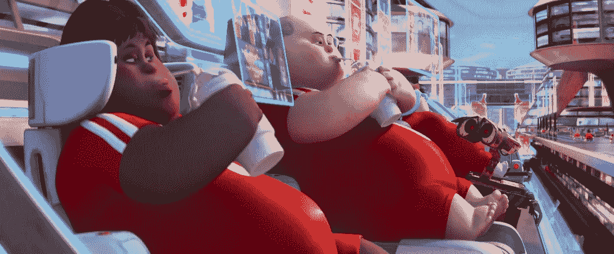
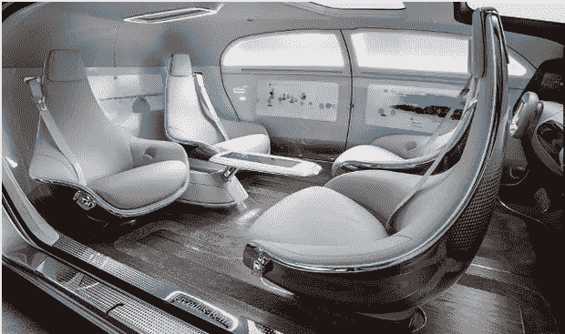

# 在未来的技术乌托邦中，技术将拯救我们还是奴役我们？

> 原文：<https://medium.com/hackernoon/in-tomorrows-technopia-will-technology-save-us-or-enslave-us-edc91e0c34d8>

*为什么自动化焦虑是我们这个时代的关键问题之一，
为什么工作结束了，
为什么我们正在经历工业时代的黄昏。*

《每日邮报》头版标题为“机器人偷走你 1500 万份工作”。

“机器人将在 30 年内接管大部分工作，”每日电讯报说。

《每日邮报》和《每日电讯报》并不是唯一担心技术进步和我们灭亡的报纸。邮件标题的来源是英格兰银行行长。《每日电讯报》的作者是一位受人尊敬的美国大学教授。

机器人末日正在催生更多可怕的头条新闻:

“机器人入侵:自动驾驶汽车将摧毁 400 万个工作岗位”

“自动驾驶卡车会像人类驾驶的卡车一样撞上我们”

“93%的投资者表示人工智能将摧毁就业岗位”

"白宫:机器人将扼杀就业机会，并使不平等加剧."

与此同时，英国广播公司采取了一种实用的方法，问“机器人会取代你的工作吗？”在 BBC 网站的一个字段中输入你的头衔，他们会告诉你你的工作是否安全。真让人放心。

难怪《经济学人》观察到“技术变革的步伐令人头晕目眩。”

# 看看谁被吓到了

正如你所看到的，这不仅仅让《每日邮报》的作者和读者感到焦虑。这也让你期望保持冷静的那类人感到担忧。它甚至吓到了那些你希望会自信地带领我们进入[未来](https://hackernoon.com/tagged/future)的有远见的人。

像未来学家 Gerd Leonhard 和 Martin Ford，他们的新书是[技术](https://hackernoon.com/tagged/technology)对人类:即将到来的人与机器之间的冲突，以及机器人的崛起:技术和失业未来的威胁。或者像安德鲁·基恩这样的硅谷评论员，他在互联网上表达了他的担忧，但这不是答案。

或者是想把人送上火星的亿万富翁贝宝创始人埃隆·马斯克。马斯克和剑桥大学的斯蒂芬·霍金一起，非常担心人工智能的影响，他建立了一个组织，以确保它不会摧毁我们以及我们的工作。

“人工智能可能意味着人类的终结，”霍金说。

这种反乌托邦的机器优先的未来不仅仅出现在书籍、报纸以及未来学家、学者和企业家焦虑的头脑中。它出现在几十年后的电影中:艾，她，少数派报告，甚至瓦力。它出现在电视上——在《人类》和《黑镜》中。简而言之，无处不在。

# 自动化焦虑

如果说“地位焦虑”反映了十年前的一个新真相，而“填充焦虑”抓住了 2015 年的情绪——那么“自动化焦虑”将定义人们未来十年的感受。

也许自动化焦虑最奇怪的事情是:鉴于对技术影响的无处不在的负面宣传，这种技术恐惧反应实际上感觉是理性的。

Lazy humans, in the automated world of Wall-E.

尤其是当你看到机器人为肥胖、懒惰的人服务的瓦力世界在你周围变成现实的时候。就在这里，在肥胖症的流行中，在食品配送服务的兴起中，在机器人吸尘器中，在新的衣物折叠洗衣机器人中。你会想，也许我们会像那样结束。

Black Mirror, season 3, episode 1, has a biting view of where social media scores could lead us.

尤其是当你担心社交媒体和虚拟现实以及我们花在手机上的所有时间从长远来看意味着什么的时候。然后黑镜向你展示，我们最终都会在心理上和生理上上瘾。也许我已经在半路上了，当你那天无数次查看你的电子邮件或推特或脸书消息时，你会这样想。

尤其是当你听到咨询公司麦肯锡(McKinsey)说 60%的工作可能是自动化的，你环顾一下你做的一些事情。机器人会比我更好、更快、更便宜吗？你想知道。我会被机器人抢了饭碗吗？

但是我们以前来过这里，不是吗？过去，社会曾多次面临技术剧变。每次我们的祖先把一只脚放在进步的台阶上，他们都以听起来愚蠢的方式担忧。

最著名的自动化焦虑者是 19 世纪 10 年代抨击机器的勒德分子。他们想知道，那些织工会做什么？

其次，还有那些为火车烦恼的人。当斯托克顿-达灵顿铁路于 1825 年开通时，一些人认为人体不能跑那么快——也就是每小时 30 英里——如果你跑那么快，你的身体可能会融化。

也有人对自行车感到烦恼。真的。在 19 世纪 80 年代，当现代自行车被发明出来时，许多人认为，它们给年轻女性提供了一种独立出行的便捷方式，可以解放女性，颠覆社会。

哎呀，他们确实这么做了。

正如他们所做的那样，他们以非常积极和完全出乎意料的方式帮助改变了社会。

所以我认为我们需要处理这种对技术的下意识反应。我们需要进行一次成熟的对话，讨论机器人、无人机、物联网(IoT)、人工智能(AI)和机器学习(ML)对我们的生活意味着什么。人们必须看到，即使是技术云也有其光明的一面。

所以我们需要谈谈自动化。我们需要谈谈自动化焦虑。

# 为什么我在 Technopia 上写这篇文章

我认为我们需要重新启动我们对自动化狭隘的、有限的、消极的态度。我们需要重新构建当前关于自动化焦虑的对话。我们需要为建立在人工智能、机器学习和机器人基础上的人类社会重新燃起激情。

我希望这篇文章能加入到对话中来，它会激励你，它会促使人们认真考虑不远的明天的“技术乌托邦”会是什么样子。

我想让他们通过提出支撑自动化焦虑的关键问题来做到这一点。

当技术超越我们——更快、更好、更便宜地完成工作——它会成为我们的主人吗？机器人不再为我们工作，我们会为他们工作吗？

当技术接管了我们如此多的任务时，会不会让我们变成无所事事、毫无意义的大胖子？

当技术超越人类时，我们会被留在历史的垃圾堆里，成为数字达尔文主义的不知情的受害者吗？我们已经启动的自动化会让人类重蹈恐龙、收音机和固定电话的覆辙吗？

在技术摧毁了一些工作岗位之后，它会决定也摧毁我们吗？

简而言之，技术会对我们不利吗？它会不会导致某种反乌托邦，人类成为奴隶，被动浪费空间，无关紧要，或者灭绝？

或者，未来远没有那么黯淡，远比现在积极？会有好的一面也有不好的一面吗？不仅仅是来自下一代最新功能集的好处，而是对社会真正有意义的积极影响？如果有，这些好处是什么？如果机器做得更多，我们会改变我们所做的吗？对你、我、我们的家人和朋友以及地球上的其他人来说，技术乌托邦会是什么样的？

(顺便说一句,《技术乌托邦》有意暗示了乌托邦和反乌托邦。从某种严格的文献学角度来看，这个词应该是“techno-topia”，来源于古希腊语的工具和地点、 *technon* 和 *topos* 。但是简化这个组合词，把“不”省略成“不”是完全可以接受的。因此，“技术乌托邦”。)

正如 1750 年的农民或纺织工甚至是主要思想家会发现很难想象有汽车、飞机、电视和 Spotify 的生活一样，大多数人也很难想象自动化后的生活会是什么样子。但并不意味着我们不能尝试。最好的方法掌握在一个有着预测未来记录的未来学家手中。

大家好，我是詹姆斯·沃曼，2004 年以来的未来学家。和我一起踏上一段短暂的旅程，看看科技是会拯救我们，还是会奴役我们。

# 工作结束？

让我们从现在最让大多数人担心的领域开始。工作。技术将彻底改变工作世界。一方面，机器人正在争夺越来越多的蓝领工作。他们的软件兄弟也在为白领工人做同样的事情。(也许这就是为什么如今媒体似乎更加烦恼的原因。机器人现在写文章。)

数百万人将会失业，因为更便宜、更高效、更准确的工人将会抢走我们的工作，这些工人周末不喝茶休息也不回家。这令人深感担忧。

另一方面，自动化将把我们从困难、枯燥、死记硬背的工作中解放出来。这将使我们能够向价值链的更高端移动，并远离价值链。

未来几十年解决这一大规模技术失业浪潮的方法之一是引入全民基本收入。目前正在荷兰、芬兰和其他地方试行，这将把我们从支付必需品的枯燥工作中解放出来。相反，我们可以自由地追求我们真正想做的事情。

# 你觉得少工作怎么样？

对每个人来说听起来都没那么好。听听这个人的观点，他启发了《每日电讯报》关于机器人抢走工作的标题，Moshe Vardi。但在此之前，请放下你的咖啡杯。

“如果机器做所有的工作，我们将可以自由地从事休闲活动，”Vardi 说。“我不认为这是一个有前途的未来，因为我不认为只有休闲的生活前景有吸引力。在我看来，这是一个反乌托邦。我相信工作对人类的幸福至关重要。”

抱歉，他刚才说什么？

对于像 Vardi 这样有着有趣、安全、终身工作的大学教授来说，工作似乎是必不可少的。但并不是每个人都对他们必须做的支付房租的事情如此感兴趣。事实上，25%到 60%的人工作不开心，讨厌自己的工作。

如果 Vardi 认为工作如此重要，他是否希望过去破坏工作的技术可以不被发明出来？他后悔有洗衣机吗？如果我们每天花几个小时洗衣服会更好吗？那最反乌托邦的发明呢:自来水和我们家中的水龙头。想想日常生活中被偷走的珍贵作品。可怜那些不再有机会每天步行几个小时去取水的人。

但瓦尔迪的评论中有所指。如果可以选择我们做什么，有些人会选择休闲，贡献很少。但迄今为止的研究表明，更多的人会花时间做对他们有意义的事情:比如让他们的邻居或世界变得更好，照顾他们的孩子或父母，或者创造艺术或生意。基本收入完全有可能开启一个前所未有的创造力时代。

硅谷孵化器 Y Combinator 的总裁萨姆·奥尔特曼(Sam Altman)说:“也许 90%的人会去抽大麻，玩电子游戏。”Y Combinator 目前正在资助关于普遍基本收入的研究。“但如果 10%的人去创造新产品、服务和新财富，那仍然是一个巨大的净收益。”

无论结果如何，这种转变都不太可能一帆风顺。鉴于以往革命的证据，未来几十年可能会充满坎坷。但最终可能会是一个有趣得多的世界——更少的无聊工作，更多的时间用于创造性的、激情主导的追求。

# 亚马逊的 Alexa 会终结家暴吗？

除了工作，自动化将彻底改变我们生活的许多其他方面:我们如何购物，我们如何出行，我们如何处理我们的关系。它甚至可以结束家庭暴力。

我凭什么这么说？

首先，想想 GPS 是如何让生活变得更容易的。首先，它阻止了我们迷路。技术反对者哀叹意外收获和自发性的丧失。但是迷路很烦。我的全球定位系统带我去了一些地方，开辟了一些路线，如果没有它我永远也不会去旅行。

GPS 阻止了多少争论？我敢打赌，有几百万。反正我家至少有几百个。GPS 意味着不再有关于地图阅读的争吵，也没有人会因为把你带进死胡同而受到责备。

如果这就是 GPS 在户外能做的，想想亚马逊的 Alexa 在家里能做什么。如果你还没有见过 Alexa，它生活在亚马逊出售的一个叫做 Echo 的小巧的扬声器/监听器中。Alexa 更喜欢住，所以手册上说，住在你家中央的某个地方，这样她就能清楚地听到你说话。然后，当被召唤时，她会播放你让她听的音乐，回答常识问题和当天天气的询问，并组织你的购物。她就像《太空漫游 2001》里的 HAL，只不过主要是用亚马逊购物，稍微没那么强大和自大狂。暂时如此。

很快，Alexa 将建立一个关于你购物欲望的档案，并为你提供建议，比如为圣诞节订购火鸡，或者根据他们的脸书档案为你的伴侣的生日提出建议。她很快就会像那些了不起的私人助理一样，在你还不知道他们需要做什么之前就为你做事。

(这被称为“认知商务”，是认知计算革命的一部分，IBM 等公司正通过其沃森人工智能计算机系统迎来这场革命。)

她甚至可以结束“你说过”、“不，我没有”、“是的，你说过”这种类型的争论。有了 Alexa，你可以通过一个简单的查询来结束这种无聊的家庭螺旋:“Alexa，你能不能检查一下，看看詹姆斯是否说他可以在我今晚出去的时候照看孩子？”

到目前为止，一切都很好，但再想半秒钟，你不需要研究乔治·奥威尔的《1984》就能认识到我们都在邀请我们进入自己家的反乌托邦。这个设备可以监听我们在那里做的一切。

你真的想这样吗？这对隐私意味着什么？如果信息落入坏人之手会发生什么？通过邀请 Alexa 和她来自其他科技公司的表亲进入我们的家，我们是否在不知不觉中创建了我们自己的技术监狱，在那里墙壁真的有耳朵？

然而。Alexa 很可能不会导致如此糟糕的结果。如我所说，她可以结束家庭暴力。

以下是方法。美国一家法院最近要求亚马逊使用 Alexa 数据来帮助谋杀调查。他们说没有，他们没有，而且这个设备只有在被明确要求时才会监听。但这并不完全正确。(见《连线》文章[一桩谋杀案考验 Alexa 对你隐私的忠诚](https://www.wired.com/2017/02/murder-case-tests-alexas-devotion-privacy/)。)已经 [Alexas 在听到一个电视节目主持人在电视上说的话后，已经订购了玩偶屋](https://www.theregister.co.uk/2017/01/07/tv_anchor_says_alexa_buy_me_a_dollhouse_and_she_does/)。

Amazon’s Alexa has ordered dolls houses.

更重要的是，家庭监听设备的含义实际上非常令人兴奋，因为当我们在节目中表现得更好一些。

想想优步的司机比过去的出租车司机好太多了，因为他们通过评级系统得到反馈。当你拿优步奖时，也要考虑如何表现得更有礼貌，因为你也很在意自己的评分。然后想想世界各地数百万面临家庭虐待的女性——就像四分之一的英国女性在她们生命中的某个时刻受到虐待。将一个小小的 Alexa 风格的麦克风放入我们的家中可以大大减少家庭暴力。

(也许，作为目前对隐私问题的担忧的一种解决办法，人们可以拥有秘密的“安全”单词或短语，自动打开机器，让它监听。)

# 意外的终结？

Concept for a driverless car interior.

我们可能会看到类似的伤害减少和生活改善，因为我们生活的另一个关键领域是自动化:汽车。当然也有人想象不到不开车。他们谈论开车的心理好处。就像在十字路口让别人先走所带来的友情。当你把踏板踩在金属上，车向前冲时的力量感。

但是人类司机容易出错。人类接电话，思考其他事情，一般都会犯错。机器不会。(嗯，实际上他们可以考虑其他事情，但是他们犯错误的可能性要小得多。)无人驾驶汽车已经比人类安全了。2016 年 12 月，一辆特斯拉的传感器甚至检测到前面两辆车发生碰撞，紧急刹车，避免了受伤。如果我们能减少每年在英国道路上死亡的 1730 名儿童、妇女和男子，这难道不是一件好事吗？

这只是自动汽车将提供的最明显的改进。想象一下，没有繁重的，浪费的费用，保持自己的车。(汽车只用了 5%的时间。)并享受你私人司机的所有好处。任何时候你想要一辆车，你都可以有效地吹口哨——以一种数字化的方式，就像现在人们叫优步一样。

Zipcar 创始人、现为美国政府未来交通顾问的罗宾·蔡斯(Robin Chase)称之为 FAVES 的东西将取代人们拥有的私家车:电动和共享的自动驾驶汽车车队。在其他进一步的好处中，对停车位和停车场的需求将大大减少，释放了我们城市的道路和空间。

此外，汽车不会完全消失。他们会变得像马一样。它们将是周末的玩物，而不是主要的日常交通工具。就像你不能在高速公路上驾驶马车一样，在有些道路上驾驶自己的汽车是违法的。我认为到 2030 年你将不能在伦敦市中心开车。(注:我是在 2008 年向英国天空新闻做出这个预测的。)

# 科技性爱革命

2009 年，我在《GQ》杂志一篇关于科技性爱革命的文章中预测的大部分事情正在成为现实。想想机器人性爱机器——也就是振动器——是如何在几十年内从难以启齿变成日常生活的，你会发现技术性性爱革命已经开始了。

在未来，由自然语言处理(NLP)、人工智能和人工智能驱动的机器人性爱机器将更加人性化，更加逼真。就像她身上的聊天机器人一样，他们会倾听我们的忧虑，抚慰我们的心灵，引诱我们。你们中的一个度过了艰难的一天，没有耐心倾听？还是只是普通的头痛？你们中的一个有幻想——斯嘉丽·约翰逊或者丹尼尔·克雷格或者更古怪的人——另一个却不热衷？同样，就像裘德洛在《人工智能》中扮演的机器人小白脸一样，完全有可能。

Gigolo Jane and Gigolo Joe in Spielberg’s AI

这些新技术会如此之好，令人上瘾，以至于我们不想回到我们非名人、不完美伴侣的现实中来吗？这会对人际关系造成危险，意味着我们不再需要其他人了吗？但是这不就是他们曾经说的振动器吗？

这一技术性的性革命将为已经起飞的 AR 和 VR 色情世界打开大门，因为一些更远的从业者开创了与机器做爱和性的想法。有趣的是(至少对我来说),今天机器驱动的爱是如何适应性从禁忌话题向值得庆祝和探索的事物转变的长期趋势的。(关于这方面的更多内容，请阅读盖伊·特立斯的非小说名著《你邻居的妻子》。)

# 大创意预警！工业时代的末期

除了希望重新构建关于我们科技驱动的未来的辩论，这里还有一个更大的想法。

我们即将经历的这种过山车之旅——工作、家庭、性、购物、城市、人际关系、旅行和我们生活的其他重要方面都发生了根本性的变化——是一种肾上腺素刺激，反映了一种更为根本的历史性变化。

你可以在靠基本收入生活的芬兰人、肯尼亚人和荷兰人身上看到这种迹象；在《想嫁给机器人的法国女人》中，她 3D 打印了一张照片；在英国，一个人在自己的身体里植入芯片，通过心灵感应与妻子交流；在 Xiaoice 背后的中国团队中，聊天机器人是 4000 万中国人每天可信赖的朋友。

准备好了吗？这是个好主意。

我相信我们即将经历人类历史上最关键的时期之一。

这就像人类驯化动物一样具有变革性。

Painting of herdsmen and cattle, Tassili-n-Ajjer, Algeria. Photo: *Jean-Dominique Lajoux*

想想从人力到畜力的转变对农业意味着什么。这和几千年后从动物到机器的转变一样有意义和革命性。想想由此引发的不可思议的变化。

我相信，在未来，人类将会把 1750-2150 年这段时期视为人类存在的一个异常。这个时代将被称为工业时代，那时人们比以往任何时候都更加努力地工作。

在 1750 年之前，在工厂和强制实行时钟时间之前，生活是杂乱而艰苦的。然后，第一次、第二次和第三次工业革命改变了地球上的生活——无论是好是坏。

第一次工业革命(1750 年至 1870 年)通过蒸汽机、火车和速度比任何人都快几百倍的机器，首次暗示了技术可以做什么，包括好的和坏的方面。想象一下特纳画中黑暗邪恶的磨坊，以及工厂里的生活是什么样子。预期寿命也下降了。

通过电话、灯泡和内燃机，第二次工业革命(1870 年至 1914 年)使通信速度大大加快，世界变得更小，晚上阅读也变得更容易。

第三次革命，数字革命，给了我们互联网、iPhone 和共享经济。

由于这些令人难以置信的进步，地球上的生活发生了根本的变化。

**预期寿命增加了一倍。**(实际上，全球所有地区的平均寿命都增加了一倍多:1770 年，非洲和欧洲的平均寿命分别为 26 岁和 34 岁，如今分别为 60 岁和 81 岁。)

**贫困减半。**(其实远比那个好。1720 年，大约 84%的人生活在“极度贫困”中。现在，只有 9%。世界银行认为，我们可能在 2030 年结束极端贫困。)

**距离是死的。**(或者说，至少是奄奄一息。但是谁在抱怨现在只需要 22 个小时就可以到达悉尼，而以前需要 40 天。别忘了 Skype 和 Google Hangout 的免费电话会议服务。)

还有无数我们认为理所当然的日常魔术的例子。我们有室内厕所、自来水和活过五岁的儿童——即使在 20 世纪 30 年代，十分之一的英国儿童在五岁生日前死亡。我们有无线网络、波音梦幻客机、电动淋浴、平板座椅、平板电视和虚拟现实。我们担心的不仅仅是活着，而是我们是否快乐。

在这三次工业革命之前，我们的祖先生活在肮脏泥泞的农家庭院里，和他们的动物一起度过短暂的时光。现在，我们活得长，干净，有联系。

这些变化并不完美。今天也有不利的一面。我们也放弃了以前的亲密家庭关系。我们不再是公民了。我们是消费者。我们有财富，但我们也有不平等、压力、抑郁、孤独、肥胖、气候变化、民粹主义和唐纳德·特朗普。

所以，是的，我们仍然有问题。但它们是第一世界，21 世纪的问题。让我努力获得良好的 wifi 连接，抱怨唐纳德·特朗普(Donald Trump)，担心自己有多幸福，而不是每天都得天花。

总的来说，这些变化是积极的。也许与我们更长久、更清洁、更美好的生活相比，气候变化只是一个小小的代价。

更重要的是，这些工业革命对于正在发生的第四次工业革命，即自动化革命至关重要。不会很完美。它既有好的一面，也有坏的一面，实现这一点可能会很困难。会有我们无法完全想象的问题，也会有难以想象的好事。

但是，无论第四次工业革命结果如何，无论到达那里的旅程如何，有一件事是肯定的。它正在发生，而且速度很快。它发生得如此之快，以至于让头脑发晕，甚至让最聪明的人也感到恐惧。

这就是为什么我们现在需要考虑这个新技术乌托邦意味着什么。因为变化是可怕的，尤其是变化发生得如此之快。但考虑到过去发生的事情，我很清楚这些担忧只是美好事物诞生时的阵痛。

我认为未来的人类会感谢我们，感谢他们勤劳的工业祖先，感谢我们创造了这个新的科技乌托邦。

最重要的进步是——更长的寿命、更健康的身体、更好的人际关系、更诚实、更好的性生活、更多的幸福、更愉快的家庭、城市和旅行——他们会惊讶地回顾今天数百万人不得不忍受的工作。

对他们来说，从他们技术乌托邦的开明角度来看，“终身工作”这个词听起来会像今天“六岁的扫烟囱工人”一样过时。

他们会对我们担心自动化会“摧毁”他们祖先认为如此珍贵的工作的想法嗤之以鼻。

在所有这些变化之后，我们将有一个问题的答案:技术是好是坏？因为科技不会简单的超越我们，奴役我们。相反，它会超过我们，让我们自由。

我们正站在巨大变革的关口。这是一个机会，我们不仅可以，而且真的应该卷起袖子，投入其中。当我们的工作完成后，我们将为我们的后来者创造一个技术驱动的乌托邦，一个技术乌托邦。

*关于作者*

詹姆斯·沃曼是未来学家、作家和企业家。预测 2004 年以来的未来。客户公司绝对，迪士尼，谷歌，苏黎世保险。经营着一家名为[的战略公司，未来就在这里](http://www.thefish.co/why)。在位于肖尔迪奇的谷歌技术中心经营一家科技创业公司。通过演讲机构利局做主题演讲。写了 Stuffocation(企鹅出版社，2015)。

*关于填充*

畅销书。在《Amazon.co.uk》上排名第 4，在《星期日泰晤士报》上排名第 11。

自 2013 年末出版。企鹅在 2014 年初购买了版权。

也发表在:美国(Spiegel + Grau)，泰国，捷克共和国，波兰，台湾，韩国。

覆盖范围:MSNBC、BBC 一台、BBC 二台、第四频道、ABC、Globo(巴西)、纽约时报、星期日泰晤士报、金融时报、时代、连线、快公司等。

演讲:Authors@Google，唐宁街 10 号，TEDxLSE，碰撞会议(拉斯维加斯)，PINC(荷兰)，生命学院(安特卫普)等。

> [黑客中午](http://bit.ly/Hackernoon)是黑客如何开始他们的下午。我们是 [@AMI](http://bit.ly/atAMIatAMI) 家庭的一员。我们现在[接受投稿](http://bit.ly/hackernoonsubmission)并乐意[讨论广告&赞助](mailto:partners@amipublications.com)机会。
> 
> 如果你喜欢这个故事，我们推荐你阅读我们的[最新科技故事](http://bit.ly/hackernoonlatestt)和[趋势科技故事](https://hackernoon.com/trending)。直到下一次，不要把世界的现实想当然！

