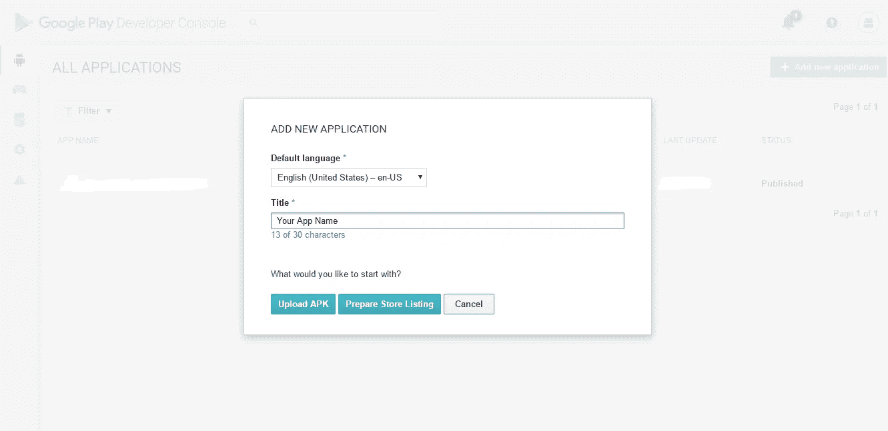
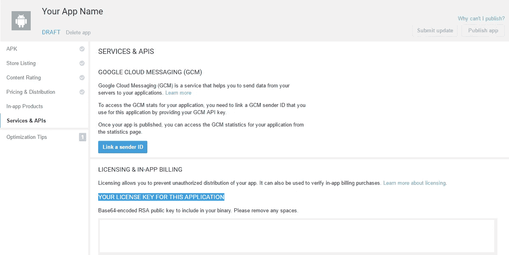
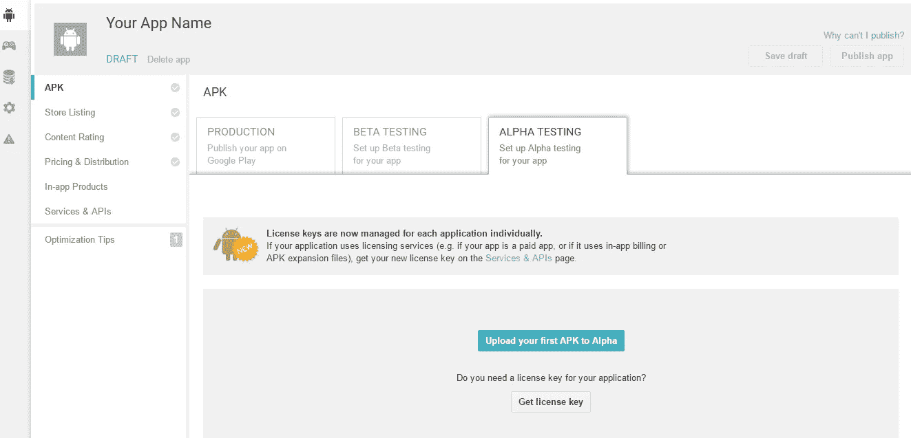
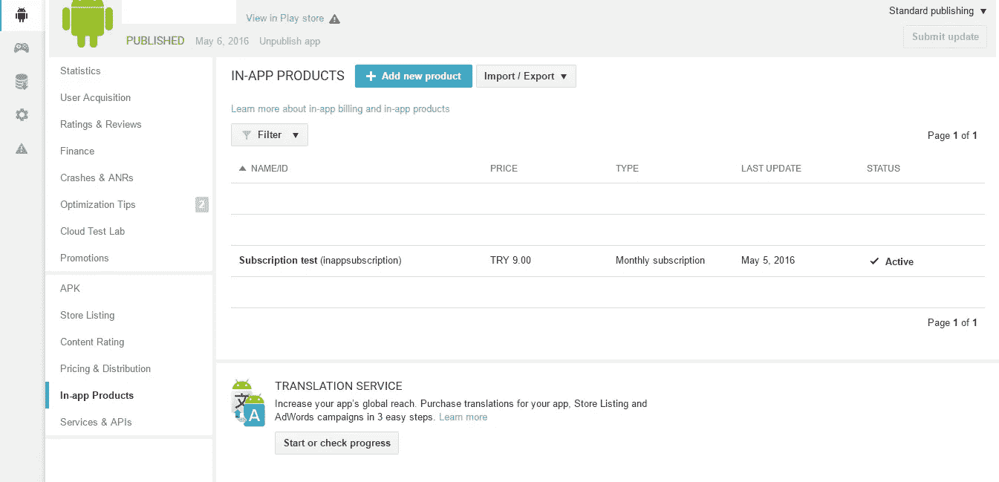
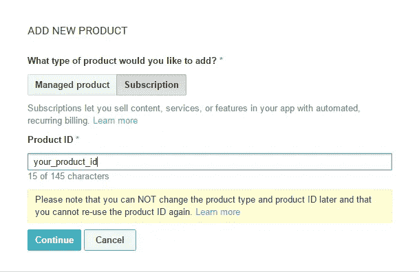
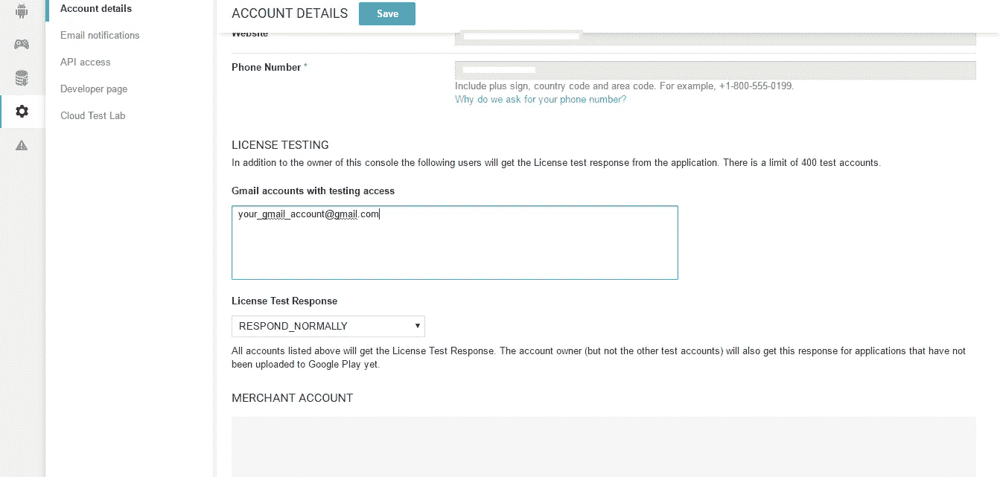
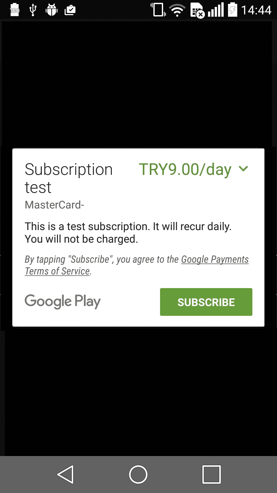

# InApp 订阅设置和测试-V3 API (Android)

> 原文：<https://medium.com/hackernoon/inapp-subscription-setup-and-testing-v3-api-android-8239534b3e79>

当在应用订阅 s 中实现[时，我发现实现它的过程并不复杂，但有一些隐藏的事实需要我花时间来弄清楚。由于没有太多关于这个案例的例子，我决定写一篇文章，可能对在应用计费](http://developer.android.com/google/play/billing/billing_subscriptions.html)中处理[的人有所帮助。](http://developer.android.com/google/play/billing/api.html)

## 游戏商店

首先，你必须有一个 [Google Play 开发者账户](https://play.google.com/apps/publish/)，用于在应用相关的情况下实施和测试**。**不幸的是，如果不在 Play Store *上发布签名 APK(至少在 Beta 或 Alpha 测试上)，你将无法运行 InApp 订阅 ***。****

## *许可密钥*

为了在应用计费中初始化[，您将需要一个*公钥*。要获得它，您必须从 play store 创建一个应用程序，方法是点击**添加新应用程序，**填写必填字段，然后点击**上传 APK:**](https://hackernoon.com/tagged/in-app-billing)



这将把您重定向到新创建的应用程序页面(您可以稍后填写应用程序发布的详细信息)。导航到**服务&API**并复制*该应用程序*的许可密钥，因为我们稍后会用到它:



## 出版 APK

然后你必须上传一个签名的 APK 在阿尔法或贝塔测试*(在这个例子中我使用阿尔法测试)*通过点击 APK 标签>阿尔法测试>上传你的第一个 APK 到阿尔法:



谷歌将处理 APK 和**它将需要几个小时，直到它被公布**。

> **您必须将您设备中的 apk 版本与发布的版本保持一致，否则应用内计费将无法工作**

## 创建订阅

apk 发布后，您将能够创建一个[**订阅(产品)**](http://developer.android.com/google/play/billing/billing_admin.html?rd=1) :



> 如果应用程序**未发布**，您**无法**创建产品

点击添加新产品将显示一个弹出屏幕，要求您填写产品的详细信息:



因为我们要创建订阅，所以我们选择*订阅选项卡。*产品 id 是识别您产品的唯一 ID。当您想要使用 play store 中的产品时，您将使用这个唯一的 id 来识别它。

创建产品后，将显示一个用于填写产品详细信息的页面。根据您的需求填充它们，现在您就可以开始了。

## 设置

[谷歌](https://hackernoon.com/tagged/google)提供了一个易于使用的库，能够处理支付、订阅和查询任务。你可以从[***这里***](https://github.com/googlesamples/android-play-billing) 或者从***{ SDK _ PATH } \ extras \ Google \ play _ billing \ samples 下载。***

您必须在 **main** 下创建一个名为 **aidl** 的文件夹，并在其中创建一个名为**com . Android . vending . billing .**的包。在该包中，您必须放置[*AIDL*](http://developer.android.com/guide/components/aidl.html)*(iinappbillingservice . aidl)*文件，该文件可以在下载的示例中找到，也可以从上面告诉 google extras 的本地路径找到。您还必须复制项目包*中的其他文件(无论在哪里，您都可以创建一个 purchaseUtils 包并放入其中)*。在我写的时候，有 8 个文件，以防你忘记任何一个: *{IabBroadcastReceiver，IabException，IabHelper，IabResult，Inventory，Purchase，Security 和 SkuDetails}。*

> 不要忘记将计费权限添加到 *AndroidManifest.xml:*

```
**<uses-permission android:name=”com.android.vending.BILLING” />**
```

## 初始化

稍后，您需要创建一个 *IabHelper* 实例，并在 *OnCreate()* 或任何满足您需求的地方初始化应用计费:

```
IabHelper iabHelper = new IabHelper(context, *base64EncodedPublicKey*);
iabHelper.startSetup(new IabHelper.OnIabSetupFinishedListener() {
  @Override
  public void onIabSetupFinished(IabResult result) {
    if (result.isFailure()) {
      Log.*d*("YOUR_TAG", "Problem setting up In-app Billing: " + result);
      dispose();
    }
  }
});/* 
** Method for releasing resources (dispose of object)
*/
public void dispose() {
  if (iabHelper != null) {
    try {
      iabHelper.dispose();
    } catch (IabHelper.IabAsyncInProgressException e) {
      e.printStackTrace();
    }
    iabHelper = null;
  }
}
```

您还启用了**调试日志**(可选地，您也可以给出一个标记名)是一个好的行为，因为这将帮助您更快地调试:

```
iabHelper.enableDebugLogging(true, "YOUR_TAG");
```

## 启动订阅

要启动订阅面板，我们必须调用*launchSubscriptionPurchaseFlow()方法。*您需要提供您创建新产品时编写的 ***产品 id****(subscription type)***和一个***REQUEST _ CODE****(可以是任意随机整数)* 这样它就可以捕捉它*onactivity result()***方法:****

```
**try {
  iabHelper.launchSubscriptionPurchaseFlow((Activity) context,
      subscriptionType,
      *REQUEST_CODE*,
      new IabHelper.OnIabPurchaseFinishedListener() {
        @Override
        public void onIabPurchaseFinished(IabResult result, Purchase info) {
          if (result.isFailure()) {
            Log.*e*("TEST", "Error purchasing: " + result);
            return;
          }
          if (info.getSku().equals(subscriptionType)) {
            if(subscriptionFinishedListener != null){
              subscriptionFinishedListener.onSuccess();
            }
            Log.*e*("TEST", "Thank you for upgrading to premium!");
          }
        }
      },
      payload
  );
} catch (IabHelper.IabAsyncInProgressException e) {
  e.printStackTrace();
}**
```

****然后借助 *handleActivityResult()* 方法来处理它:****

```
**@Override
public void onActivityResult(int requestCode, int resultCode, Intent data) {
  if (!iabHelper.handleActivityResult(requestCode, resultCode, data)) {
    super.onActivityResult(requestCode, resultCode, data);
  }
}**
```

## ****消费订阅详细信息****

****您还可以通过 *queryInventoryAsync()* 方法获得显示或验证它们的订阅细节。它异步查询详细信息，因此从 UI 线程调用它是安全的:****

```
**try {
  iabHelper.queryInventoryAsync(true, null, skuIdsList, new IabHelper.QueryInventoryFinishedListener() {
    @Override
    public void onQueryInventoryFinished(IabResult result, Inventory inventory) {
      if (result.isFailure()) {
        Log.*d*("TEST", "Problem querying inventory: " + result);
        dispose();
        return;
      }

      for (String skuId : skuIdsList) {
        SkuDetails sku = inventory.getSkuDetails(skuId);
        if (sku.getSku().equals(skuId)) {
        Log.*e*("YOUR_TAG", "Product Price:" + sku.getPrice());
        }
      }
    }
  });
} catch (IabHelper.IabAsyncInProgressException e) {
  Log.*e*("TEST", "EXCEPTION:" + e.getMessage());
}**
```

> ****skuIdsList 是存储多个产品 id 的字符串列表****

## ****试验****

****要进行测试，您需要在 Google Play 帐户详情的*设置*选项卡上的 ***许可测试*** 中添加您的测试电子邮件。这样，您在订购时就不会被收费:****

********

> ****请注意，您不能使用用于发布应用程序的同一开发人员帐户进行订阅。您必须使用不同的帐户在设备上打开 play store****

******就这些！******

********

## ******TL；dr；******

****[这是我在应用订阅中写的一个要点](https://gist.github.com/hrskrs/333651415eb877a8a01784d03b4dfc68)。您可以在您的应用程序中包含那个 *SubscriptionUtil.class* 。然后，您可以在 *onCreate()* 方法中或者您认为最适合您的情况的地方初始化它的实例:****

```
**subscriptionUtil = new SubscriptionUtil(context);**
```

****在 *onDestroy()* 上释放资源:****

```
**@Override
public void onDestroy() {
  super.onDestroy();
  if (subscriptionUtil != null) {
    subscriptionUtil.dispose();
  }
}**
```

****在 *onActivityResult()* 上处理请求:****

```
**@Override
public void onActivityResult(int requestCode, int resultCode, Intent data) {
  if (!subscriptionUtil.getIabHelper().handleActivityResult(requestCode, resultCode, data)) {
    super.onActivityResult(requestCode, resultCode, data);
  }
}**
```

****如果您想要使用订阅类型，请创建一个列表，其中包含您想要使用的那些订阅的*产品 id*，并使用 *getSkuDetailsList()* 方法按请求发送它们:****

```
**ArrayList<String> skuRequestList = new ArrayList<>();
skuRequest.add("first_product_id");
skuRequest.add("second_product_id");

subscriptionUtil.getSkuDetailsList(skuRequestList, new SubscriptionUtil.SubscriptionInventoryListener() {
  @Override
  public void onQueryInventoryFinished(ArrayList<SkuDetails> skuList) {
   //Do whatever you want with list of SkuDetails
  }
});**
```

****如果您想继续订阅，您可以将该订阅的对象(SkuDetails 对象)发送到 *initSubscription()* 方法:****

```
**subscriptionUtil.initSubscription(skuDetailsObject.getSku(), new SubscriptionUtil.SubscriptionFinishedListener() {
  @Override
  public void onSuccess() {
    //*Do whatever you want on subscription success* }
});**
```

****你准备好了吗:)****

****[](http://bit.ly/HackernoonFB)********[](https://goo.gl/k7XYbx)********[](https://goo.gl/4ofytp)****

> ****[黑客中午](http://bit.ly/Hackernoon)是黑客如何开始他们的下午。我们是 [@AMI](http://bit.ly/atAMIatAMI) 家庭的一员。我们现在[接受投稿](http://bit.ly/hackernoonsubmission)并乐意[讨论广告&赞助](mailto:partners@amipublications.com)机会。****
> 
> ****如果你喜欢这个故事，我们推荐你阅读我们的[最新科技故事](http://bit.ly/hackernoonlatestt)和[趋势科技故事](https://hackernoon.com/trending)。直到下一次，不要把世界的现实想当然！****

****[](https://goo.gl/Ahtev1)****