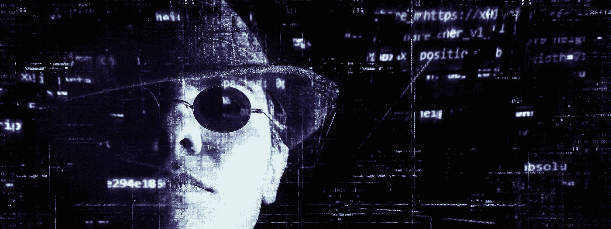

# 听不见的语音命令可以黑掉 Siri、Google Now 和 Alexa

> 原文：<https://medium.com/hackernoon/inaudible-voice-commands-can-hack-siri-google-now-alexa-3ebc654e0ad6>

作为一个懒人，我是 Siri、Google Now、Alexa 等语音控制系统的超级粉丝。由于最近使用深度神经网络进行识别的爆发，这肯定是未来的趋势。但是如果它能被黑客入侵呢？

声控系统总是处于监听模式。如果是 iPhone Siri，你需要说*“嘿 Siri”*来激活系统。之后你可以给它下命令，比如*【给我哥哥发信息】*。iPhone Siri 有用户依赖激活，这意味着我的声音不会激活你的手机。它只能通过你的声音激活。因此，你的 iPhone 会不断监听周围的音频，并检查模式是否匹配。一旦设备被激活，它就可以接受不同用户的命令。

为了让黑客偷偷侵入 iPhone。他需要

1.)模仿用户的*“嘿 Siri”*语音模式

2.)在用户不知情的情况下执行命令

## 模仿用户的*“嘿 Siri”*声音模式

最简单的方法是通过记录用户何时说*“嘿 Siri”*。如果没有的话，我们可以通过串联合成来实现。很多单词发音和*‘嘿’*一样，比如我们可以把*’****何****’*和*‘a’*从*‘C】****a****柯’*组合成 ***嘿*** 。同理从*'****Ci****ty '*和 *'re'* 从*' Ca****re****'*切片得到 *'Siri'* 。只有*“嘿 Siri”*需要模仿，一旦 Siri 被激活，它就可以接受命令，而不管用户的声音。

我还发现 [LyreBird](https://lyrebird.ai/) 已经能够在给定足够的用户语音训练数据的情况下从文本中生成用户的语音。他们已经能够模仿唐纳德·特朗普的声音。我尝试用 LyreBird 制作我的数字语音，并让它说*“嘿 Siri”*。这个声音能够激活我设备上的 Siri。你也可以试试。

## 在用户不知情的情况下执行命令

我们人类只能听到特定频率的声音。研究人员使用了我们听不到的大约 20 千赫的超声波或频率。

这是演示，在前半部分你可以看到 iPhone 用声音命令打电话。在后半段使用听不见的命令。

现在黑客已经被证实，我们将看到可能性。

它可以用来

1.  )使设备打开恶意链接
2.  )通过发起电话窥探用户周边。
3.  )通过发送虚假消息来冒充用户(用户可能会因为他没有做的事情而受到诬陷)
4.  )将用户的电话切换到飞行模式，以便用户保持断开连接。
5.  )因为这些命令激活屏幕并发出声音。可以降低亮度和声音以避免被检测到。

研究人员已经在超过 16 个语音控制系统(包括奥迪汽车中的语音导航系统)中成功测试了海豚攻击。研究人员提出了硬件防御机制来对抗它。鉴于黑客已经获得了用户的录音。他/她的设备易受攻击。

如果你对漏洞感到焦虑。禁用 IOS 上的“嘿 Siri”或 Android 上的“OK Google”。希望谷歌和苹果能尽快发布补丁。

这是研究论文[海豚攻击:听不见的声音命令](https://endchan.xyz/.media/50cf379143925a3926298f881d3c19ab-applicationpdf.pdf)的衍生作品。这要归功于浙江大学的、、季天辰、和徐。

> 关注哈克农和我([费宾·约翰·詹姆士](https://medium.com/u/75a616711f4e?source=post_page-----3ebc654e0ad6--------------------------------))了解更多故事。我喜欢将包含技术术语的研究论文转换成故事，这样就可以很容易理解。如果你有一篇论文或者一个话题需要转换成一个故事，在这里私信。

*我还在写一本书，以提高人们对蓝鲸挑战的认识，蓝鲸挑战已经夺去了几个国家许多青少年的生命。它旨在帮助父母了解黑暗网络的威胁，并采取行动确保他们孩子的安全。亚马逊上有* [*斗蓝鲸*](http://amzn.to/2gSdZXk) *这本书可以预购。该书将于本月 20 日发行。*