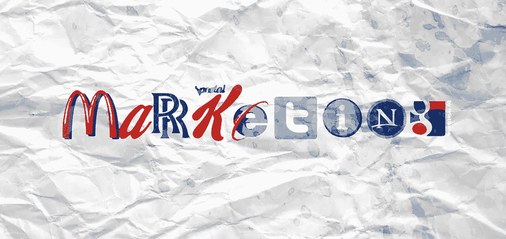

# 集客营销

> 原文：<https://medium.com/hackernoon/inbound-marketing-a3814185a91e>

[http://hris.deviantart.com/art/marketing-banner-324840681](http://hris.deviantart.com/art/marketing-banner-324840681)

我去年为一些需要营销建议的创始人做了一个简短的介绍。会议的主题是确定什么是[集客](https://hackernoon.com/tagged/inbound)营销，以及如何在他们的层面实施。