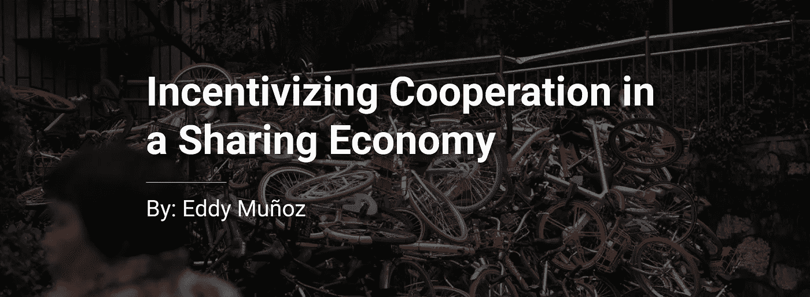
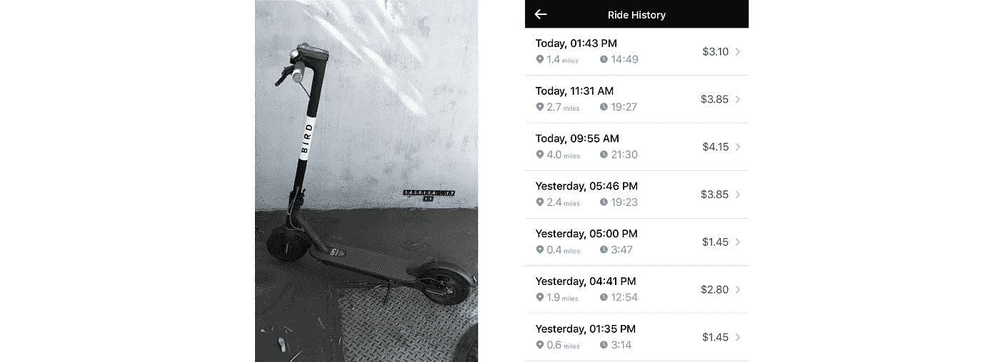
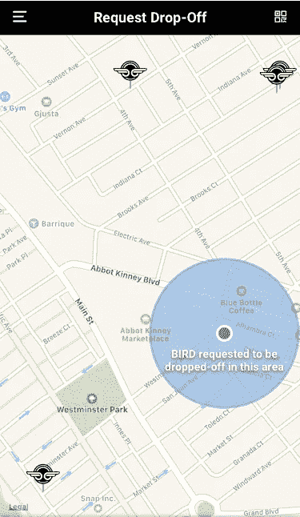
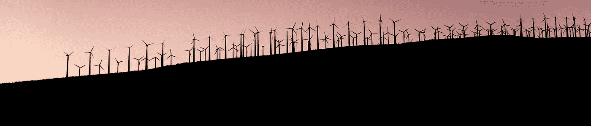

# 共享经济中的激励合作:公地悲剧的可能解决方案

> 原文：<https://medium.com/hackernoon/incentivizing-cooperation-in-a-sharing-economy-possible-solutions-to-the-tragedy-of-the-commons-f59a609145be>

随着市政府制定解决交通和停车不足的方案，自行车共享等项目也应运而生。然而，绝大多数情况下，这些自行车共享解决方案容易受到盗窃、T2 破坏和 T4 黑市交易的影响，因此这种尝试不可持续，并以牺牲市民的利益为代价，耗费了这座城市大量的金钱。这种失败可以被称为[公地悲剧](http://www.investopedia.com/terms/t/tragedy-of-the-commons.asp)，在这种情况下，个人最大化个人收益，同时耗尽公共资源的可持续性。**为了培育一个公共资源改善日常生活的可持续社区，必须鼓励人们比以前更好地放弃公共资源。**

在偶然发现一辆名为 [BIRD](http://www.bird.co) 的共享电动滑板车后，我总结出几个想法，在一个人追求自身利益最大化的同时，激励公共利益。尽管这些解决方案是针对伯德的，但为了解决其他悲剧，还可以制定衍生方案。

BIRD Scooter and my Ride History

# 骑着鸟

骑鸟很容易。只需打开手机应用程序，找到你附近的一只鸟，预订它，一旦你靠近它就解锁。伯德向骑手收取每次 1 美元的费用，解锁后每分钟加收 0.15 美元。虽然不是像自行车共享计划那样的终极公共资源，骑自行车是免费的，但 BIRD 的准入门槛很低，每个人都可以负担得起。这种低准入门槛(2-4 美元)对于激励可持续合作至关重要，因为它能够量化可持续行为，从而为良好行为赋予美元价值。

**骑手是骑小鸟(电动滑板车)的用户*

# 伯德的问题

虽然骑鸟既便宜又容易，但有几个问题可能会导致它追随自行车共享项目的脚步:

*   骑手们不愿意租一只离他们不方便的鸟
*   鸟类的电池电量耗尽，无法全天充电，因此减少了可用的供应
*   鸟儿被放在不方便的地方，让下一个骑手发现

# 激励下车地点

虽然鸟最初被创造出来是为了被放在任何地方，但是骑手可以被激励去把鸟放在方便的地方给下一个骑手使用。如果一个未来的骑手想要一只离他们很近的鸟，他们可以支付象征性的费用(0.50 美元)，让鸟在他们周围下车。在请求的邻近区域放下鸟的当前骑手被记入未来骑手在他们请求鸟时锁定的象征性费用。

BIRD app screenshot with my edits to add the requested drop-off

这种形式的请求满足了鸟类的持续需求，因此通过最大化个人收益来激励持续使用。把鸟放在要求的地点的骑手满意地离开了，因为他们把鸟放在比他们原来的目的地远一两个街区的地方，他们的总费用被打折了。

为了让骑手从要求的下车中获益，他们必须重视折扣，使其大于步行到最初目的地所花费的额外时间。为了让未来骑手从所请求的落客中获益，他们必须将名义请求费用定为低于步行到最近的鸟所花费的时间。因此，如果他们能够产生足够的需求，BIRD 将通过其持续使用从所请求的下车功能中获益。

# 激励充电的鸟

即使在一个完美的世界里，所有的鸟都在使用，并有一个要求的下车位置，鸟的电池必须重新充电，以维持其连续使用。除了太阳能充电之外，还可以实施几种解决方案来确保鸟类始终处于充电状态。

第一个解决方案是向骑行时收费的用户推广折扣骑行。便携式电池组可以免费分发或出售(10-15 美元)给希望获得折扣的乘客。在多次使用电池组后，骑手可以从每次骑行给予的折扣中获益，从而使他们购买 10 美元的电池组成为成功的投资(总是将电池组充电的电费考虑在内)。伯德必须宣传，在“X”次骑行后，你可以从购买他们的电池组中获利。

The BIRD BATTERY can be freely-distributed or sold to riders who wish to unlock a discount

另一个可以立即实施的解决方案包括激励人们在巢穴中下车。鸟巢是鸟类的充电中心，已经遍布整个城市。如果用户被鼓励在鸟巢中放下鸟，他们可以得到他们当前乘坐的折扣，类似于请求的放下位置。

在骑手起飞之前，应该给他们一分钟时间输入目的地。这不仅预测了他们的乘车成本，还显示了可用的折扣，允许用户在请求的位置放下鸟时支付更少的费用。

# 结论

社区必须利用可持续的解决方案，如电动小鸟踏板车，以解决交通和停车不足的问题，同时最大限度地减少当前交通方式留下的碳足迹。虽然有些人可能会认为，通过煤炭发电来为电动滑板车充电会留下碳足迹，但目前有效的可持续解决方案将简化发电能力。

令人兴奋的是，每天都能看到解决方案是如何让我们最大限度地获取个人利益，同时留下一个可持续的社区。让我们始终努力寻求双赢的解决方案！

From [Kai Gradert](https://unsplash.com/@kai) on [Unsplash](https://unsplash.com/photos/07KxLPfH0l4)

*感谢您抽出时间* ***:)*** *随时点击拍手按钮，与朋友分享！如果有什么意见，欢迎在下面提出来！*