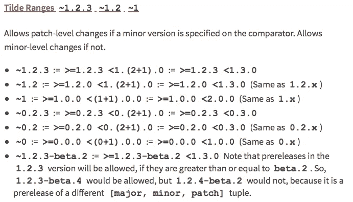
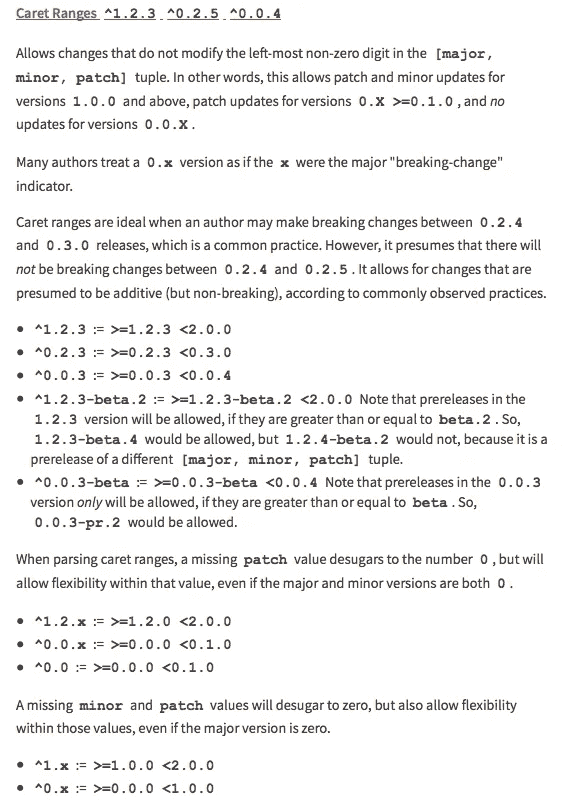

# 不一致是一个特征

> 原文：<https://medium.com/hackernoon/inconsistency-as-a-feature-f5f1a28356d4>

## 下图描绘了几乎每个 JS 开发者都大量使用的两个最致命的包管理器的标志。

Lethal weapons 2017

通过几个 CLI 命令，与它们的交互变得简单明了。他们所做的很简单，根据具体的版本为你下载软件包。左边的标志属于 ***鲍尔*** ，右边的当然属于 ***npm*** 。

# 体验 Bower & npm

我使用 ***bower*** 已经有一段时间了(1 年多了)，因为我从事前端工作，我的体验并不完全愉快。事实上，我认为我讨厌它。另一方面，我们有主要由 node.js 开发人员使用的包管理器(后端/前端)。这两种我都用过，我都不喜欢，但我认为 NPM 比鲍尔更糟糕。

我与这些包管理器的交互或多或少是相同的，它们甚至有相同的命令，有时会产生不同的结果。例如，在 bower 中安装一个包(所有特性中最常用的特性)会安装在 bower_components 中(默认情况下)，但是在 npm 中它会安装在 node_modules 中。好吧，不同的名字，谁在乎。诀窍就在每个目录里。Bower 将所有的依赖关系都记在一个平面结构中，相反，npm 将所有的依赖关系都记在一个层次结构中。这意味着，如果你想要一个依赖项，在你的项目的 node_module 目录中，你将只有那个依赖项，但是在那个目录中，可能有另一个 node_modules 目录，它包含你的依赖项的依赖项，这样继续下去…这可能不是一个坏主意，因为你隔离了依赖项，它使你免于麻烦。**在 node 4.x.x 之前，从版本 5.x.x 开始，他们也使用扁平结构。**

小心 Windows 用户嵌套目录是痛苦的…

## 版本控制

在我工作的一个项目中，我们应该使用语义版本控制，但不是标准形式，而是在开发时使用的形式，即 0.Y.Z。然而，我们使用这个 X . yβ-Z，其中 Z 在发布时自动递增。在 SemVer 中，它声明一个库应该有一个公共 API，它是库的接口。那不应该经常改变，对吗？？

两个**bower**&**NPM**都有相同的怪异的版本解析规则，这允许许多不同的方式来定义你的依赖关系。我真的不知道为什么有人想要一两种以上的方法来解决项目依赖的版本，但无论如何。

> 最可笑的 2 个版本不等 ***^*** 和 ***~***

你不觉得很复杂吗？等待下一次…

简单的任务有太多的规则。我不明白为什么这两种语义对处理版本有用。它们只是让你的生活变得复杂，让你的开发环境不一致。

# 问题是

如果你正在做一个小项目，使用上面的版本解析规则可能不会遇到任何问题，但是如果你正在做一个非常大的项目，并且多个团队之间有很多依赖关系，那么事情就变得复杂了。**您总是想知道您正在运行的版本**。是 *x.y.z* 还是 *x.y1.z2* ？你需要在每个包内部搜索，以确保你使用的是正确的版本，而不是只看真相应该出现的地方，即 ***bower.json*** 或 ***package.json*** 。

> 从根本上说，你是在维护一个不一致的系统

我所说的不一致的系统是指依赖关系可能会在你不知道的情况下从一天到另一天发生变化。当您拥有自动 CI 构建时，这是非常可能发生的。所以，每次你的依赖项更新时，你都心甘情愿地生成一个不同的系统，而你并不知道。在某种程度上，你创造了一个自动进化的活系统。我不知道这到底是不是一件好事。

## **示例**

您的系统包含:

*   lib-A.js
*   图书馆-B.js
*   ext-lib-C.js
*   ext-lib-D.js

你在你的所有团队内部维护 ***lib-A.js*** 和 ***lib-B.js*** ，它们会不断更新，也就是说，每周都会有几个小版本。 ***ext-lib-C*** 和 ***D*** 是外部的，更新不那么频繁。然后你在你的产品中使用 **A** 和 **B** ，使用 ***x.y.**** 语义，这样你就安装了微小的改变(在这种情况下 ***可能*** 包括新的特性)。

所以你有一个包括库的系统，不清楚它们包含什么，也不清楚它们是否正常工作。JavaScript 是一种动态语言，除非运行代码，否则很难知道会发生什么。除此之外，缺乏集成测试、功能测试(甚至是 E2E 测试),你就有了不一致性和系统脆弱性的完美配方。

# 优点

*   你不必关心更新，它们是“自动”完成的。

我想象不出其他的优点…

# 问题

*   您不知道安装了什么，因此不清楚要验证什么。
*   您可能会遇到难以发现的问题，因为您没有关于已安装内容的良好参考。

# 结论

可变的包版本控制使得维护和开发系统变得困难，因为它可以在你不知道的情况下随时中断。项目越大，就越难维护它，也越难确保没有什么东西被破坏。总的来说，保持简单，使用特定版本的包，一切都会变得容易得多。